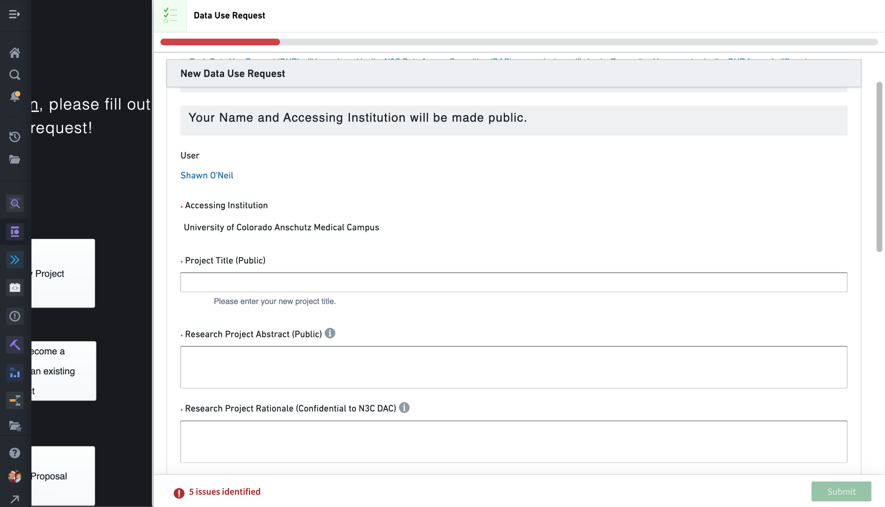
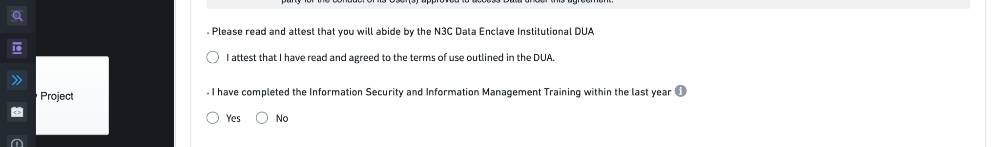
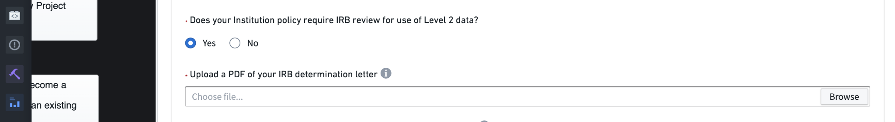
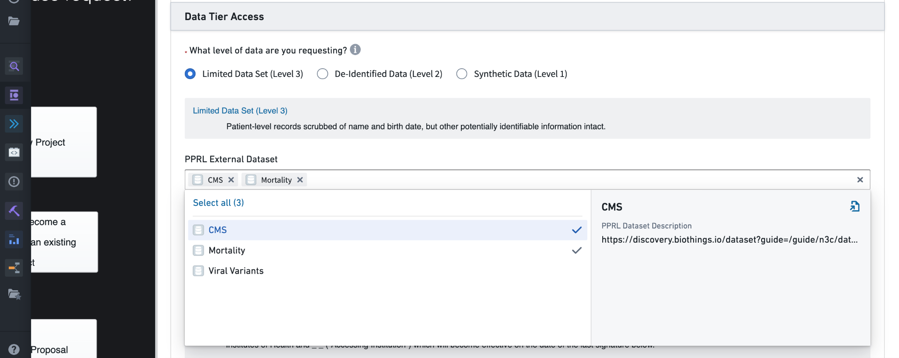
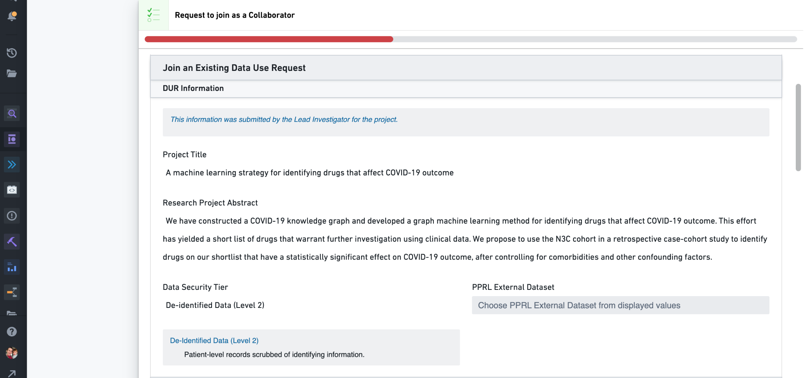
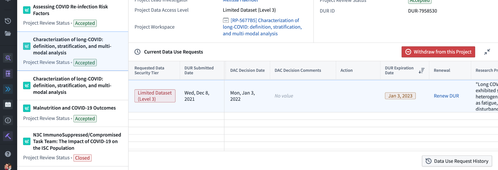
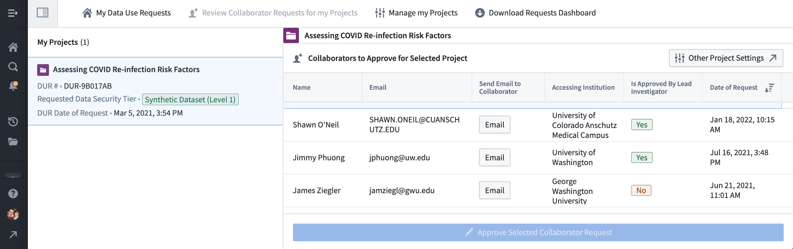
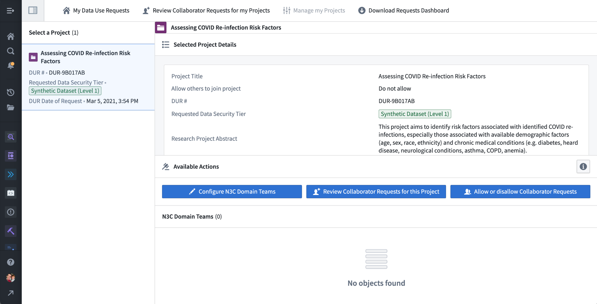

---
author:
  - name: Shawn O'Neil
    affiliation: University of Colorado, Anschutz
    affiliation-url: https://oneilsh.github.io/
    email: shawn@tislab.org
    orcid: 0000-0001-6220-7080
    attributes:
      corresponding: true

  - name: Mariam Deacy
    affiliation: NIH NCATS
    affiliation-url: https://ncats.nih.gov/
    email: mariam.deacy@nih.gov
    orcid: 0000-0001-8307-5208

csl: ../assets/csl/apa-7e.csl
---

# Getting & Managing Data Access {#sec-access}

**Chapter Leads:** Shawn O'Neil, Mariam Deacy

N3C is strongly committed to patient privacy.
After all, N3C is the steward for EHR data on millions of patients from dozens of healthcare organizations who've placed their trust in N3C's ability to protect it.
Some of these protections include agreeing to report a data leak incident within 2 business days (covered by the Data Use Agreements, discussed in @sec-onboarding), a formal review process to export any results derived from the data, and a formal per-project, per-person application process for data access.

This last protection, known as a Data Use Request or DUR, will be the main focus of this chapter.
The DUR form is available only inside the N3C Data Enclave, so Enclave access is required to request data access.
N3C registration and Enclave access are covered in @sec-onboarding, so we won't cover those topics here.

## Background: N3C Protected Data Levels {#sec-access-background}

Not all data in the N3C Data Enclave requires an approved DUR to access–mock datasets and publicly-available data (e.g., US census data) are accessible by everyone with Enclave access.
These low-risk data are covered more in Chapters [-@sec-understanding] and [-@sec-publishing].

The harmonized EHR data that _do_ require an approved DUR to access are made available in three different "levels," each with different amounts of data obfuscation, and correspondingly different access requirements.
Deciding which level of data is appropriate for your study is important, because accessing Level 3 data is more work and restrictive than accessing Level 2 data.
On the other hand, there are some studies that can be accomplished only with Level 3 data.
Note that if you start with a lower level of data, it is possible to "upgrade" a project's access level, though all participants in the project will need to complete another DUR for the new level.

In addition to the primary Level 1, 2, and 3 datasets is "PPRL" data.
PPRL data includes extra non-EHR sources of information such as obituary-based mortality records and viral variant sequencing information.
These are available alongside only Level 3 data as an optional add-on; we'll discuss PPRL in more detail below.

### Level 3, Limited Data Set (LDS) {#sec-access-background-l3}

Level 3, or LDS data is the most complete and protected (the term "limited data set" is defined by HIPAA and may contain a limited set of potentially identifying information).
This dataset contains two pieces of Protected Health Information (PHI) defined by HIPAA: full, 5-digit patient zip codes,^[There are some exceptions where five digit zip codes are not visible in Level 3 data: zip codes represented by fewer than 20,000 patients are removed altogether; sometimes only the first three digits of the zip code are displayed (such as zips with a predominantly American Indian/Alaskan Native population and zip codes from participating institutions who send only the first three digits).] and accurate dates of events and services (except for dates of birth which are limited to month and year).^[In actuality, a few data partners also perform small amounts of date shifting–randomly shifting all dates on a per-patient basis to further protect patient privacy–prior to sending their data to N3C.
The manifest information (described below) indicates which data partners do so and the range of potential shift so researchers can remove data from these partners if they need highly-accurate date information.] Level 3 data are in the OMOP common data model, with some N3C-specific additions and conveniences, and are versioned as releases as described above.
(OMOP and N3C-specific additions are covered in @sec-understanding.)

### Level 2, De-Identified {#sec-access-background-l2}

Level 2 data, also known as De-Identified data, contains nearly the same information as the Level 3 data, but the two PHI-containing fields are further anonymized.
Zip codes available in Level 3 are truncated to just the first 3 digits, and all recorded dates are shifted randomly, where the range of the random shift is &plusmn;180 days.
This is not as dramatic a research limitation as it may seem, because the random shift amount is determined _per patient_: all dates for a given patient are shifted by the same (unknown, random) amount, allowing identifying sets of patients who had, for example, a positive COVID-19 PCR test and within 14 days received a given drug treatment.^[Like Level 3 data, birth dates are available only at the year and month level, and these are similarly shifted along with other patient-associated dates.
In Level 2 data birth date information is removed entirely for patients who are more than 90 years old, and a separate `is_age_90_or_older` column identifies these individuals as a group.] Level 2 data would not be appropriate for studies considering absolute timing, such as whether a patients' primary COVID infection occurred during the Delta wave.
Such questions are best answered by the LDS data.

The Level 2 data are also in OMOP format and versioned as releases.
We'll forgo examples of notional data because the format is exactly the same as for Level 3, LDS data.

### Level 1, Synthetic {#sec-access-background-l1}

Level 1, or Synthetic,^[The Synthetic data discussed here should not be confused with the notional (fake) datasets described in @sec-publishing.
These happen to have similar sounding names: SynPuf and Synthea.] data provide the most anonymous view of the harmonized data, and are quite different from the Level 2 and 3 datasets in both format and content.
Rather, Level 1 data were _generated_ from a statistical model of a _researcher-defined subset_ of the Level 3 data.
This means Level 1 data contain no real patient records at all, but only a synthetic derivative designed to be statistically similar.
The generation process is handled by a private company, MDClone, whose proprietary algorithms also look for resulting information that is too similar to real patient information, potentially resulting in a loss of patient privacy.
Such records are masked with "censored" values in the resulting dataset.

Because this statistical-modeling approach doesn't scale to the entirety of an EHR database, it is generated on subsets of data of interest to researchers, with the assistance of MDClone representatives.
To take an example, consider a research team interested in outcomes of COVID-19 in diabetic vs. non-diabetic individuals.
Inside the Enclave, the team initiates a request with an MDClone liaison, suggesting that they would like to collect a set of patient information (with one row per patient in the resulting table), with columns for `patient_age` (at the date of their first COVID-positive PCR test result), `has_diabetes` (indicating if their record contains a diabetes diagnosis), `days_until_ventilation` (number of days elapsed between their COVID-positive test and subsequent mechanical ventilation, or `null` if they were not ventilated within 30 days), and several other potential confounding variables.
The MDClone liaison then collects this requested information from the Level 3 data, develops a representative statistical model, and delivers a table of synthesized rows from the model with the columns requested to the team.

Level 1 datasets are generated from the most recent Level 3 release at the time of generation, and not automatically updated as new primary N3C data arrives.
Notes for each Level 1 dataset describe the date of generation and information included for future reference.

::: {.callout-note appearance="simple" icon=true}
Update: As of mid-2022, N3C is no longer able to generate new synthetic datasets at researcher request.
The previously-generated datasets are still available for use however, and gaining access to Level 1 data provides access to all generated synthetic datasets.
:::

#### Example N3C OMOP Data Format {#sec-access-background-l1-example}

To give a sneak preview of the primary N3C data format, here's a snapshot of a few columns of notional (_fake_) data in OMOP format from the `condition_occurrence` table:

{#fig-access-010-condition_occurrence fig-alt="A subset of rows and columns for mock condition_occurrence data.
Notice the N3C-added `data_partner_id`, these are anonymized identifiers for sites contributing data, labeling each record with a source."}

Notice in particular the columns for `data_partner_id` (a pseudo-random identifier assigned to each data partner), `condition_concept_id` (the OMOP identifier uniquely describing the condition used for data filtering and analysis), and `condition_concept_name` (the human-readable version of `condition_concept_id`, used for convenience but not for data filtering).
Other OMOP tables link records by shared columns; here are a few columns from the `person` table describing basic demographics of patients:

{#fig-access-020-person fig-alt="Example data for the OMOP `person` table."}

Some other tables available with Level 3 data are specific to N3C; here are a few columns from a notional `manifest` table providing information about data partners, including the source CDM used by the data partner, the dates of data extraction and submission to N3C, and whether the data partner performs random date shifting prior to submission to N3C:

{#fig-access-030-manifest fig-alt="An example of the N3C-specific `manifest` table.
This table provides information about data partners, such as their source common data model (`cdm_name`), whether they pre-shift dates (see @sec-cycle), and when their last submission was."}

### PPRL Data {#sec-access-background-pprl}

PPRL, short for "Privacy-Preserving Record Linkage," is a strong cryptographic data handling technique allowing for the matching of records about individuals from different data sources, _without_ revealing to any party except the data sources themselves any identifying information about the individual.
While we won't describe how the process works here, researchers with Enclave access can read more about it in @sec-understanding and the Introduction section of the [PPRL training module](https://unite.nih.gov/workspace/module/view/latest/ri.workshop.main.module.e7b83a8c-545e-49ac-8714-f34bfa7f7767?view=focus&Id=23)  in the Training Portal (see @sec-support-training).

## Level 1/2/3 (and PPRL) Availability {#sec-access-availability}

Level 3, LDS data are available only to researchers affiliated with US-based organizations such as universities and medical schools.
As we'll discuss below, the most significant access requirement for Level 3 data is a letter of determination from researchers' local Institutional Review Board (IRB), so this level of data is also available to other US-based organizations with the ability to work with an Institutional Review Board, or IRB (e.g., pharmaceutical companies).

Level 2, De-Identified data are available to researchers at both US and approved foreign organizations (those that can sign an institutional Data Use Agreement (DUA), see @sec-cycle).

Level 1 Synthetic data are available to researchers at US and approved foreign organizations (though note the update about Level 1 data generation above), as well as individuals without any affiliation with a research organization, i.e., "citizen scientists." This level of data thus provides opportunities for public outreach and engagement with topics in clinical science.
Citizen scientists must nevertheless complete some training requirements and sign the legal Data Use Agreement document.
Minors may apply for access, but only via their parents' or legal guardians' consent and with explicit N3C consent.

Since the registration process is non-trivial for those not affiliated with a research institution, citizen scientists hoping to work with Level 1 Synthetic data should reach out to one of the N3C support venues to get started (see @sec-support).

PPRL data can be accessed alongside only Level 3 (LDS) data, and as such has the same access availability.
As we'll discuss below, there are special procedures for gaining access to PPRL data as part of a Level 3 access request.

## Workspaces, Permissions, and the Data Catalog {#sec-access-workspaces}

The N3C Data Enclave uses a fine-grained permissions model to manage researcher access to protected data.
While researchers are not able to modify these permissions themselves, understanding them will help in navigating the DUR process and subsequent work.

Data management in the Enclave is centered around "project workspaces" which act like folders–workspaces are indicated by a small filing-drawer icon and are listed under the "Projects & files" link in the left navigation menu.

{#fig-access-040-projects-list fig-alt='Project workspace browser.
Note that the "Request access" buttons are not active and clicking one will suggest visiting the DUR dashboards described below.'}

Workspaces are used for multiple purposes.
Some store the Level 1/2/3 data; the "LDS Release" workspace for example stores the tables for the Level 3 LDS data. (The Data Catalog provides a more efficient way to access these tables however, more on that below.) Some are used to store "external" datasets such as publicly-available US Census data (see @sec-understanding).
The "N3C Training Area" workspace can be accessed by anyone as a place to practice on notional data (see @sec-publishing).
Most, however, house research projects, and these are indicated with an `RP-XXXXXX` prefix.

Work in one project workspace can access only data or files from another project workspace if a "reference" has been added from the former to the latter.
Researchers do not have permission to add such references.
Thus, access from a research project workspace to protected datasets is possible only if the appropriate references have been added by administrators, which is done after a corresponding Data Use Request has been approved.
Said another way, rather than providing researchers access to data, researchers are provided access to project workspaces, and these are in turn provided access to data.

This reference-based permission scheme supports a number of useful features for N3C.
Naturally, restricting workspace access to a subset of data affords the possibility of different levels of data access with correspondingly different access requirements.
A single researcher may be involved with multiple research projects of different levels but cannot share data or files across them, thus it is impossible for a researcher with access to Level 3 data to share it with their colleagues in another project with Level 2 data.

## The DUR - Data Use Request {#sec-access-dur}

### Project Roles and DUR Types {#sec-access-dur-roles}

In the simplest view, each research project is associated with a single 'DUR' listing the project title and abstract, and governing the level of data accessible to the project workspace (and thus also to all researchers with access to that workspace).
DURs are reviewed by the N3C Data Access Committee (DAC), and when approved administrators configure the workspace and researcher access to it.

In practice the situation is a bit more complicated.
The researcher who submits the initial DUR defining the title, abstract, and data access level is known as the project _lead_.
Other researchers who sign on to the project submit "collaborator DURs." A collaborator DUR is a copy of the original DUR submitted by the lead, but the title, abstract, and data access level are fixed.
Both leads and collaborators must enter other requirements depending on the data access level (e.g., date of most recent Human Subjects Research Protection training or local IRB approval), and both lead and collaborator DURs are reviewed by the DAC before access is granted.
If a lead's DUR is rejected by the DAC, they will have the opportunity to appeal by updating the information provided.

The lead has certain abilities and responsibilities, most importantly configuring whether the project is open so that other researchers may request to join as collaborators, and if so periodically reviewing those requests.
These cannot be delegated, so the lead should be someone with that decision-making authority.
Aside from these aspects however, leads and collaborators all have the same permissions in the project workspace and can review and share work.

Since DURs expire after one year, there is also a "renewal" DUR type, which both leads and collaborators are prompted to fill in the weeks prior to their DUR expiry via email.
Renewal DURs don't allow editing the title, abstract, or data level, and so are usually expedited by the DAC.

Lastly, there are "revision" DURs, where the lead requests to change some major feature of the DUR (most commonly to upgrade the data access level) for an existing project workspace.
Once approved by the DAC, administrators reach out to the lead to plan the revision, because collaborators will also need to submit new collaborator DURs prior to the change or they will lose access to the workspace.

Note that while we've described these different types of DURs, they all use the same DUR form, with the differences boiling down to what fields can be changed by the researcher filling it out.

Theoretically a single researcher may have multiple outstanding DURs for the same project.
For example, the lead for a project nearing its expiry may submit a renewal DUR, and while that renewal is pending DAC approval the lead may also decide to submit a revision DUR to access a higher level of data.
Most likely the renewal will be approved first, followed by the revision.
If it so happens that the revision is approved before the renewal, the renewal request will then be moot as revision also resets the expiry date.
Such cases may require intervention by administrative support, so it is wise to be judicious about DUR submissions to expedite the process.

## DUR Dashboards {#sec-access-dashboards}

There are three primary dashboards used to create and manage DURs; all three are linked from the N3C Data Enclave homepage via buttons titled "Data Use Request (DUR)", "My Projects (DURs)", and "Explore Projects (DURs)."

{#fig-access-050-dur-dashboards-home fig-alt="Enclave homepage. Highlighted are the three DUR-related dashboards."}

Although there is some functionality overlap, the primary uses for these three dashboards are:

* **Data Use Request (DUR)** is used to submit a new Data Use Request for a **new** project.
The submitter provides the project abstract and title and selects the data level needed, and will become the lead for the project.

* **My Projects (DURs)** shows the status of your submitted requests and projects.
This interface also provides some project management functionality for leads, such as linking a project to an N3C [domain team](onboarding.md#dt), reviewing requests from potential collaborators to join the project, appealing rejected DUR submissions, and accessing the [download request dashboard](publishing.md).
<!-- TODO: for DRR, add link to section w/n chapter -->

* **Explore Projects (DURs)** lists all N3C research projects, and for those that allow it, provides a link to request to join a project by submitting a collaborator DUR.

## Data Use Request (DUR): Initiate a New Research Project {#sec-access-request}

This first dashboard is really just the DUR form itself, and is used to request the creation of, and access to, a brand-new research project with access to one of the levels of protected N3C data.
The form has a number of sections, and some of these are dynamic, depending on choices to earlier questions.
The left side of the DUR form provides quick links to other dashboards or actions; "Create a New Project" simply refreshes the page (since we are already creating a new project DUR), "Request to become a collaborator on an existing project" opens the Explore Projects dashboard (discussed below), and Public Health Proposal opens the application form for the [N3C PHASTR](https://covid.cd2h.org/phastr) initiative (which utilizes a specialized variant of the DUR process discussed here).

{#fig-access-060-new-dur fig-alt="New Data Use Request (DUR) form."}

Moving to the main content of the DUR form, the first three questions prompt for a Title, Abstract, and Research Project Rationale. (The green Submit button is always visible, and will be clickable when all fields for the DUR are properly completed.) Title and Abstract are self-descriptive, but know that these entries will be listed for others to see, both inside the N3C Data Enclave via the Explore Projects dashboard, and outside at <https://covid.cd2h.org/dashboard/>.

The Research Project Rationale deserves special attention.
This information will be visible only to you (the submitter) and the Data Access Committee (DAC) who will approve or deny the request.
The project rationale should describe for the DAC why data access is being requested in light of the goals of the research project.
The rationale should include a justification for the level of data being requested, especially if requesting the Level 3 Limited Data Set (LDS).
If your project doesn't require the accurate dates or full patient zip codes provided by Level 3 data, it will be rejected, or approved for the Level 2 data even though Level 3 was requested.
Similarly, if requesting access to any PPRL (see @sec-access-availability) datasets the rationale should include why. (You will also need to have the PPRL data mentioned in your IRB letter of determination - see below.)

{#fig-access-070-dur-metadata fig-alt="DUR metadata fields."}

The next questions pertain to potential collaborations.
The "Please associate your project with an existing N3C Domain Team" prompts you to select a domain team that best fits your project.
Domain Teams are N3C working groups encompassing multiple research projects and are used to facilitate collaboration.
Linking your project to a domain team this way in the Enclave allows others to navigate domain teams and browse linked projects dynamically.
It is possible to modify this linkage later, so if you aren't sure feel free to check the "need help choosing" check box.

{#fig-access-080-dur-collaborators fig-alt="DUR Domain Teams and collaborator fields."}

The next question, "Allow other researchers to join this project," configures the project so that others can request to join via the Explore Projects dashboard.
If this is enabled, other researchers will be able to fill out a collaborator DUR (a copy of this DUR but with the title, abstract, and data level fixed).
As the lead submitting this primary DUR, you will have the opportunity to approve or deny such requests (via the My Projects dashboard); if you approve, their request will be forwarded to the DAC for final approval of the workspace and data.
This option can be changed later.

The Collaborators section allows you to send invites to potential collaborators to join the project.
Added collaborators will receive an email notification (with instructions to register for N3C in case they don't already have access), and will see the invite in their My Projects dashboard with a link to fill out a collaboration DUR (much like those who request to join described above).
These invites are sent regardless of the earlier choice to Allow/Do not allow others to join the project.

Next is the choice of data level to request.
Levels 2 and 3 require additional information, so we'll start with the Level 1 data and return to see the differences for Levels 2 and 3.

{#fig-access-090-dur-data-level fig-alt="DUR data level request."}

### Level 1 DUR Requirements {#sec-access-request-l1}

For Level 1 access, the first requirements are that you have read and attested to the [Data Use Agreement](onboarding.md#data-use-agreements), and that you have completed the required NIH IT Security training course within the past year.
Both of these are also required as part of onboarding, so we won't cover them here (see @sec-onboarding).

{#fig-access-100-dur-attestations fig-alt="DUR attestations."}

Finally, you will need to attest to having read the N3C Code of Conduct (with the text provided above), that you have read and understood the [N3C download policy](publishing.md) (a link is provided via the more information icon), and that if you choose to use any additional data sources in connection with N3C protected data that you are aware of your institutions' policies around doing so.
(Some institutions restrict how and when EHR data can be linked to other datasets, including [publicly available](understanding.md) data ingested for use by N3C researchers.)
<!-- TODO: like the last section of the "Understanding the Data" chapter -->

{#fig-access-110-dur-acknowledgments fig-alt="DUR attestations and acknowledgments."}

With all of this information provided, you will be able to click Submit and send the request to the Data Access Committee for review.

### Level 2 DUR Requirements {#sec-access-request-l2}

Requesting access to Level 2, De-Identified data requires additional information.
First, when selecting the Level 2 request option, you will be asked to confirm that you have taken Human Subjects Research Protection training within the last three years and provide the date of completion.
Most research institutions provide specific training courses to satisfy this requirement, for example via the [CITI Program](https://citiprogram.org).
The specific courses required vary from institution to institution, so check with your research office or equivalent authority for guidance.
If your institution does not offer or recommend specific courses, you can utilize the [free course](https://www.hhs.gov/ohrp/education-and-outreach/human-research-protection-training/human-research-protection-foundational-training) provided by Health and Human Services.

{#fig-access-120-dur-hsrp fig-alt="HSRP training attestation."}

In addition to human subjects research protection training, you will need to consider whether your institution requires a letter of determination from your local IRB when using De-Identified data.
If so, you'll be prompted to upload the letter as a PDF before you can submit the DUR.

{#fig-access-130-dur-level2-irb fig-alt="DUR IRB letter upload.
For a Level 2 DUR, this is required only if your local institution requires IRB approval for de-identified data access."}

### Level 3 DUR Requirements {#sec-access-request-l3}

The Level 3, Limited Data Set (LDS) offers the most complete view of N3C data.
Unlike Level 2 De-Identified data, dates are not shifted (for most contributing data partners) and 5-digit patient zip codes are available (for most zip codes).
See @sec-cycle for more details

Level 3 DURs require the same attestations and human subjects research protection training as Level 2 DURs.
A Level 3 DUR also allows researchers to request access to one or more supplemental PPRL datasets providing additional information about patients.
These provide additional mortality information, viral variant records, and claims data from the Centers for Medicare and Medicaid Services, but are available only for subsets of N3C patients (see @sec-understanding for details about PPRL).

{#fig-access-140-dur-level3-pprl fig-alt="DUR Privacy-Preserving Record Linkage (PPRL) options for Level 3 requests."}

A Level 3 DUR additionally requires a letter of determination from the submitter's local IRB:

{#fig-access-150-dur-level3-irb fig-alt="The lead (submitting) investigator must supply an IRB letter of determination from their local institution.
Collaborators from the same institution as the lead aren't required to, but collaborators from other institutions must also obtain and submit a determination letter from their own local IRB."}

Note that when requesting access to PPRL datasets, _both the Research Project Rationale (reviewed by the DAC) and the IRB letter of determination should address the need for the PPRL datasets requested._ Failure to adequately justify the use of PPRL datasets may result in denial of the DUR, or approval with lack of PPRL dataset access.

### Project Workspace Creation and Data Access {#sec-access-request-creation}

The Data Access Committee reviews all DURs.
After a new project DUR is approved, a workspace is created inside the Enclave with access to the approved datasets (see [Workspaces, Permissions, and the Data Catalog](access.md#sec-access-workspaces) above), and the submitting lead is given access to this project workspace.
An email is also sent to the submitting lead with links to useful learning resources.

The full review and access process varies depending on the level of data requested and workload of the DAC, but most DURs are evaluated within 2 weeks.
The status of your DUR will be shown in the My Projects dashboard (below).
If a submitted DUR has not received any update for longer than two weeks, you should submit a request for a follow-up to the [Enclave-external](support.md#sec-support-external) ticket support system.

## Explore Projects (DURs): Browse and Join Projects {#sec-access-explore}

Although all N3C research projects are listed in the [public dashboard](https://covid.cd2h.org/dashboard/exploration#projects), the Explore Projects dashboard within the N3C Data Enclave allows researchers to request to join projects that allow for it as collaborators.

First, let's explore the dashboard.
The initial list of projects shown is "Projects to join" - these have been configured by the project lead to allow any N3C researcher to request access to the project for collaboration.
Below this list are two expandable sections, "Projects to Explore" listing projects that do not allow requests to join, and "Operational Projects (N3C Technical Development)" listing DURs used by the data ingestion and harmonization teams and others.

The "Search Projects" field is helpful in finding one of the many N3C projects and supports searching in any of the shown text columns.
The "Projects by N3C Domain Team" button shows the project list organized by domain team, which can be useful in identifying potential overlapping research.
Finally, "Closed Projects" lists non-active projects, for example those whose 1-year expiry has passed without renewal.

{#fig-access-160-explore-projects fig-alt="The Explore Projects dashboard."}

To request to join a project, simply click its Request to Join link from the list.
This opens up a collaborator DUR: a copy of the DUR submitted by the project lead, but the Title, Abstract, selected data level, and domain-team linkage are not changeable.
You will need to complete the other requirements for the data level however (see above), including submitting a letter of determination from your local IRB if needed.
If the DUR indicates that PPRL data are requested, your IRB letter should also reference these datasets.
IRB determination letters are required for all Level 3 DURs, or if the DUR is Level 2 and your institution requires IRB review. (Note that the DUR form will not ask for an IRB letter if you are registered with N3C as being from the same institution as the project lead; in this case it is assumed that the lead's already-submitted letter covers you as well.)

{#fig-access-170-collaborator-dur fig-alt="Requesting to join a project from the Explore Projects dashboard opens a collaborator DUR for the project, where metadata fields such as title and abstract are fixed."}

Collaborator DURs must first be approved by the project lead (via their My Projects dashboard, see below).
You may thus want to reach out to the lead prior to requesting access to their project so they can expect the request.
Once approved by the lead the DUR is sent to the DAC for final approval.
After DAC approval you will be given access to the project workspace (see [Workspaces, Permissions, and the Data Catalog](access.md#sec-access-workspaces) above).
Collaborator DURs are generally faster to approve than new project DURs, but as with new project DURs if no progress is made in two weeks you should submit a request for follow-up to the [Enclave-external](support.md#sec-support-external) ticket support system.

As with new project DURs, the status of your submitted collaborator DURs can be found in the My Projects dashboard.

## My Projects (DURs): DUR Invitations, Status, and Management for Leads {#sec-access-my}

The My Projects dashboard, linked from the N3C Data Enclave homepage, shows the status of your Data Use Requests and allows leads to configure some parameters of their projects.

{#fig-access-180-my-projects fig-alt="The My Projects dashboard."}

Along the left are the various projects you've requested access to, either as a lead who's submitted a new project DUR, or as a collaborator who's requested to join a project.
Notice along the bottom the "Invitations to Submit a Project Collaborator DUR" - this section may be expanded, and if any leads have added you to their DUR as invited collaborators, you will see a link to fill out a collaborator DUR here. (This is the same process as requesting to join a project as described above.) A quick link to the [Download Requests Dashboard](access.md#sec-access-dashboards) is also provided near the top, which we won't discuss further here.
Nearby are two buttons for project leads, "Review Collaborator Requests for My Projects," and "Manage My Projects," both discussed below.

Having selected a project from the list, the interface shows a variety of information about the project, including the data access level, project lead, and a direct link to the project workspace.
If you are a collaborator on the project rather than the lead, you will also see a button to voluntarily withdraw from the project, which will remove your access to the project workspace but leave intact your work within that workspace for your collaborators.

The table below shows the DURs you have submitted pertaining to the project.
Usually this will list a single DUR, but as noted at the beginning of this chapter in theory you may have multiple outstanding DURs pertaining to the same project.
The "DUR Review Status" column shows the state of the DUR, and may contain one of several values indicating its progress: "Pending Lead Investigator Approval" if the DUR still needs to be approved by the project lead ("Denied by Lead Investigator" if they deny the request), "Pending DAC Review" for DURs that have been approved by the lead and are awaiting DAC review ("Denied" for those DURs that have been denied by the DAC), "Reviewed and Pending Workspace Access" for DURs that are fully approved but awaiting permissions to be applied for project workspace access, and "Complete" for fully approved DURs with enabled data access.

If we scroll further to the right we see other important columns, particularly the Action and Renewal columns.

{#fig-access-190-my-projects-more fig-alt="Scrolling rightward when reviewing a project in the My Projects dashboard reveals more information and options."}

N3C DURs are valid for one year–continued access to the project workspace requires submitting a renewal DUR before the expiration date listed.
The Renew DUR link in the Renewal column opens up a renewal DUR: a copy of the DUR with almost all information uneditable, but requiring re-attestation of information like the Data Use Agreement, Code of Conduct, and human subjects research protection training.
Renewal DURs are processed more quickly than other types, but if you miss the renewal deadline and you are a collaborator (not the lead) you will need to resubmit a collaborator DUR for a more thorough review.
Leads who miss the renewal deadline will have their projects closed and will need to submit an [Enclave-external](support.md#sec-support-external) support ticket for help re-opening it.

If you are the lead for the project you will have the option to "Appeal" the DUR under the Action column to appeal a DUR rejected by the DAC.
The appeal DUR is a copy of the submitted DUR, but all fields are editable, including Title, Abstract, data access level, and research project rationale.
When appealing a rejected DUR, you will likely want to update at least the research project rationale.
Finally, for active projects there will be an "Update DUR" option to request a significant change to an approved DUR requiring DAC review, such as updating a project to a higher level of data access.

### Project Management for Leads {#sec-access-my-leads}

The My Projects dashboard provides some additional functionality for project leads not available to collaborators in addition to the Appeal link.
First is the dashboard accessed via the "Review Collaborator Requests for My Projects" button.
The projects for which you are a lead are listed along the left, and the requests to access that project are listed along the right.
You can choose to approve or deny each request by selecting it and clicking the large blue "Approve Selected Collaborator Request" button.
Collaborator access cannot be revoked this way, however.

{#fig-access-200-review-collaborator-requests fig-alt="Reviewing collaborator requests to join my projects."}

Back in the My Projects dashboard, we can select the "Manage My Projects" button to see more project configuration options.
The main configuration options are "Configure N3C Domain Teams" to modify the listed linkage between the project and domain teams, "Review Collaborator Requests for this Project" which opens the collaborator approval dashboard above, and "Allow or Disallow Collaborator Requests." This last option enables or disables the "Request to Join" link for the project in the Explore Projects dashboard.

{#fig-access-210-other-project-settings fig-alt="Adjusting other project settings."}

::: {.callout-note appearance="simple"}

## Additional Chapter Details

This chapter was first published May 2023.
If you have suggested modifications or additions, please see [How to Contribute](../index.qmd#sec-welcome-contribute) on the book's initial page.
:::
