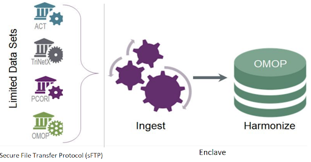
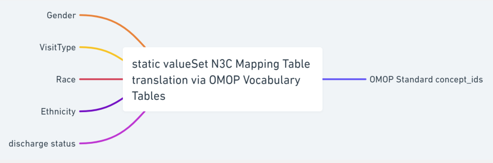
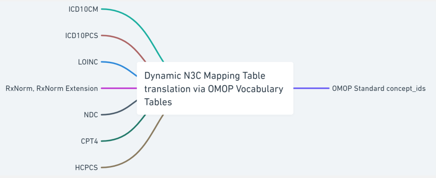
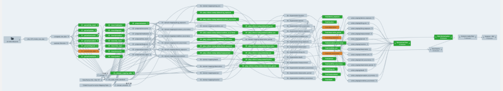
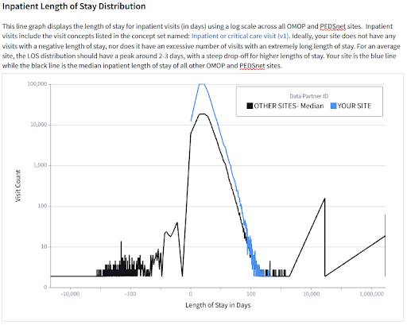

---
author:
  - name: Stephanie S. Hong
    affiliation: Johns Hopkins School of Medicine, Department of General Internal Medicine, Biomedical Informatics and Data Science Section
    affiliation-url: http://dhsi.med.jhmi.edu/index.php
    email: shong59@jh.edu
    orcid: 0000-0002-0795-1293
    attributes:
      corresponding: true

  - name: Bryan Laraway
    affiliation: University of Colorado - Anschutz Medical Campus
    affiliation-url: https://medschool.cuanschutz.edu/dbmi
    email: bryan.laraway@cuanschutz.edu
    orcid: 0000-0002-0450-7074

  - name: Xiaohan Tanner Zhang
    affiliation: Johns Hopkins School of Medicine, Department of General Internal Medicine, Biomedical Informatics and Data Science Section
    affiliation-url: http://dhsi.med.jhmi.edu/index.php
    email: xzhan161@jhmi.edu
    orcid: 0000-0002-4843-9077

  - name: Maya Choudhury
    affiliation: Palantir Technologies
    affiliation-url: https://www.linkedin.com/in/maya-choudhury
    email: mchoudhury@palantir.com
    orcid: 0000-0001-5654-8997

  - name: Sofia Z. Dard
    affiliation: University of North Carolina School of Medicine, NC Translational and Clinical Sciences Institute
    affiliation-url: https://tracs.unc.edu/index.php/services/informatics-and-data-science
    email: sdard@live.unc.edu
    orcid: 0000-0002-0286-2515

csl: ../assets/csl/apa-7e.csl
---

# Data Life Cycle - From Patients to N3C Researchers {#sec-cycle}

**Chapter Leads:** Stephanie Hong, Bryan Laraway

## Introduction {#sec-cycle-intro}

This chapter introduces the National COVID Cohort Collaborative (N3C) data ingestion and harmonization pipeline and explains the technical and research requirements for the central data repository.
N3C is a centralized data repository and accessible Real World Data (RWD) dataset that facilitates COVID-19 research.
The COVID-19 pandemic has taken the lives of over 6.8 million people worldwide^[See <https://covid19.who.int/>] and more than 1.1 million in the United States^[See <https://covid.cdc.gov/covid-data-tracker/#datatracker-home>].

N3C is the largest national, publicly available HIPAA-limited dataset in US history, and its innovative data-governance and public-government partnership have made broad sensitive clinical data sharing possible to support COVID-19 research.
To date, N3C brings together over 23 billion clinical records from over 18 million patients from 75 medical institutions.
It represents a major achievement in overcoming legal, regulatory, and technical barriers to become the largest and first national, publicly available HIPAA-limited data set.

The N3C has galvanized sharing of data, methods, and artifacts; reproducibility and transparency; and attribution for all types of contributors.
Furthermore, N3C connects to other patient data repositories through Patient Privacy Preserving Record Linkage (PPRL) and integrates with environmental, social, mortality evidence, viral variant genomic datasets, and CMS (Centers for Medicare & Medicaid Services) datasets to create a holistic view of the patient's healthcare journey.
The availability of this data has catalyzed over 300+ institutions involving 3,800+ researchers.

### N3C Overall Cohort Definition {#sec-cycle-intro-cohort}

Each COVID-positive patient is matched to roughly two control cohort patients.
N3C defines _control cohort_ as a patient with one or more non-positive COVID labs.

A N3C COVID-19 patient is defined
^[The exact LOINC, SNOMED-CT, and ICD-10CM codes are enumerated in this
[N3C wiki](https://github.com/National-COVID-Cohort-Collaborative/Phenotype_Data_Acquisition/wiki/Latest-Phenotype)]
as a person with:

* one or more COVID-19 positive lab results,

  _or_
* one or more strong positive diagnosis codes,

  _or_
* two or more "weak positive" diagnosis codes during the same encounter
  or on the same date on or prior to May 1, 2020 without age or demographic restrictions.

The N3C cohort uses Jan 1, 2020 as the encounter start date.
We recommend that an analyst manages control cohorts independently of the N3C controls.
Each study may have criteria that are very specific to the research question
and the control cohort decision may be different for each research project
and N3C control cohort may not be representative to meet the standards of each research group.

Please see more advice in the "Articulate Research Question" section of the
[Best Practices](https://national-covid-cohort-collaborative.github.io/guide-to-n3c-v1/chapters/practices.md) chapter.

## Overview {#sec-cycle-overview}

Disparate data sources from over 75 data partners are ingested, harmonized and merged together to create a central electronic health record (EHR) data repository.
Manual curation of 2,000 mappings was scaled into a fully automated data pipeline that includes common data model (CDM) schema checks, data conformance checks, correction for missing COVID test measurement codes and data expectation checks within the data ingestion and harmonization process.
Each data partner's ingested data is merged to create a central data repository, which allows for consistent and efficient data quality reviews.

Beyond well-recognized data quality issues, we discovered heuristics relating to each CDM conformance, demographics, COVID tests and associated results, conditions, encounters, measurements, observations, coding completeness, and fitness for use.
The results of the data quality issues were communicated back to the participating sites and the sites improved their data quality after feedback.
Furthermore, the N3C central data repository, referred to as the N3C Data Enclave or Enclave, is able to infer missing measurement units as well as correct invalid units of measure for certain laboratory test results through unit inference algorithms.
Unified Code for Units of Measure is used to harmonize the measurement units.

The N3C's central data repository also supports the N3C's data integrity, security, accessibility, and governance objectives.
The contributing sites submit data in one of four CDM formats through SSH File Transfer Protocol (sFTP) to the secure cloud platform in a compressed data file zip format.
The zip file structure must conform to a predefined payload structure for efficient processing.
The zip file is then transferred to the Enclave.
All access to the sFTP site is audited and monitored.
It is Federal Risk and Authorization Management Program (FedRAMP) compliant.
As data is transferred into the Enclave for processing, the governance team receives secure messages regarding this process for audit purposes.
Once the data is transferred to the Enclave the automated pipeline is triggered to process the data through the data ingestion and harmonization pipeline.

{#fig-cycle-010-pipeline fig-alt="Data Pipeline"}

### N3C Data Ingestion Pipeline Workflow {#sec-cycle-overview-ingestion}

The contributing sites regularly run scripts written by the N3C Phenotype Workstream to extract COVID and control group patients' data.
Data encoded in four different CDMs (i.e., OMOP, PCORnet, ACT, and TriNetX) from over 232 medical institutions are harmonized to the target Observational Medical Outcomes Partnership (OMOP) CDM with ~50,000 transforms and constituent mappings recorded with full provenance.

The N3C Data ingestion pipeline consists of the following five categories of steps:

1. Native source CDM conformance check after unzipping the payload.
  This ensures that the submitted data adheres to the source CDM specification.
1. Correction of COVID-19 laboratory tests with missing LOINC codes.
  The COVID-19 TestNorm utility [@dong_2020] is used to rescue COVID lab tests with missing LOINC codes.
1. Source data terminology translation.
   The terminology translation step involves standardizing the terminology used in the data so that they are consistent across data sources, and includes conversion of terms used in the source dataset to those used in the target data model.
1. OMOP CDM conformance check which structures and organizes the data into common domains using common terminology.
1. Data quality check where the source data terminology is converted to OMOP concepts using the OMOP concept relationships to ensure that the data is consistent and accurate across the domain.

{#fig-cycle-015-workflow fig-alt="Pipeline Workflow"}

Source terminology is largely classified into two groups; a defined series of valued sets permissible within each source CDM and a varied dynamic list of codes and respective code systems that exist in the source CDM, e.g., UCUM, LOINC, HCPCS, ICD10CM, ICD10PCS, CPT4 and RxNorm.
We created a shareable set of crosswalk mappings that are used to convert the value sets, such as gender and race concept sets, from all source CDMs to OMOP concepts along with associated OMOP domain mapping information.
Code map service is used to generate site-specific dynamic lists of terminology crosswalk mapping tables to accurately map the source terminology into OMOP concept ids.
The OMOP relationship table is referenced to identify the codes or terms found in the source data with standard OMOP concept ids.
This terminology translation is a critical component of the data ingestion process as it allows the data from different sources with varying terminology to be used together, enabling more consistent, comprehensive and accurate analyses and insights.
The following sections will describe the data ingestion steps in more detail.

### Validate Receipt of the Data {#sec-cycle-overview-validate}

Sites that are contributing data to N3C are required to include a manifest file with every submitted data payload that contains metadata describing the submitted dataset.
This manifest file includes detailed information about the submitted dataset, such as the local CDM name, site name, run date, information on date shifting that the site may perform prior to submission, the site's contact information, and the OMOP vocabulary version number used at the site if the site uses the OMOP CDM.
In addition to submitting the zipped data files, sites must also provide the expected row counts of the submitted datasets.
The row count information is used as part of a handshake protocol for the pipeline to confirm the correct receipt of the datasets sent by the participating site.
If the parsed data counts in the Enclave do not match the data counts sent by the site, then an issue is generated for follow-up by the data triage team.
This metadata helps to ensure that the submitted datasets are properly parsed through the automated ingestion pipeline and can be used effectively by N3C researchers.

### Check Conformance with the Source Common Data Model {#sec-cycle-overview-conformance}

The N3C data conformance check is an important process that is used to verify the quality and consistency of incoming datasets.
This process ensures that the data meets the source CDM constraints and is formatted and structured correctly according to the CDM version specification set by the CDM model.
During the data conformance check, the data files are parsed and any empty strings are replaced with null values.
The columns are also cast to the expected data types as defined by the CDM model specifications.

There are several types of checks that are included in the data conformance process, such as the presence of required tables and primary key checks.
Table checks are used to ensure that all of the required tables (such as demographics, patient_dimension, and patient) are present in the dataset.
Primary key checks verify that there are no null values or duplicates in the primary key fields, which helps to ensure the integrity and reliability of the data.
For example, if the primary key field contains duplicates, the build will fail as a result of a failed data health check, and an issue is logged for the triage team to contact the site with reference to the source data that raised the error.
The integrity of the foreign key reference is also checked and the row is excluded and removed from the ingestion pipeline.

Certain data health checks will fail the build and prevent the data from getting reviewed for release.
By performing native CDM conformance checks, N3C can ensure that data is fully prepared to be ingested by the next step in the data pipeline.

### COVID Lab Correction {#sec-cycle-overview-lab}

Among different types of clinical data ingested into N3C, COVID-19 diagnostic testings are extremely important for research analyses, as they are the primary means to identify the confirmed COVID-19 cases.
To address the urgency of the pandemic, individual institutions have created local names and local codes for those new COVID-19 testings in their EHRs.
Meanwhile, LOINC, a widely used international standard for lab tests, has responded quickly by developing a new set of standard codes for COVID-19 testings to guide standard coding of COVID-19 testings in clinical settings.
The Enclave repository contains a supplementary data mapping table to map COVID-19 lab measurement data with missing LOINC codes.

The [COVID-19 TestNorm](https://clamp.uth.edu/covid/loinc.php) tool developed at UT Houston was used to initially prepare the mapping table.
This tool is available as an open-source package for developers and as an online Web application for end users.
In addition to the curated mapping table, missing LOINC codes for COVID-19 test measurement data are carefully reviewed by the Data Ingestion & Harmonization (DI&H) team.
This correction process is based on the source lab test names submitted in the data and is carried out using a strict string-matching approach.
The new mapping entries are manually reviewed by vocabulary experts and clinicians to ensure their accuracy.

### Source Data Vocabulary / Terminology Translation {#sec-cycle-overview-vocabulary}

The incoming data sets submitted by contributing sites use collections of vocabulary codes to describe the managed concept collections from which to draw value set content.
Each CDM defines a list of codes / vocabulary that are native to its CDM and internally unique to represent a concept.
The CDM-defined static sets of common data elements (CDE) do not change from payload to payload and are uniform across different sites and data payloads.

Technically, terminology, vocabulary, and code system are not synonyms, but the community often uses these phrases interchangeably.
The incoming data sets use well-defined terminology to encode clinical meanings in the data.
For example, the International Classification of Diseases, 10th Revision, Clinical Modification (ICD-10-CM) is used for diagnoses which have complex ideas that include multiple, nuanced sub-elements.
SNOMED CT is also used to encode clinical diagnoses which have internal hierarchies built upon increasing specificity (IS-A) and may also include relationships among the concepts (e.g., caused-by or finding-site).
Logical Observation Identifiers Names and Codes (LOINC) are used to represent laboratory tests.
ICD-10-PCS, HCPCS, and CPT4 codes are used for procedures.
CVX codes are used for vaccines and RxNorm codes are used to specify the medications prescribed and administered.
The string text used to indicate the code system categories are not uniform across the CDM models and some are case sensitive, i.e., "RxNorm" vs. "RXNORM".^[See <https://mmshub.cms.gov/sites/default/files/Codes-Code-Systems-Value-Sets.pdf>.]

All of the coded data found in the submitted payload are collected and translated into OMOP concept ids using the OMOP vocabulary, concept and concept relationship tables.
Two categories of crosswalk mapping tables are generated to perform the translation; a static list of common data elements that are specific to CDM tables and a dynamic list of codes/code systems that can contain a varied list of values from payload to payload.

Static crosswalk common data element mappings are based on permissible values for a given column within a CDM table and they are well defined by the CDM specifications.
CDE are uniform across different sites and data payloads.
These CDE mappings include categories such as race, ethnicity, and gender.
CDM-specific CDE values are reviewed and the corresponding list of OMOP concept ids is identified to create a crosswalk mapping table that can be used in the vocabulary transformation step in the pipeline.
The curated crosswalk mapping table is available in the [N3C GitHub repository](https://github.com/National-COVID-Cohort-Collaborative/Data-Ingestion-and-Harmonization/tree/master/pipeline_logic/reference_tables).

{#fig-cycle-020-mapping-static fig-alt="Pipeline Workflow"}

Dynamic crosswalk mapping tables, on the other hand, are created during the transformation process in the pipeline based on the existence of codes that are found in the sites' submitted payload.
These mappings are created for each data payload to maximize the efficiency of the transformation process.
For example some sites only submit a handful of distinct COVID-19 lab tests and would only need a short list of entries in the mapping table for the laboratory tests.
The code used to generate the crosswalk mapping table is also available in the [N3C GitHub repository](https://github.com/National-COVID-Cohort-Collaborative/Data-Ingestion-and-Harmonization/tree/master/pipeline_logic).

{#fig-cycle-030-mapping-dynamic fig-alt="Dynamic N3C Mapping Table"}

### OMOP domain mapping {#sec-cycle-overview-domain}

The OMOP CDM is person-centric.
OMOP organizes the patient's temporal EHR records in multiple domains; condition, procedure, drug, device, and measurement.
OMOP domain mapping is the process of aligning data from different sources to the OMOP framework, using OMOP standard terminology and concepts, and ensuring that the data are populated in the correct OMOP domain table.
This process is important because it helps to ensure that the data are consistent and can be easily understood and analyzed.
By mapping data to the OMOP framework, researchers and analysts are able to compare and combine data from different sources, enabling more comprehensive and accurate insights into healthcare outcomes and trends.

OMOP domain mapping typically involves the creation of mapping tables that translate the source code from different CDM data sources to the OMOP standard concept terminology and concept ids used in the OMOP vocabulary framework.
The OMOP vocabulary dictates which source code should be placed in which target domain after it is translated into OMOP concepts.
This vocabulary transformation using the OMOP concept relationships arranges the data into a well-organized and consistent format that can be easily analyzed and queried.

### N3C Global ID generation for all primary key fields {#sec-cycle-overview-globalid}

The incoming data sets submitted to N3C may or may not include their own primary keys.
For those tables that do not include a primary key, one is generated such that each row of incoming data can be uniquely identifiable.
Furthermore, in order to ensure the integrity and reliability of the data at scale, N3C automatically generates new unique IDs for all of the primary key fields as one of the steps in the data transformation pipeline.
The data partner's id is encoded in the key generation step to minimize primary key conflicts.
For those rare occasions where primary key conflicts do occur, they are resolved by the primary key conflict resolution step in the transformation pipeline.
This ensures that all of the primary keys are unique, even when data from multiple sites are combined and released as a whole.
In addition, the data provenance is preserved so that the newly generated key can be traced back to the originating site's row of data.
The automated N3C DI&H pipeline is able to handle large volumes of data efficiently and effectively and ensures the quality and reliability of the data for research and analysis.

### Sensitive Information Screening {#sec-cycle-overview-sensitive}

The N3C works with domain experts to screen sensitive information to protect patient privacy.
N3C datasets are cleaned again in the pipeline before the data is released.
The pipeline contains a process to remove any possible privacy-breaching data.
This process includes tribal zip code truncation and Agency for Healthcare Research and Quality (AHRQ) code removal.

Tribal zip code truncation is a process that is used to protect the privacy of individuals who live on tribal lands in the United States.
In order to protect the privacy of these individuals, all zip codes that represent a region where the majority of residents are American Indian (AI) or Alaska Native (AN) have been truncated to three digits.
This announcement can be found in the [N3C Training Area](https://unite.nih.gov/workspace/notepad/view-read-only/ri.notepad.main.notepad.8cef6f46-aac3-48ca-ae16-5b0acb5b597e) .

Furthermore, data is scanned to remove any "Never Events" codes that may be left in the submitted data.
The term "Never Events" was first introduced in 2001 by Ken Kizer, MD, former CEO of the National Quality Forum (NQF), in reference to particularly shocking medical errors --such as wrong-site surgery --that should never occur.
AHRQ codes are "Never Events" that are used by AHRQ to identify specific healthcare treatments, procedures, and diagnoses in data sets.
"Never Events" consists of 29 "serious reportable events" grouped into the following seven categories:

1. _Surgical or procedural events_, such as surgery or other invasive procedure performed on the wrong body part.
1. _Product or device events_, such as patient death or serious injury associated with the use of contaminated drugs, devices, or biologics provided by the health care setting.
1. _Patient protection events_, such as patient death or serious disability associated with patient elopement (disappearance).
1. _Care management events_, such as patient death or serious injury associated with a medication error.
1. _Environmental events_, such as patient or staff death or serious disability associated with an electric shock in the course of a patient care process in a health care setting.
1. _Radiologic events_, such as death or serious injury of a patient or staff associated with introduction of a metallic object into the MRI area.
1. _Criminal events_, such as any instance of care ordered by or provided by someone impersonating a physician, nurse, pharmacist, or other licensed health care provider or abduction of a patient/resident of any age.

By removing AHRQ codes indicating data elements deemed to contain or represent sensitive information, it becomes more difficult to identify specific individuals and their healthcare treatments, procedures, and diagnoses.
The N3C has a list of AHRQ codes to screen out sensitive items, and these records have been removed from the datasets before the weekly releases.
More detailed information about the list of the serious Never Events can be found [here](https://www.qualityforum.org/Topics/SREs/List_of_SREs.aspx).
Note that different healthcare organizations may classify incidents in different ways.

## N3C Data Harmonization Workflow {#sec-cycle-workflow}

Data harmonization is an essential step in the process of analyzing and understanding COVID-19 patient data, as it helps to bring data from different sources into a consistent format and structure.
With the unprecedented amount of data being collected during the pandemic, it is especially important to ensure that this data is accurate, reliable, and comparable.
N3C data is harmonized using the OHDSI standardized vocabularies and the clinical data is organized into OMOP CDM structures, which enables standardized analytics that leverage the OHDSI knowledge base when constructing exposure and outcome phenotypes and features within cohort characterization.
Using common data standards and organizing data in common data structures allows researchers and analysts to gain a rapid comprehensive understanding of the health impact of the SARS-CoV-2 pandemic, and to use this information to inform decision-making and policy development.

In addition, unit harmonization is performed to rescue possibly unusable data where measurement units are missing.
With over 11 billion rows of measurement data within N3C, the DI&H pipeline was built to maximize the usefulness of this valuable resource for researchers and analysts through the unit inference and harmonization pipeline step.
Rows of patient data that are missing measurement units as well as rows of data that contain invalid laboratory measurement units undergo unit inference to rescue otherwise unusable rows of data.

### Unit Harmonization {#sec-cycle-harmonization-unit}

N3C has compiled one of the largest secure collections of clinical health data with over 23 billion rows of patient data from over 18 million patients spread across 75 data partners, including over 11 billion rows of laboratory measurement data, all harmonized in the OMOP CDM.
In order to facilitate COVID-19 research, N3C has grouped ontologically similar OMOP measurement concepts together for 53 measured concept categories and developed a unit-harmonization pipeline to ensure that the data is consistent and comparable.
Unit inference is performed in the following cases; cases where the measurement units are missing or in cases where the units are provided by the site and valid for the given lab, but the value distribution indicates that it is the wrong unit.

The massive amounts of measurement data in N3C enable the process of correcting units via inference based on the distribution of the existing data values for the same laboratory results.
Furthermore, the same measurement data in different units are also converted to use the canonical units using the unit conversion table.

This unit-harmonization pipeline consists of several steps:

1. Select a canonical unit for each measurement variable.
1. Develop a formula for converting data values to this canonical unit.
1. Obtain a clinical review of each formula.
1. Apply the formula to convert data values in each unit into the target canonical unit.
1. Remove any rows containing harmonized values that fall outside of accepted value ranges for the measurement.

For data with missing units for all the results within a lab test for a particular data partner, N3C compares the values to pooled values from all data partners using the Kolmogorov-Smirnov test.

{#fig-cycle-040-conversion fig-alt="Unit conversion example for degree Fahrenheit to degree Celsius"}

In order to help sites locally leverage the centralized information on measurement units from N3C, a useful unit harmonization and inference tool is published in the N3C GitHub repository.
For more details please refer to the [UHI-tool-for-sites page](https://github.com/National-COVID-Cohort-Collaborative/Data-Ingestion-and-Harmonization/tree/master/pipeline_logic/v2/unit-harmonization-and-inference/UHI-tool-for-sites).

### Data Quality Checks {#sec-cycle-harmonization-dqc}

The N3C Data Enclave performs two types of data quality checks: automated data health checks during the ingestion phase, and manual data quality assessment checks with the help of the Data Quality Portal tool after the data ingestion pipeline steps are complete.

#### Automated Data Health Checks {#sec-cycle-harmonization-dqc-automated}

{#fig-cycle-050-checks-1 fig-alt="A visual representation of the many ingestion and harmonization steps"}

When the data ingestion pipeline is deployed for a new site, it includes a set of automated data health checks.
The DI&H pipeline is run every time a data payload is submitted to N3C, and if the new data doesn't meet the desired data health expectations, the pipeline automatically logs an issue and the pipeline administrators are immediately notified.
The logged issues are triaged by the DI&H team, and if the issue requires communication with the site to correct, a site buddy is assigned to review the issue details for communication with the site to aid in correcting the site data that raised the data expectation failure.

{#fig-cycle-055-checks-2 fig-alt="Data Health Checks 2"}

{#fig-cycle-060-checks-3 fig-alt="Data Health Checks 3"}

Within N3C, template technology is utilized to deploy the data ingestion pipeline.
The CDM-specific DI&H pipeline is deployed for a new site using the same data ingestion template written for each source CDM.
Once deployed the data checks run automatically and are tracked within the Enclave.
The data pipeline is refreshed within roughly 30 minutes whenever source data is updated at the sFTP site.
The data ingestion pipeline templates are utilized to ingest over 75 data partners' data.
The ingested data that pass the data quality checks are available to be merged to the limited dataset (LDS) where they then become available to the research community.

#### Manual Data Quality Checks through Data Quality Portal {#sec-cycle-harmonization-dqc-manual}

The N3C Data Quality Portal (DQP) is a comprehensive tool and interface developed by the N3C Data Ingestion and Harmonization workstream to review the quality of the transformed data once the data ingestion pipeline is finished but prior to final data release to the N3C research community.
The DQP is only accessible to the ingestion and harmonization team.
It covers all aspects of data quality across different OMOP domain tables.

{#fig-cycle-070-dqp-1 fig-alt="Data Quality Portal"}

The figure above shows a screenshot of the Data Quality Portal (showing the checks for the measurement domain).

The N3C DQP is based on the OHDSI OMOP Data Quality Dashboard (DQD), which provides a range of features and tools for identifying and addressing data quality issues.
Through queries implemented in the N3C DQP, we are able to quickly assess after every new data build each site's number of  COVID-19 tests and their results, demographic counts by gender, race and ethnicity, counts of visit types, counts and percentages of non-standard concepts found in each domain, implausible death and birth dates, and visits with negative duration.

The DQP is used to determine the coding completeness of the site's data and its overall fitness for use by the research community and whether further data improvement is required before the data can be released for research.
The combination of both automated and continual assessment of manual data quality checks through DQP enables the scale and rigor required for the N3C research community.
In addition to the capabilities provided by the DQD, the N3C DQP includes a set of COVID-19-specific data quality checks that focus on the coding of COVID-19 labs, patient encounters, and other data relevant to the SARS-CoV-2 pandemic.
These checks help to ensure that the data is accurate, reliable, consistent, and support more comprehensive and informed analysis of the data.

{#fig-cycle-075-dqp-2 fig-alt="DQP"}

One unique feature of the DQP is the ability to check distributions and patterns across different sites, which can help to identify and fix any abnormal patterns or anomalies in the data.
This is particularly important for the N3C centralized data repository, as it enables the team to quickly identify and correct the data issues.

### Site Scorecard {#sec-cycle-harmonization-scorecard}

The DI&H team has created site feedback reports called scorecards that could not only be sent to all sites but could also be used by the DI&H team in conjunction with the DQP to monitor and maintain optimal data quality for research across the Enclave.
The scorecards were developed for sites by utilizing the DQP as a starting point for the development of analyses.
Figures and tables were created using Palantir's Contour application to provide indicators of site data quality, and to give sites greater visibility into their data.

{#fig-cycle-078-scorecard-1 fig-alt="Site Scorecard 1"}

Site scorecards provide reports to all sites that are released in the Enclave.
These reports are sent on a biweekly cadence, via the sFTP outgoing folder.
They are created in an automated fashion and based on the latest data available for the site in the Enclave.

Each site receives two scorecards: a site-specific report and a site-comparison report.
The _site-specific_ scorecard provides data quality information specific to the site's latest payload.
The _site-comparison_ scorecard provides useful context via comparisons between the site and other anonymized sites on various metrics.
Sites submitting data in the OMOP or PEDSnet CDM receive scorecards with comparisons to other OMOP sites, while sites submitting data in ACT, TriNetX, or PCORnet CDM receive scorecards with comparisons to sites with these non-OMOP data models.

Scorecards focus on several data quality areas including demographics, COVID-19 metrics, visits/encounters, measurements/labs, non-plausible dates such as dates in the distant past or future, use of non-standard concepts, and N3C-specific data enhancements such as social determinants of health and oxygen supplementation device data.
Sites are also provided with contact information should they have further questions about their scorecard or need help troubleshooting data discrepancies.

{#fig-cycle-079-scorecard-2 fig-alt="Site Scorecard 2"}

The scorecards allow sites to be directly involved in the data quality improvement process by highlighting areas for targeted improvement in their local source data, which would ultimately result in data quality improvements in their N3C payloads.
Additionally, the scorecards allow the DI&H team to monitor and maintain data quality across subsequent N3C data submissions and prevent any regression on those metrics.
If the scorecards reveal that a released site is no longer passing key data quality metrics, then the site is unreleased until they are able to remediate their data quality issues.

## N3C Data Releases {#sec-cycle-releases}

### De-Identification and release to LDS (L3) {#sec-cycle-releases-lds}

The N3C Data Enclave hosts patient data at multiple levels of patient data completeness

with corresponding levels of restricted access.
The most complete data set available within the  Enclave is the limited data set (LDS), which is a type of dataset that has had certain protected health information (PHI) removed or de-identified in accordance with the Health Insurance Portability and Accountability Act (HIPAA).
However, some data elements, such as dates (date of birth/death, admission, discharge, service, etc.), location data (city, state, five-digit zip code), and age are still available.

The DI&H workstream meets bi-weekly to review potential data quality issues found in site data submissions.
Based on various data quality metrics of the submitted data from each site, the "release" or "no release" status flag is set for each data partner.
Based on this release status flag, the pipeline determines whether or not to merge the site's payload data to the LDS.
The dimension of data quality checks includes internal and external validations, data conformance, and completeness that are based on the OHDSI data quality framework [@pfaff_2022b].

Generate SafeHarbor DataSets (L2)

A Safe Harbor dataset is a type of limited data set (LDS) that has had certain identifying information removed or de-identified using the Safe Harbor method.
The SafeHarbor dataset (L2) is generated by applying the following list of procedures to LDS (L3):

* The zip code is truncated to the first 3 digits.
* All patient-level date and datetime fields are shifted by keeping two sets of random &plusmn;180 numbers.
  One number is used to shift the time part and the other number is used to shift the date part. (Please note that a number of sites do pre-shift the date fields prior to submitting the data to N3C.
  The data partners who pre-shift the date field can be identified by the maxDateShift column of the manifest table.)
* After creating the randomized date/time shifting numbers for a patient new to the Enclave, the patient-level date shift is stored for each subsequent payload, such that the same number is used for the patient from the patient's initial data load and every data load thereafter.
* Times are shifted &plusmn;180 minutes from the actual time.
  All times are shifted by a consistent base time shift for all patients.
  However, an additional secret fuzz factor is applied to each time shift by an additional &plusmn;30 minutes and/or seconds, and this secret fuzz factor is patient-specific.
* The date part is shifted &plusmn;180 days after the time shift is performed, as the time shift can cause the date to rollover to the next or previous date.

For more details on generation of the SafeHarbor dataset, please refer to the [GitHub page.](https://github.com/National-COVID-Cohort-Collaborative/Data-Ingestion-and-Harmonization/wiki/Safe-Harbor-Requirement)

## N3C Data Enhancements {#sec-cycle-enhancements}

As part of N3C's efforts to support COVID-19 and long COVID research, N3C requested sites that are able to add new data elements to their common data models (CDMs).
These data elements help to create a more comprehensive and rich dataset that can support more in-depth and informative analyses of the SARS-CoV-2 pandemic.
By adding these data elements, sites can contribute to the collective knowledge about COVID-19 and help to inform the development of effective treatments, policies, and strategies to address the pandemic.
N3C is committed to working closely with participating sites to ensure that the data collection process is efficient and straightforward and that the data is accurately and reliably captured and integrated into the N3C dataset.

{#fig-cycle-080-enhancements fig-alt="Data Enhancements"}

### Long COVID Clinics {#sec-cycle-enhancements-long}

While many patients recover from COVID-19 within a few weeks or months, a significant proportion of patients continue to experience ongoing symptoms, such as fatigue, shortness of breath, and mental health problems, for months or even years after the initial infection.
This phenomenon, known as long COVID, can have a significant impact on a patient's quality of life and ability to function normally.

By collecting data from long COVID clinics, researchers and healthcare providers can better understand the prevalence, severity, and course of long COVID, as well as the risk factors and protective factors that may influence the likelihood and severity of long COVID.

Long COVID clinic data is collected in the N3C Data Enclave.
For more details, please refer to this [GitHub page](https://github.com/National-COVID-Cohort-Collaborative/Phenotype_Data_Acquisition/wiki/New-Data-Element:-Long-COVID-Clinic).

### ADT Transactions {#sec-cycle-enhancements-adt}

ADT transactions (also known as Admission, Discharge, and Transfer transactions) encompass any event, transition, or change in a patient's location, department, level of service, or accommodation that would be recorded in a Health System's Admission, Discharge, and Transfer hospital information system.
ADT Transactions are recorded when a patient presents to a health care system, and are tracked during a patient's stay until departure.
This information is used to update patient records, track patients' movements within the facility, and support other administrative and clinical functions.

Though specifics vary by the data model, the following apply to all sites completing the ADT transaction data enhancement.

* ADT transaction data does not require changes to the visit occurrence/encounter tables.
* ADT transaction data must be mapped to one of three designated codes to represent ICU, Emergency Department, and all other inpatient transactions.
* Sites should include raw/source values in the appropriate fields in their CDM.
  These fields will be used for validation and harmonization purposes and will not be exposed to end users in the N3C Data Enclave.
* If the site has observation visits captured in ADT transaction data, the related transactions do not need to be included in the data submitted to N3C.
  Should the site choose to include them, an appropriate code, other than the three chosen for N3C's ADT data, should be chosen.

The data is stored in the VISIT_DETAIL table in the Enclave.
For more information, please refer to this [GitHub page](https://github.com/National-COVID-Cohort-Collaborative/Phenotype_Data_Acquisition/wiki/New-Data-Element:-ADT-Transactions).

### NLP {#sec-cycle-enhancements-nlp}

Whether they are clinical notes, radiology notes, or some other note type, notes that are present in EHR systems potentially contain a wealth of patient information that may not be present in standardized or structured fields.
Although there may be some structured data elements present in these notes that are actionable within the EHR, most of the note information will be free-text that must be processed in order to fit in a structured data model like OMOP.
In order to process the note data, it is necessary to use Natural Language Processing (NLP) techniques.
Once processed, the data is available to researchers in the OMOP NOTE_NLP table.

For more details about the N3C NLP data, including the NLP submission process and GitHub repository containing tools for processing notes, please refer to this [GitHub page](https://github.com/National-COVID-Cohort-Collaborative/Phenotype_Data_Acquisition/wiki/NLP-Submission-Process).

### O2 Supplement Devices {#sec-cycle-enhancements-oxygen}

O2 device data is critical for N3C research, as a significant number of hospitalized COVID-19 patients have required oxygen supplementation and/or ventilation support using O2 devices or ventilators.
However, the current common data model (CDM) does not capture oxygen supplementation with sufficient granularity, which can limit the usefulness of the data for research purposes.

To address this issue, N3C is working to improve the data on oxygen supplementation and ventilation support in the CDM, including by collecting more detailed data on the types and modes of O2 delivery and ventilation support that patients receive.
This will help to provide a more comprehensive and nuanced understanding of the role of oxygen supplementation and ventilation support in the care of hospitalized COVID-19 patients.

For more details about the N3C O2 Device data please refer to this [GitHub page](https://github.com/National-COVID-Cohort-Collaborative/Phenotype_Data_Acquisition/wiki/New-Data-Element:-O2-Device-(Tier-1)).

### Social Determinants of Health {#sec-cycle-enhancements-sdoh}

Social Determinants of Health (SDOH) refer to the social, economic, and environmental factors that can impact an individual's health and well-being.
These factors can include things like income and education level, housing and transportation, and access to healthcare and other resources.
While N3C has made available several external datasets containing SDOH data that can be incorporated into a research project ([See the Public/External Datasets section of the Understanding The Data chapter](https://docs.google.com/document/d/1cgQItN3dYY3HJDTkYz0YgOgaK5FDU1lGDSFdeE8Cc8s/edit#heading=h.olgqg22wdn4y)), N3C has also requested that data partners that routinely collect SDOH data provide that data as part of their data submissions, if they are able.

For more details about the N3C SDOH data please refer to this [GitHub page](https://github.com/National-COVID-Cohort-Collaborative/Phenotype_Data_Acquisition/wiki/New-Data-Element:-Social-Determinants-of-Health).

### PPRL {#sec-cycle-enhancements-pprl}

Additional datasets beyond those submitted by N3C clinical data partners are available within N3C and linked through Privacy Preserving Record Linkage (PPRL).
More information about PPRL and the datasets available through this linkage can be found in the [Understanding The Data chapter](https://docs.google.com/document/d/1cgQItN3dYY3HJDTkYz0YgOgaK5FDU1lGDSFdeE8Cc8s/edit#heading=h.ter2k3zf5e9).

### CMS {#sec-cycle-enhancements-cms}

The Enclave is a continuously refreshed data resource following the Observational Medical Outcomes Partnership (OMOP) Common Data Model.
However a patient's data from the EHR may be missing data from the patient's healthcare journey outside of hospital settings.
The missing portion of health care received by the patient may include visits to the pharmacy, visits to the outpatient clinic as well as the non-hospital institutional care facilities.
It may also be missing telehealth visits and the purchasing of equipment or devices to be used at home.
Often data from these outside-of-hospital visit settings are not captured via the EHR.
Using PPRL technology, we linked N3C patients with CMS patients and supplemented N3C EHR information using a comprehensive CMS claims dataset.
For the PPRL-linked patients we provide additional datasets that can be referenced to render a more holistic view of the patient's healthcare journey.
This work is currently ongoing.
The approach and methods to construct the claims data with encounters will be updated soon.
The CMS data is used to complement and augment the N3C OMOP datasets.

Additional details on the CMS datasets can be found in the [Understanding The Data chapter](https://docs.google.com/document/d/1cgQItN3dYY3HJDTkYz0YgOgaK5FDU1lGDSFdeE8Cc8s/edit#heading=h.ter2k3zf5e9).

::: {.callout-note appearance="simple"}

## Additional Chapter Details

This chapter was first published May 2023.
If you have suggested modifications or additions, please see [How to Contribute](../index.qmd#sec-welcome-contribute) on the book's initial page.
:::
