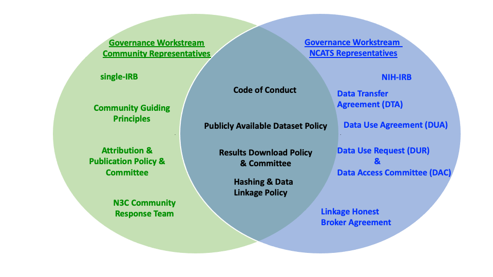
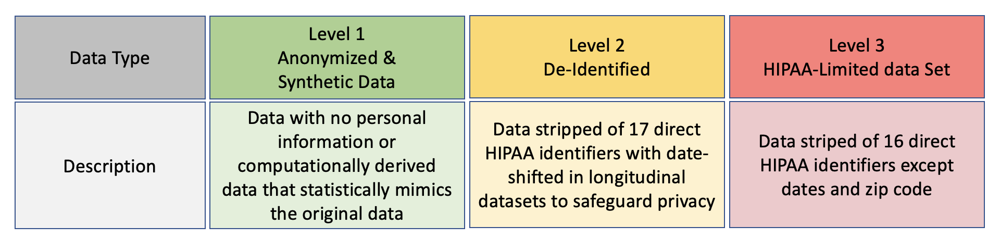

---
author:
  - name: Christine Suver
    affiliation: Sage Bionetworks
    affiliation-url: https://sagebionetworks.org/
    email: christine.suver@sagebase.org
    orcid: 0000-0002-2986-385X
    attributes:
      corresponding: true

  - name: Johanna Loomba
    affiliation: University of Virginia, integrated Translational Health Research Institute of Virginia
    affiliation-url: https://www.ithriv.org/directory
    email: jjl4d@uvahealth.org
    orcid: 0000-0003-3673-5423

filters:
   - lightbox

lightbox: auto
---

# Governance, Leadership, and Operations Structures {#sec-governance}

## Preamble {#sec-governance-preamble}

N3C is more than simply a data enclave. It is a research community dedicated to facilitating collaborations and the rapid generation and dissemination of knowledge to help combat COVID-19. There were numerous innovations along the pathway to N3C. The novel governance procedures and structures described here may benefit other collaborative research efforts beyond the pandemic emergency response.

## N3C Leadership {#sec-governance-leadership}

N3C is a public-private-government partnership among the Clinical and Translational Science Awards (CTSA) Program hubs supported by the National Center for Advancing Translational Sciences (NCATS) as the overall data steward; the National Center for Data to Health (CD2H); the Institutional Development Award Networks for Clinical and Translational Research (IdeA-CTR); data contributing organizations (e.g., public health Health Information Exchanges, hospitals/health systems, academic medicine, and clinical research); distributed clinical data networks (PCORnet, OHDSI, Act, TriNetX); multiple commercial partners; and a large community of researchers.

Four [co-leads](https://covid.cd2h.org/team) (two from the researcher community and two from NCATS) developed the vision for N3C and led its implementation with extensive community consultation. Their vision was to bridge the traditional siloes of biomedical research to rapidly enable team science while respecting the rights of data subjects, institutions, and researchers. To accomplish this at record speed, the N3C leadership established five community [workstreams](https://covid.cd2h.org/n3c)^[Five Community workstreams were rapidly organized: Data Partnership & Governance, Phenotype & Data Acquisition, Data Ingestion & Harmonization, Collaborative Analytics, and Synthetic Data.] focusing on specific N3C components. The workstreams are supported by dedicated administrative staff, with virtual workspaces and communication channels (Slack) to share materials and reduce barriers to participation. The workstreams meet regularly, and meetings are open to anyone interested in participating or monitoring activities. Early on, the N3C conducted [general webinars](https://www.youtube.com/watch?v=O8dZAl9nSds&list=PLE4bNBEGV4OW6UBwCaJzurbQNFhz48TKn&index=7OW6UBwCaJzurbQNFhz48TKn) and Questions and Answers sessions to inform potential partners and created a Welcome Partnership Packet to help initiate participation.

## Establishing a collaborative governance culture- The Partnership and Governance Workstream {#sec-governance-culture}

Achieving the goals of a shared data resource involves deciding how the resource may be produced, operated, used, and sustained. Critical considerations for establishing a data sharing governance framework include:

* Developing a data-sharing strategy (i.e., deciding what data will be shared and whether sharing will be bilateral or multilateral, whether the data will be centralized or distributed /decentralized),
* Understanding the legal, regulatory and organizational compliance requirements and establishing the data sharing agreements (i.e. identifying potential restrictions on data sharing and use due to laws, regulations or ancillary agreements, and understanding party's legitimate interests)
* Selecting the technical environment where sharing will occur (i.e. selecting the technical infrastructure and the security measures to be implemented to protect data integrity, assessing risks and managing data access)
* Preparing the data for sharing, retention and disposition (i.e. optimizing data usability, selecting data processing methods and adopting FAIR principles)
* Monitoring data sharing (i.e. establishing a monitoring and reporting plan, enforcing policies and procedures, and resolving disputes)

[The Data Partnership and Governance Workstream](https://covid.cd2h.org/N3C_governance) established by the N3C PIs with participation from NCATS and the scientific and ethics community, is responsible for (1) establishing and refining the principles, policies, and procedures to support N3C, (2) determining the roles and functions to support the governance strategy, and (3) making recommendations to NIH for their implementation. The workstream convenes representatives of contributing organizations, researchers, and institutions that support them, NCATS, ethicists, and anyone interested in advancing N3C.

At the start, the Partnership and Governance workstream met twice weekly to rapidly align on an N3C governance vision and establish the universal conditions governing the use of N3C data. These conditions are that data protection is adopted by default, contributing sites are not identified, and workspaces must be provisioned on a per-project basis only for COVID-19-related research. Also, data cannot be extracted or downloaded from the data enclave, with the exception of publishable summary results or figures, each of which must be reviewed prior to export (see @sec-publishing for details on this process).

The workstream split into a smaller subgroup to draft the supporting governance documents while continuing to meet with the whole Workstream for ideation, context, and feedback weekly. Onward, the workstream adjusted the frequency of the meetings to the work cadence.

### N3C Governance Bridges Individual Oversight Responsibilities {#sec-governance-bridges}

The N3C Governance is a set of behavioral norms, policies, and procedures supported by technology/security measures and oversight mechanisms. The N3C Governance structure relies on a variety of collaborative approaches, from hierarchical to consultative to consensus-based. The Data Partnership and Governance Workstream advocates a partnership approach that builds on collective competencies where governance aligns with community values, and final sign-off is obtained according to leadership roles and responsibilities. This governance approach values input from stakeholders and helps develop a shared understanding while recognizing the different risks and obligations of the scientific community and NCATS. Governance policies are posted on Zenodo to promote transparency and elicit community feedback. This also provides a resource for other researchers facing similar governance needs.

The N3C Governance framework was developed with guidance from the NIH Office of the General Counsel. As data steward, NCATS has fiduciary responsibility for the data enclave and adjudicating access. NCATS is responsible for establishing the terms for data contribution and use, user training requirements, and enclave usage accountability mechanisms. Participating in N3C necessitates both organization-level agreement(s) and user commitments.

The scientific community representatives in the Participation and Governance Workstream, set the behavioral and ethical expectations and norms, including the [Community Guiding Principles](https://zenodo.org/record/3979610#.Y27mtOzMKUA) to support collaborative research and the [Attribution and Publication Policy](https://zenodo.org/record/4741279#.Y27mh-zMKUA) to clarify the acknowledgment and authorship expectations for disseminating N3C-enabled research.  The [Community Guiding Principles](https://zenodo.org/record/3979610#.Y6InH-zMKwp) include a Diversity and Inclusion statement highlighting the commitment to create a safe and welcoming environment for all participants to N3C. It also has an Ethics statement highlighting the community's core values. The scientific community takes a holistic approach to enforce the Community Guiding Principles. A Community Response Team follows a conflict resolution process emphasizing dialog and mutual respect to adjudicate complaints and solve disagreements.

Seven principles summarize the Community Guiding Principles:

1. **Partnership**: N3C community members are trusted partners committed to honoring the N3C community guiding principles and Code of Conduct
1. **Inclusivity**: N3C is open to any organization that wishes to contribute data, code, and ideas, as well as anyone who registers to use N3C data to conduct COVID-19 related research, including citizen/community scientists
1. **Transparency**: Open processes and reproducible research is the hallmark of N3C and good scientific practice. Access to data is project-based and focused on COVID-19 research questions. Descriptions of projects are posted publicly and are searchable to promote collaborations.
1. **Reciprocity**: Contributions are acknowledged and results from analyses, including provenance and attribution, are expected to be shared with the N3C community.
1. **Accountability**: N3C community members take responsibility for their activities and hold each other accountable for achieving the N3C objectives and acting through good scientific practices.
1. **Security**: All activities are conducted in a secure, controlled access cloud-based environment and are recorded for auditing and attribution purposes.
1. **Mutual respect**: Communications should be professional, concise, clear, and relevant. Follow proper communication etiquette articulated below. Avoid excessive conflict, unprofessional arguments, ad hominem attacks, and/or ridicule over chat and in messaging.

{#fig-01-shared fig-alt="N3C shared Governance initiatives with sign-off responsibility represented"}

## Ethical oversight {#sec-governance-ethics}

The ethical oversight of N3C is two-fold. First, the IRB at John Hopkins University (JHU's IRB) approved the N3C protocol and methodologies employed to create N3C data resources. Institutions must obtain relevant authorizations, including applicable IRB approvals or waivers, before contributing data to N3C. Institutions can select their own IRB or rely on JHU's IRB as the Central IRB for N3C. Relying institutions must use the [SMART-IRB online reliance system](https://smartirb.org/reliance/) and execute a Master Reliance Agreement to delegate IRB oversight to JHU's IRB for their contribution to N3C. While it is not necessary to use JHU's IRB, the reliance process is simple and efficient, and relying on a single IRB reduces the burden associated with contributing data and speeds up IRB review.

Second, NCATS obtained IRB approval for the Data Enclave from the NIH IRB since NIH houses the Enclave under NCATS oversight. NCATS also received a Certificate of Confidentiality to resist legal requests to disclose identifying information from the people represented in N3C data.

## Contractual Agreements: Separating Data Transfer and Data Use {#sec-governance-contractual}

The N3C Community contributed to the two types of contractual agreements: ones that delineate data contribution (or data transfer) and others that define data access (or data use) conditions. Both types of agreements clarify confidentiality, intellectual property, warranties and liabilities, conflict resolution, and expiration or termination. The data transfer and use agreements are intentionally separated since contributing data is not required to be eligible to access the data. All contractual agreements are made between NCATS and signing officials from home institutions

An N3C [Data Transfer Agreement](https://ncats.nih.gov/files/NCATS_Data_Transfer_Agreement_508.pdf) (DTA) must be executed between NCATS and a contributing organization before they can submit health record data.

N3C leaders saw the value of enhancing the N3C research capability and developing the governance to enable [privacy-preserving record linkage](https://covid.cd2h.org/PPRL) (PPRL) between N3C data and other data sources. PPRL enables linking records across multiple datasets without revealing the identity of the data subject. Organizations willing to participate in this data linkage pilot must execute a separate [Linkage Honest Data Broker Agreement](https://ncats.nih.gov/files/NCATS_LHBA-508.pdf)(LHBA) with NCATS and the Linkage Honest Broker. Again, separating the DTA and LHBA provides the flexibility to contribute data without enrolling in the PPRL.

A separate [Data Use Agreement](https://ncats.nih.gov/files/NCATS_N3C_Data_Use_Agreement.pdf) (DUA) must be executed between NCATS and signing officials from an institution whose investigators wish to access N3C data. To improve efficiency, instead of executing a traditional pair-wise agreement each time a researcher needs access to N3C, a single DUA is executed between NCATS and an organization to render individual researchers eligible to request access to N3C content.

### Data Access by Researchers {#sec-governance-access}

First-time users wishing to access N3C must verify that their institution has executed a DUA with NCATS. Then users must register an account with N3C, including agreeing to the Community Guiding Principles (described below) and complete a designated [NIH Information Security and Information Management TrainingNIH data management and security training](https://irtsectraining.nih.gov/FYR/00_005.aspx). Only then can users submit a Data Use Request (DUR). NCATS established a Data Access Committee (DAC) responsible for reviewing and approving DURs and addressing user questions. Users must submit a new DUR for every separate study. (See @sec-onboarding and @sec-data-access for details.)

There are three levels of data access commensurate with the sensitivity of the data. See @sec-data-access for more details about these levels.

{#fig-02-tiers fig-alt="Data Tiers"}

Access to each data level requires approval from the Data Access Committee. In addition, investigators requesting access to level 3 data must submit proof of IRB approval from their institution or an independent accredited IRB for their intended use. Note that PPRL data is only available by special request in level 3 projects with appropriate additional IRB approval.

N3C governance includes considerations for protecting special populations and communities and respect for tribal sovereignty. N3C contains no Tribal affiliation. Using ZIP code information to make assumptions about Tribal affiliation is not valid or appropriate.

{#fig-03-process fig-alt="Data Access Governance Process. To lower the burden on participation, user authentication and eligibility are established once during account registration. Eligible users can then submit their Data Use Request for evaluation by the Data Access Committee. A new request must be submitted for each specific project."}

## Incident Notification and Escalation procedure {#sec-governance-incident}

It is essential to create an Incident Notification Policy to ensure that the right people are notified about incidents at the right time and that problems can be addressed rapidly.  Incidents include interpersonal interactions or disputes, suspected terms/policies violations, technical issues such as systems interruption or process delays, a potential data breach, and attribution or publication situations. For each incident type, an escalation path clarifies the first line of response and any further process or action for escalating it based on severity.

Users can report interpersonal conflicts to the “Report Conduct Concerns” page on the website. All concerns reported are taken seriously and handled with discretion. A Community Response Team of 2-3 individuals nominated by the community follows a conflict resolution process to help parties solve disagreements in good faith with constructive dialog and escalate to NIH if relevant.
