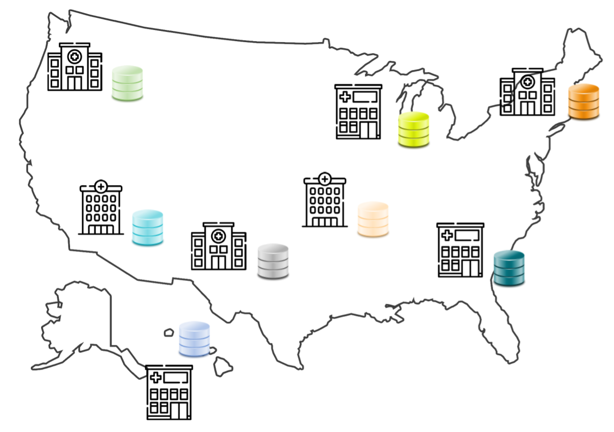
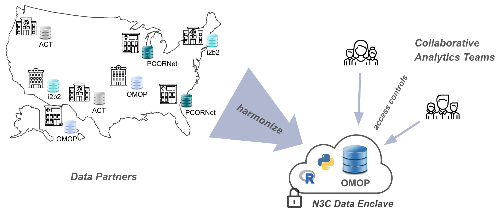

---
author:
  - name: Karen Crowley
    affiliation: Brown University
    affiliation-url: https://bcbi.brown.edu/
    email: karen_crowley@brown.edu
    orcid: 0000-0002-1995-6358
    attributes:
      corresponding: true

  - name: Shawn O'Neil
    affiliation: University of Colorado Anschutz
    affiliation-url: https://oneilsh.github.io/
    email: shawn@tislab.org
    orcid: 0000-0001-6220-7080

csl: ../assets/csl/apa-7e.csl
---

# Introduction {#sec-intro}

**Chapter Leads**: Karen Crowley, Shawn O'Neil

## Mission {#sec-intro-mission}

The National COVID Cohort Collaborative, or N3C, is an open-science community stewarded by the National Center for Data To Health (CD2H) and the NIH National Center for Advancing Translational Sciences (NCATS), with significant contributions from many partners including the Clinical and Translational Science Awards (CTSA) program, Centers for Translational Research (CTRs), and thousands of researchers from hundreds of participating institutions in the US and abroad.

Faced with the COVID-19 pandemic, the issue addressed by N3C is clear and direct:
the US has no centralized data repository for health records and related information,
hindering the response of the scientific community.^[These
articles provide good overviews of N3C and the surrounding landscape:
[It took a pandemic, but the US finally has (some) centralized medical data](https://www.technologyreview.com/2021/06/21/1026590/us-covid-database-n3c-nih-privacy/)
(MIT Technology Review), and
[The ambitious effort to piece together America's fragmented health data](https://www.theverge.com/2020/10/19/21522863/health-data-records-covid-coronavirus-model-nih-privacy-n3c)
(The Verge)]
Although healthcare providers are mandated by law to utilize electronic health records (EHR), little guidance coordinates how or exactly what information to collect and store.
Commercial data-collection suites (e.g., Epic) are widely used in clinical settings, and controlled vocabularies (e.g., ICD10 and SNOMED) provide standards for representing medical information, but there are many such standards in use and software is highly configurable to the needs of individual organizations.
As a result, databases of EHR information across the US are largely non-interoperable, presenting challenges to researchers hoping to use this vast national store of information in practice.

## Common Data Models and N3C  {#sec-intro-cdm}

In recent years, the common solution to these issues has been the creation of _Common Data Models_ (CDMs).
A Common Data Model is an agreed-upon structure and format for databases containing clinical information, into which diverse organizational EHR databases can be standardized for research purposes.
Even so, healthcare organizations are reluctant to share their data directly, because the risks associated with data breaches for protected health information (PHI) defined by Health Information Portability and Accountability Act (HIPAA) are high.
As a result, several groups of healthcare and research organizations have formed _federated_ research networks, where each organization in a network translates some subset of its data into an agreed-upon common data model, and affiliated researchers can then write queries intended for data in that format.
Examples of such federated networks include PCORNet, i2b2, and OHDSI, each of which utilizes their own common data model.
In a federated model, data queries are generated by researchers, but executed locally by the data owners and only summarized or specifically requested results are sent back to researchers.
This ensures protection for the patient data (which never leaves the boundaries of any individual organization), but prevents exploratory data investigation and other techniques (like many machine-learning methods) which require direct access to the totality of the data.

{#fig-intro-010-siloed fig-alt="A visual representation of disparate, non-compatible EHR databases across the United States"}

Driven by the imperative of addressing COVID-19, in concert with the use of a FedRAMP-certified cloud-based analysis ecosystem we call the N3C Data Enclave,^[The Federal Risk and Authorization Management Program (FedRAMP) is a rigorous, standardized certification program with an emphasis on security and information protection.
The Enclave is an installation of Palantir Technologies' Foundry platform, a FedRAMP-certified data analytics suite.] N3C is partnering with EHR data providers across the nation to collect billions of EHR data points for millions of patients with and without COVID-19 in a single, secure, accessible database for research use.
In this centralized model, researchers have direct access to the entirety of the data to support complex analyses including AI and other machine learning techniques.
N3C simultaneously moderates controlled access to these data by research teams from across the country (and beyond), including private companies, community colleges, universities, medical schools, and government entities.
While data cannot be exported from the N3C Data Enclave, published results can be after an export review (see @sec-publishing).

Like federated research networks, N3C also uses a common data model, known as OMOP, chosen for its strong community support and open nature, support of scientific use cases, and availability of tools for translating and working with data (@sec-understanding and @sec-tools discuss OMOP in more detail).^[OMOP was originally developed by its namesake, the Observational Medical Outcomes Partnership, but is now stewarded by the Observational Health Data Sciences and Informatics (OHDSI, pronounced "odyssey") program, an international group of researchers and clinicians.
For complete information about OHDSI and OMOP, see the [Book of OHDSI](https://ohdsi.github.io/TheBookOfOhdsi/).] To rapidly collect data from around the country, N3C leverages the existing work data owners have already done to convert their organization-unique data to one of a handful of N3C-supported "source" common data models: PCORNet, i2b2, TriNetX, ACT, and OMOP.
A potential data partner with data in PCORNet format, for example, will locally run a set of N3C-generated "PCORNet to OMOP" translation scripts prior to transferring the result to N3C via a secure channel.
The process of coalescing multiple such data payloads into a unified whole is known as _harmonization_, and is a complex task even after everything has been mapped to OMOP initially.
Two overlapping teams of EHR data experts participate in this process: one works closely with data partners to make it as easy as possible to contribute data to N3C, and another handles the post-ingestion harmonization and comprehensive quality checks of the incoming data.

## The N3C Data Enclave and Data Access {#sec-intro-enclave}

Once harmonized and stored in the secure "N3C Data Enclave", the data are made available via a web-based interface to research teams using common tools such as SQL, Python, and R, as well as a number of code-light graphical user interfaces.

{#fig-intro-intro-harmonized fig-alt="A visual representation of N3C's data harmonization from source-CDM model, and team-based access to these data in a secure cloud-based Enclave"}

Mere access to the Enclave, however, doesn't automatically provide access to any of the protected data itself (although we do make other, publicly-available datasets available with minimal restriction for practice and learning purposes).
Multiple "levels" of the data are available with different anonymization techniques applied, facilitating "just enough" access to research teams depending on their needs and ability to access protected health information.
Accessing data will full patient zip codes, for example, requires obtaining approval from an Institutional Review Board (IRB) which validates the appropriateness of human subjects research, while access to de-identified data with truncated zip codes requires only having completed Human Subject Research Protection training at your local institution.

Because effective analysis of EHR data requires a diverse set of skills-especially clinical and data science/statistical expertise-N3C provides organizational structures and resources to rapidly create and support multidisciplinary research teams, many of which are geographically diverse as well.
As of February 2023, dozens of these "[Domain Teams](onboarding.md#sec-onboarding-dt)" have supported over 400 research projects, contributed to by over 3,300 researchers hailing from 350+ different institutions and organizations.
Over seventy data partners provide EHR data for 17 million patients (a third of whom have had COVID-19), representing 10.5 billion lab results, 3.5 billion medication records, 2 billion clinical observations, and 1 billion clinical visits.
For up-to-date information on these numbers and more, visit our dashboard at <https://covid.cd2h.org/dashboard>.

{#fig-intro-030-summary-stats fig-alt="Summary statistics for N3C patients as of Aug, 2022. Confirmed COVID-19 patients are those with a known positive PCR or Antigen lab test, possible patients are those with likely symptomatology"}

## Where to Go Next {#sec-intro-next}

### For Researchers {#sec-intro-next-researchers}

So, why should you get involved with N3C? First and foremost, N3C provides an opportunity to participate in impactful team science.
Investigators with expertise in multiple domains come together across organizational boundaries to understand and address the impact of COVID-19 across the United States.
Dozens of N3C-supported publications span the gamut of research:
@pfaff_2022a applied machine-learning methods to understand important predictive factors for Long-COVID, and
@sharafeldin_2021 identified demographic and clinical factors contributing to mortality risk in cancer patients.
@mehta_2021 studied the use of hydroxychloroquine, remdesivir, and dexamethasone over time at multiple sites, revealing how treatment guidelines evolve in response to updated information over time.
@sun_2022 studied breakthrough infections after vaccination,
@yang_2021 evaluated COVID-19 outcomes in HIV patients,
@reese_2023 clustered patients to reveal sub-types of Long-COVID, and
@anzalone_2023 found higher hospitalization and mortality in rural communities.
These are but a small sample of work produced by researchers participating in N3C.

This range of work is only possible by the diversity of interests and expertise researchers bring.
Practicing clinicians, biostatisticians, machine-learning researchers, and others collaborate on projects inside the secure N3C Data Enclave.
N3C supports team science in a variety of ways.
Domain Teams, for example, serve to connect groups with similar interests for peer support, research coordination, and collaboration building.
While most Domain Teams are clinically oriented (e.g., the Pregnancy Domain Team), others are more general (e.g., the Machine Learning Domain Team). @sec-onboarding covers Domain Teams in more detail.
N3C provides a number of training and support venues, including regular office hours, training modules, and of course this book.
See @sec-support for more information on these topics.

Of course, N3C brings significant value as one of the largest databases of de-identified patient records in the US, covering drug prescriptions, conditions, procedures, and more, each associated with a corresponding visit and other information.
Data are extensively quality-checked and harmonized for consistency with the OMOP common data model (see @sec-cycle), which supports sophisticated filtering and querying (Chapters [-@sec-understanding] and [-@sec-tools]).
Other data are available as well, including publicly-available datasets (e.g., from the US Census) and, for some patients, additional mortality, viral variant, or billing data from non-EHR sources (@sec-cycle).

Big data is of little value without powerful analysis tools.
Fortunately, N3C's Enclave supports analyses with SQL, Python, and R, including thousands of popular libraries for the latter two.
Backed by the high-performance distributed-computing framework Apache Spark, researchers can include billions of rows of data in a single analysis.
Graphical tools are also available for those without coding expertise, and the N3C community generates reusable code and datasets to pave the way for others.
All of these tools are cloud-hosted, so researchers only need to bring a web browser.
For information on these topics, see @sec-tools.

Finally, N3C has worked hard to make these resources secure _and_ accessible.
Enclave access requires coverage by a Data Use Agreement, which hundreds of institutions across the US and beyond have signed on behalf of all their employees and students.
Data itself is accessed via a guided Data Use Request form in the Enclave, and researchers can invite others to their projects at any time.
See Chapters [-@sec-onboarding] and [-@sec-access] for details.

### For Institutions {#sec-intro-next-institutions}

There are two primary ways that institutions can participate in N3C: (1) by signing an institutional Data Use Agreement; and (2) by contributing data.

Signing an institutional Data Use Agreement provides Enclave access to all employees and students at your institution.
Hundreds of institutions have done so, connecting their research community to a vast network of data, tools, and expertise.
For more information about Data Use Agreements, see @sec-onboarding-dua.

Institutions that contribute data to N3C gain more than recognition-contributing sites get early access to new features and pilot programs.
More importantly, N3C provides data partners feedback on their data quality.
While contributing sites implement their own data quality checks, N3C has discovered a number of issues that are only apparent in an environment with multiple organizations' data [@pfaff_2022b].

Finally, N3C's governance structures may be of interest to other organizations embarking on large-scale, team-science efforts. @sec-governance introduces these perspectives.

Regardless of how you think your institution can work with N3C, getting started is as simple as reaching out-either by contacting [N3C leadership](https://covid.cd2h.org/team), submitting a ticket to our Enclave-external help desk, or just stopping by office hours.
More information on these latter two options may be found in @sec-support.

::: {.callout-note appearance="simple"}

## Additional Chapter Details

This chapter was first published May 2023.
If you have suggested modifications or additions, please see [How to Contribute](../index.qmd#sec-welcome-contribute) on the book's initial page.
:::
