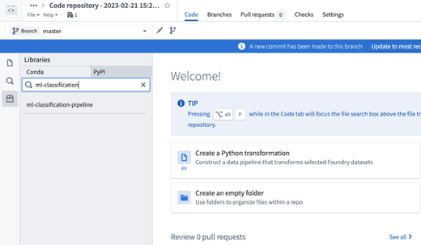
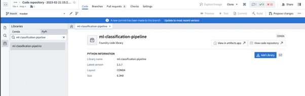
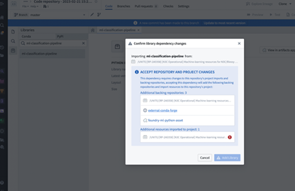

---
author:
  - name: Peter Robinson
    affiliation: The Jackson Laboratory
    affiliation-url: https://robinsongroup.github.io/
    # email: Peter.Robinson@jax.org
    # orcid:
    attributes:
      corresponding: true

  - name: Justin Reese
    affiliation: Lawrence Berkeley National Lab
    affiliation-url: https://www.lbl.gov/
    # email: justaddcoffee@gmail.com
    # orcid:

csl: ../assets/csl/apa-7e.csl
---

# Machine Learning {#sec-ml}

**Chapter Leads:** Peter Robinson, Justin Reese, Blessy Antony, T.M. Murali, Elena Casiraghi, Hannah Blau

## Introduction {#sec-ml-introduction}

Machine learning (ML) is a method of teaching computers to learn a classification or regression function from data, or detect patterns (e.g., clusters) in data, without explicitly programming the model. Machine learning is a powerful tool for solving complex problems, and it is widely used in biomedicine and many other fields.

For biomedical applications, two main types of ML algorithms are generally used: supervised and unsupervised. In supervised learning, the labels (i.e., true classifications) for the input data used to train the model (e.g. which patients have a disease of interest, or develop an outcome of interest) are known. The goal of supervised learning is to learn a mapping function that can accurately predict the label for new, unseen input examples. A practical example of classification is reported in one of the first publications by the [ML Domain Team](onboarding.md#dt), in which the aim was to classify COVID-patients based on their prognosis [-@casiraghi_2020].

In unsupervised ML, models are trained on input data without labels. In this case, the algorithm aims to discover structure within the data in order to facilitate the assignment of labels. One of the most widely known unsupervised ML techniques is clustering, which aims at partitioning the input cases into classes, where each class corresponds to similar cases according to a similarity/dissimilarity metric. In the clinical/medical field, clustering is often used to identify subtypes of a disease of interest. A practical example of clustering was also recently published by our ML group on the identification of long-COVID subtypes [-@reese_2023].

The intention of this chapter is to demonstrate how to perform ML in N3C by walking the reader through a specific ML use case with working code.

## Good Algorithmic Practice (GAP) {#sec-ml-gap}

Knowledge of GAP is crucial to the successful application of machine learning to biomedical data. We intend to demonstrate GAP in this chapter by example. A full discussion of this is beyond the scope of this document, but a partial list of important considerations, with references for further reading, is as follows:

-   **Generalizability** - models trained on one set of data often do not perform well on data originating from other places (e.g. other hospital systems) or other times (e.g. in a different period of time in the COVID pandemic) [-@roberts_2021]. Since the goal of supervised machine learning is to develop generalizable algorithms that perform well on completely unseen (i.e., independent) test data, practitioners must be familiar with various techniques and considerations that mitigate the risk of failure to generalize (i.e., model overfitting) in the appropriate context, such as regularization, dimensionality reduction, feature extraction, cross-validation, and use of a model type that is appropriate given the amount of available data (e.g., deep learning algorithms may require relatively large training sets) [-@chollet_2021, @geron_2022]. The machine learning practitioner should thoroughly understand the potential trade-off between under-fitting and overfitting a predictive model [-@hastie_2009]. In addition, N3C data is not a random sample, and it worth familiarizing yourself with the data as described in Chapters [-@sec-understanding] and [-@sec-cycle].
-   **Social bias** - scientific literature abounds with ML models and results that contain bias with respect to factors such as gender, ethnicity, and race. It is critical to realize that the choice of data or ML model may reinforce harmful bias in scientific literature [-@roberts_2021]. This can happen even if you do not intend to introduce such a bias.
-   **Data Considerations**
    -   **Site-Level Heterogeneity** - N3C contains data from a large number of different hospital/healthcare systems (identified by the variable `data_parter_id` in the N3C `person` table) with several distinct common data models (ACT, OMOP, PCORNET, TRINETX). Features can vary wildly between data partners due to factors such as differing data models, patient populations, coding practices, and ETL code required for harmonization of data. This can negsatively affect ML models, for example by limiting generalizability of models that depend on features that differ between sites [-@fu_2020]. It is thus helpful to understand the N3C data ingestion and harmonization processes described in Chapter [-@sec-cycle].
    -   **Missingness** - Your data will likely have missingness, sometimes quite often. How you deal with this can greatly affect your ML results. [-@mitra_2023] See also Casiraghi, et al.[-@casiraghi_2023] for a detailed description of missingness specifically in N3C, and strategies for dealing with it, such as imputation. Ultimately, how you deal with missingness is subject to how reasonable your assumptions are concerning relationships between observed data and desired-yet-missing information, assumptions best guided by engaging with subject matter experts familiar with the data relationships at hand (see below).
    -   **Features for ML:** In the example use case we describe here, we will leverage the N3C Logic Liaison COVID-19 Diagnosed or Lab Confirmed Patients fact table as a source of features. If this table does not contain the data you need for your ML task, you can explore other available datasets or use the Logic Liaison templates to construct additional derived variables, or create your own custom derived variables. Appropriate data pre-processing, feature selection and/or feature engineering is a crucial step in the machine learning process. Depending upon the type of algorithm, data may also need to be normalized [-@muhammad_2014] to reduce the risk of excessive influence of features in certain classifiers. See [-@sahner_2020]
-   **Engaging with subject matter experts:** Your ML project will greatly benefit from subject matter experts to guide your experimental design and to help interpret your results. If you are performing ML on data from people with, for example, diabetes, you should engage at least one clinical diabetes expert with whom you can collaborate. One of the strengths of N3C is the large and diverse community of scientists, and it is likely that there is an expert in almost any field of interest who can help. Subject matter experts can provide important help in feature selection, assessments of windows for variables, choice of feature transformations and interaction terms in a model, and definition of model performance goals (sensitivity versus specificity trade-off). N3C [Domain Teams](#onboarding-domain-teams) are an excellent source of such expertise, as many are organized around clinical topics such as Diabetes, Kidney Injury, Pregnancy, and many more.
-   **Explainability:** Of great interest to practitioners is the explainability of machine learning models, as deep learning tools that rely upon progressive abstractions of data in hidden layers may seem like “black boxes,” especially to those who are not versed in machine learning. Tools are available to help assess feature importance (e.g., SHAP values [-@lundburg_2018] [-@shapley_1953]
-   **Adequate Documentation:** Clearly annotated code, with explicit characterization of methodology and techniques that are employed, as well as descriptions of all key steps in a pipeline, including hyperparameter choice/search, appropriate train/test splits, etc., are critical to reproducibility of research. In addition, The N3C Enclave provides a feature called Protocol Pad which can explain exactly how a study was conducted in N3C.

## ML in N3C

Developing ML pipelines in the N3C platform is similar to developing code to solve other tasks, e.g. statistical analyses. The main challenges involve preparing the data to form cohorts, selecting features, and understanding how to develop your code.

### Languages and libraries available in N3C

ML in N3C is typically performed using Python or R. Pipelines are also sometimes mixed-language (R, Python, SQL, Java). Most major ML libraries in Python and R are already installed and additional libraries can be made available on a project-specific basis. The examples in this chapter will use Python. For long-running and memory-intensive machine learning jobs, pyspark provides the library [pyspark.ml](https://spark.apache.org/docs/2.2.0/api/python/pyspark.ml.html).

#### What you should know before reading this chapter:

-   Understanding of GAP (see GAP section above)
-   Basic proficiency in software development
-   Basic proficiency in Python (see [here](https://www.python.org/about/gettingstarted/) for some references on learning Python)
-   Basic knowledge of ML (see [here](https://www.oreilly.com/library/view/hands-on-machine-learning/9781098125967/) for a good reference)
-   Basic knowledge of EHR data, especially data that follows the OMOP common data model (see the [Book of OHDSI](https://ohdsi.github.io/TheBookOfOhdsi/) for a good reference)
-   Basic familiarity with code repositories (see [here](tools.md#sec-tools-apps-repo) for N3C documentation)
-   Basic familiarity with code workbooks (see [here](tools.md#sec-tools-apps-workbook) for N3C documentation)

### Example project

To demonstrate how to implement ML software in N3C, we will walk through a specific example: predicting cardiovascular sequelae (specifically, atrial fibrillation/flutter) from acute COVID.

#### Strategy

1.  **Create a reusable ML library package.** This library contains the implementations of standard machine learning classification algorithms such as logistic regression, naïve Bayes, random forest, support vector machine, and multi-layer perceptron. This package can be imported and used for any downstream classification applications.
2.  **Define cohort and features using the N3C Logic Liaison COVID-19 Diagnosed or Lab Confirmed Patients fact table** (see also the [“Introducing Enclave Analysis Tools”](tools.md) chapter.) This table provides many variables (including records for COVID-associated conditions such as diabetes or acute kidney injury by the timing of each: before, during and after acute COVID-19 infection) for each patient and is useful for ML tasks.
3.  **Choose one post-COVID indicator column as a label to predict.** Here we will predict cardiovascular sequelae following acute COVID. In this example, we will use ‘Atrial Fibrillation Flutter (AFF)’ post COVID-19 as an indicator for cardiovascular sequelae.
4.  **Predict this label using a single ML model.** We will use the random forest model from the ML library created in step 1 to predict AFF post COVID. One can use as an alternative any of the classification models available in the library.

#### Walkthrough:

We implemented the above strategy using code repositories. Code repositories greatly facilitate software development in the Enclave. Useful features include a debugger, a GitHub-like workflow (pull requests, branches, diffs, etc.) to coordinate among developers, and a convenient method to export code to GitHub. In addition, the process for specifying Python packages to be used is much more convenient, and (in the authors’ experience) code repositories are also more stable and less prone to runtime issues than code workbooks. Two notable limitations of code repositories should be noted:

1.  plots/visualization must be done separately in a code workbook (as in step 3 below) and
2.  the R language is not supported in code repositories as of July 2023, so performing statistical analyses with R packages also requires a code workbook.

For our walkthrough, we will be creating and using a Python library repository [ml-classification-pipeline Python library](https://github.com/National-COVID-Cohort-Collaborative/ml-classification-pipeline) and a data transform code repository that Blessy Antony (Virginia Tech, blessyantony\@vt.edu) developed to do machine learning in N3C.

Source code: [Github repo containing ml-classification-pipeline python library](https://github.com/National-COVID-Cohort-Collaborative/ml-classification-pipeline)

For the basics of creating a code repository and using its debugger, see \[the tools chapter\[(tools.html#sec-tools-apps-repo)

1.  Reusable ML library package

    a.  **Create a folder in a workspace** Go to your DUR workspace or “Practice Area - Public and Example Data” Left sidebar → Search → “Practice Area - Public and Example Data” → click on first hit → make a new folder  Figure 1: Create a folder in your workspace of choice (private DUR or public practice area) where all your code will be located.

    b.  **Creafte a Python library code repository to implement the ML algorithms** New → code repository → Python Library → initialize repository  Figure 2: Create a python library code repository that will contain all reusable code to be later used in other downstream code repositories.

    This repository provides two frameworks that implement logistic regression, random forest, support vector machine, and muli-layer perceptron - scikit-learn and pyspark.ml at ml-classification-pipeline/src/models/.

    c.  **Adding dependencies to code repository** See the N3C documentation on discovering and using Python libraries in code repositories.

    d.  **Implementation of classification algorithms** The scikit-learn and pyspark implementations have the following code organization -

    <!-- -->

    i)  **dataset_preprocessor.py** Methods to drop column(s) from the input dataset, split the dataset into training and test datasets based on a given ratio, sample the training and/or testing datasets to have approximately equal number of positive and negative samples (if required), standardize the datasets. The pyspark implementation contains an additional method to assemble the input into libsvm format.

    ii) **classification_model.py** The ClassificationModel class implements a classification pipeline. First, preprocess the dataset and compute training and testing datasets using the methods in dataset_preprocessor.py. Second, perform hyperparameter search and train classification models using k-fold cross validation. Third, evaluate the trained models on test datasets. Finally, perform multiple iterations of these three steps to generalize the results.

    iii) **classification algorithms** The logistic_regression.py, multi_layer_perceptron.py, random_forest.py, and svm.py files implement the respective classification algorithms with model instantiation and definition of the hyperparameter search. The classes defined in each of these files extend the ClassificationModel class defined in classification_model.py and leverage the pipeline implemented in the parent class.

2.  Post COVID cardiovascular sequelae prediction <!-- https://serial-comma.com/blog/posts/2020-09-13-hanging-paragraphs-in-markdown.html -->

    a.  **Create a Python transforms code repository** Go to the folder that you had created in step 1a and create a new python transforms code repository - New → code repository → Data transforms (Python) → initialize repository:  Figure 3: Create a python data transforms code repository for cardiovascular sequelae prediction that will use the library created in step 1.

    b.  **Define cohort and features using COVID patient facts table**\* Create a new transform called “aff_create_cohort.py” Left sidebar → select folder where you want to create the file → right click → New File → Enter filename → Select ‘Python Transformation (\*.py)’ from the drop down → Create  Figure 4: Create a new python transformation script file within a code repository. XXXX We’ve created a code repository, now we can create a transform to build a random forest model using the ml-classification-pipeline library (note that this library can also be used in code workbooks):

    c.  **Add the ml-classification-pipeline library** Sidebar -\> Libraries -\> search for ml-classification-pipeline  Figure 5: Search for a custom-created python library in the code repository.  Figure 6: Add a custom-created python library in the code repository. XXX Click “Add library”  Figure 7: Access error while adding custom-created libraries in code repositories. N3C support may be necessary to resolve this error XXX Go back to the ‘files’ tab on the left sidebar, and commit your changes.

    d.  **Implement a random forest model for the prediction task**

NOTE: The error message similar to the one below is sometimes encountered during this step:
