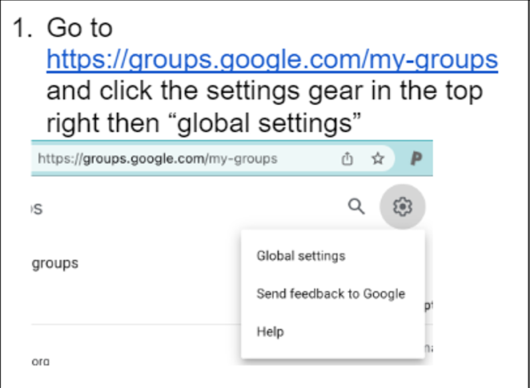
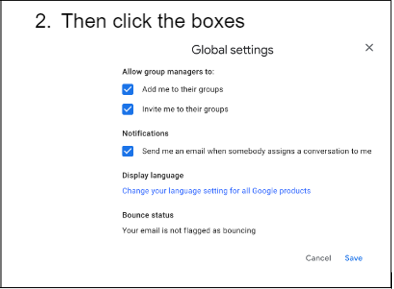
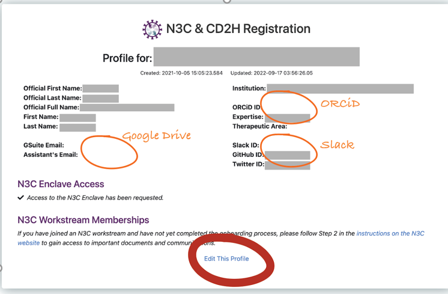
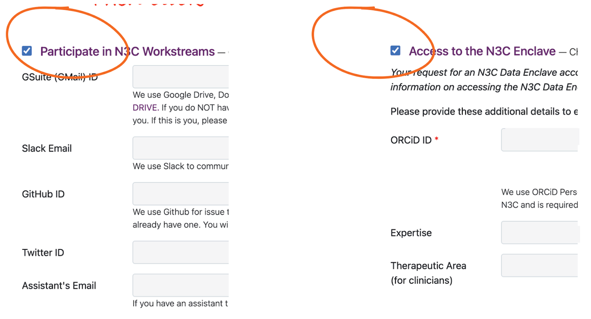

---
author:
  - name: Sharon Patrick
    affiliation: West Virginia Clinical and Translational Science Institute
    affiliation-url: https://www.wvctsi.org/
    email: patricks@hsc.wvu.edu
    orcid: 0000-0001-6535-2013
    attributes:
      corresponding: true

  - name: Jonathan Freixas Emery
    affiliation: University of Vermont
    affiliation-url: https://www.uvm.edu/biostatistics
    email: jonathan.f.emery@uvm.edu
    orcid: 0000-0002-3353-3570

  - name: Suzanne McCahan
    affiliation: Nemours Children's Health
    affiliation-url: https://www.nemours.org/pediatric-research/labservices/core/biomedical-research-informatics.html
    email: suzanne.mccahan@nemours.org
    orcid: 0000-0003-4459-0949

  - name: Mary Helen Mays
    affiliation: Hispanic Alliance for Clinical and Translational Research
    affiliation-url: https://alliance.rcm.upr.edu/cores/biomedical-informatics-core
    email: Mary.Mays@upr.edu
    orcid: 0000-0001-6624-2238

  - name: Julie A McMurry
    affiliation: University of Colorado, Anschutz Medical Campus
    affiliation-url: https://tislab.org/
    email: julie.mcmurry@cuanschutz.edu
    orcid: 0000-0002-9353-5498

csl: ../assets/csl/apa-7e.csl
---

# Onboarding, Enclave Access, N3C Team Science {#sec-onboarding}

**Chapter Leads**: Sharon Patrick, Suzanne McCahan, Jonathan Emery

:::{.callout-note}
This chapter is undergoing final edits, including formatting and cross-referencing.
Edits are expected to complete by June 2023.
:::

:::{.callout-note}
This chapter is being drafted in Google Docs at
<https://drive.google.com/drive/u/0/folders/1zOGR2rGGgr1lxP8mV5XmtkuxEZI_R7II>

See a draft of the chapter outline at
<https://docs.google.com/document/d/1ttUKgwVcIZHM87elrlUNV6Qi9thzOwKBg8GegKObEtg/>
:::

:::{.callout-warning}
At this point, any edits to this chapter should be made in Google Docs.
The current Markdown is for testing only.
It is NOT the source of truth (yet).
:::

The N3C has an extensive secure onboarding process due to the sensitivity of the data within the N3C Data Enclave.
There are several steps that need to be completed in order for a researcher or N3C user to gain access to the Enclave.

## Researcher Eligibility {#sec-onboarding-eligibility}

Citizen scientists, researchers from foreign institutions, and researchers from U.S.-based institutions are all eligible to have access to the N3C Data Enclave.
Everyone with an N3C Data Enclave account has access to the tools and public [datasets](https://covid.cd2h.org/external-datasets) that are available in the Enclave.

There are several levels of Electronic Health Record (EHR) data that are available within the N3C Data Enclave.
For more information about the levels of data, see section [Description of Levels 1, 2, 3] ( From 'Getting & Managing Data Access' chapter).

If an individual is not affiliated with an institution, they are termed a "citizen scientist".   Citizen scientists are only eligible to access synthetic data (Level 1).
This data set is artificial but statistically-comparable to, and computationally derived from, the original EHR data.

Researchers from institutions outside the U.S. are eligible to access synthetic data (Level 1) and patient data that has been deidentified by removal of protected health information (PHI) (Level 2).
Protected health information includes 18 elements defined by the Health Insurance Portability and Accountability Act (HIPAA). (A list of identifiers that the HIPAA Privacy Rule applies to is available on the U.S. Department of Health & Human Services website in the section '[The second is the "Safe Harbor" method](https://www.hhs.gov/hipaa/for-professionals/privacy/special-topics/de-identification/index.html)'.)

Researchers from U.S.-based institutions are eligible to access synthetic data (Level 1), deidentified patient data (Level 2), and patient data that includes dates of service and patient zip code (Level 3). (The Level 3 data set is referred to as a _limited_ dataset because it contains only 2 of the 18 PHI elements.) Table 1 describes the data access levels, eligibility, and access requirements.

### Data Level 3

* _Also known as_:
  * Limited Data Set (LDS)

* _Data Description_:
  Patient data that retain the following protected health information:
  * dates of service, and
  * patient ZIP code.

* _Eligible Users_:
  * Researchers from U.S.-based institutions.

* _Access Requirements_:
  * N3C registration
  * N3C Data Enclave account
  * Data Use Agreement (DUA) executed with NCATS
  * NIH IT training completion
  * Approved Data Use Request (DUR)
  * Human Subjects Research Protection training completion
  * Local Human Research Protection Program IRB determination letter

### Data Level 2

* _Also known as_:
  * De-identified Data Set

* _Data Description_:
  Patient data from the LDS with the following changes —
  * Dates of service are algorithmically shifted to protect patient privacy.
  * Patient ZIP codes are truncated to the first three digits or removed entirely if the ZIP code represents fewer than 20,000 individuals.

* _Eligible Users_:
  * Researchers from U.S.-based institutions
  * Researchers from foreign institutions

* _Access Requirements_:
  * N3C registration
  * N3C Data Enclave account
  * DUA executed with NCATS
  * NIH IT training completion
  * Approved DUR
  * Human Subjects Research Protection training completion

### Data Level 1

* _Also known as_:
  * Synthetic Data Set

* _Data Description_:
  Data that are computationally derived from the LDS that resemble patient information statistically but are not actual patient data.

* _Eligible Users_:
  * Researchers from U.S.-based institutions
  * Researchers from foreign institutions
  * Citizen scientists

* _Access Requirements_:
  * N3C registration
  * N3C Data Enclave account
  * DUA executed with NCATS
  * NIH IT training completion
  * Approved DUR

## Program Registration {#sec-onboarding-program}

Not everyone who registers to participate in N3C necessarily needs Enclave access; however, everyone who needs Enclave access also needs access to the Google Drive.
Access to the Google Drive is conferred through membership in a Google Group called [n3c-allhands@ctsa.io](mailto:n3c-allhands@ctsa.io).
You can onboard with your institutional address and add a Gmail as an alias for the purposes of document access.
Before you begin onboarding, be sure that your Google Groups settings (if you have them at all) are configured to allow others to add you to their groups:

First sign into your Google account of choice and go to <https://groups.google.com/my-groups> and click the settings gear in the top right then "global settings".

{#fig-onboarding-010-google-groups-setting-1 fig-alt="Open Global Settings in Google Groups"}

Then click the following boxes.

{#fig-onboarding-020-google-groups-setting-2 fig-alt="Modify Global Settings in Google Groups"}

## Enclave Registration

Due to the secure nature of the data that is available in the N3C Enclave, [registration](https://labs.cd2h.org/registration/)is required.
Your institution or organization will need to have a Data Use Agreement (DUA) on record with NCATS - see [Data Use Agreements](#data-use-agreements) below for details.
There are four options you can use to login and create an N3C Enclave account: InCommon, Login.gov, NIH login, or HHS login. (See the image below for a screenshot of the login menu.)

Most US universities participate in the InCommon authentication network; registering through this route enables you to use your existing Single Sign On to authenticate into the Enclave.
There is a link on the registration page that leads to a list of organizations that participate in InCommon.
You can also see it at <https://incommon.org/community-organizations/>.
If your organization participates, you should use the InCommon option and your institution credentials.
It can cause issues later if your institution does participate in InCommon, but you do not use this mechanism.

If your institution does not participate with InCommon and you do not have an NIH or HHS login, you will need a Login.gov account.
If you do not already have a Login.gov account associated with your institutional email address, click on the Login.gov option to create a Login.gov account.
In order to confirm if your organization has a data use agreement on file, it is required that you use your institutional email rather than a personal email.
When a new Login.gov account is created, you will be prompted to set up two-factor authentication with any of the following apps:

* [DUO ](https://duo.com/)
* [Free OTP](https://apps.apple.com/us/app/freeotp-authenticator/id872559395)
* [Google Authenticator](https://support.google.com/accounts/answer/1066447?co=GENIE.Platform=iOS&hl=en)
* [Microsoft Authenticator](https://play.google.com/store/apps/details?id=com.azure.authenticator&hl=en_US&pli=1)

Once logged in, complete the required fields to create an account.

{#fig-onboarding-030-login fig-alt="Login options for registration"}

Figure 1: Login options for registration.
Many organizations participate in InCommon, a federated login network linking to your institution's login.
Other users will need to link a Login.gov account to their email for use in registration and login.

Once you know which pathway you will use to create an Enclave account there are other security measures that you need to complete.
You will need to have an ORCID iD, complete NIH security training, and complete human subjects research training. [ORCiD](https://orcid.org/), which stands for Open Researcher and Contributor ID, is a unique identifier free of charge to researchers.

The N3C Data Enclave is hosted by National Center for Advancing Translational Sciences (NCATS) and all researchers must complete the "Informational Security, Counterintelligence, Privacy Awareness, Records Management Refresher, Emergency Preparedness Refresher" course.
The course can be accessed at <https://irtsectraining.nih.gov/public.aspx>.  (Click on the 'Enter Public Training Portal' button to see the course listing.) The course takes approximately 60-90 minutes to complete and you should save your certificate of completion for your records.

You need to complete Human Subjects Research training that aligns with your institution's guidelines.
You will need to provide the date of completion when submitting or joining a DUR.
Overall, users will need to confirm if they use the InCommon or Login.gov pathway, register for an ORCiD, have completed NIH Security Training, and completed institution human subjects research training.

If you've already registered, you'll see the option to update your profile

Then click the "edit this profile" at the bottom.

{#fig-onboarding-040-access fig-alt="Edit N3C & CD2H Registration"}

Whether you are a new or returning user, be sure to click both boxes

{#fig-onboarding-050-participate fig-alt="Participate by clicking both boxes"}

For Google Drive, completing your onboarding profile with a Google-enabled account (whether a Gmail, Institutional email, or self-managed account) this update will automatically add your address to [n3c-allhands@ctsa.io](mailto:n3c-allhands@ctsa.io) Google Group which confers access to the N3C shared drive and is also used for low-volume communications.
For your Google-enabled account (if different from your primary onboarding address) you may wish to change your subscription settings to "no email" so that you don't get double notifications at your primary and Gmail accounts.

{#fig-onboarding-060-do-not-leave-group fig-alt="Do not leave group"}

Most institutions offer Google-enabled accounts.
Some institutions that don't offer that, do allow individuals to set up free self-managed Google accounts using their existing work address.
For instructions on how to do this, see [tislab.org/google-intro](http://tislab.org/google-intro)

If you have any issues, please log a ticket at [covid.cd2h.org/support](http://covid.cd2h.org/support)

## Data Use Agreements

Any research using N3C data first requires a data use agreement.
A data use agreement (DUA) establishes the permitted uses of the data in the N3C Data Enclave.
By signing the agreement, an institutional official is assuring that users from their institution will abide by the terms defined in the agreement.

A DUA must be executed by the National Center for Advancing Translational Science (NCATS) and a research institution or private organization.
The DUA must be signed by authorized officials who have the authority to bind all users at their organization to the terms of the DUA.  (A citizen scientist who is not affiliated with an institution must execute a DUA with NCATS individually in order to gain access to the Enclave.)  A DUA will be in effect for five years from the DUA Effective Date.

Every individual who has access to the N3C Data Enclave must be covered by a DUA.
This DUA must be in place before an account for the N3C Enclave is requested.
If your institution has an active DUA, there is no additional action required with regard to the DUA.
A list of institutions with DUAs can be found at <https://covid.cd2h.org/duas>.

The [Institutional DUA form](https://ncats.nih.gov/files/NCATS_N3C_Data_Use_Agreement.pdf) is available on the web.
If your institution is not on the list, your Institution can submit a DUA to NCATS by emailing the completed form to <NCATSPartnerships@mail.nih.gov>.
See <https://ncats.nih.gov/n3c/resources/data-access> for more information on access forms and resources.

## Research Project Teams

### Project Lead vs Collaborators

N3C projects must identify a 'Project Lead' as a key person on studies using the N3C Data Enclave.
The Project Lead may be the Principal Investigator of the research project, but it may also be someone with a role that is similar to that of a Project Coordinator.
The Project Lead provides overall guidance to the study and is the primary point of contact, linking, and communicating with all other players collaborating on the project.
The Project Lead has responsibilities that can not be delegated to other team members.

N3C strongly encourages collaborations among investigators within institutions as well as between institutions.
As discussed in the [Data Use Agreements](@DUA) section, individuals wishing access to the N3C Data Enclave must be at an institution that is covered by a DUA.
Collaborators in a study are encouraged to request access to the Data Enclave.

Although collaboration on projects is promoted and encouraged, individuals can work on their own projects.   Collaborators are not required.

### Common roles and expectations (PIs, PMs, SMEs, Analysts, ...)

The process of developing and conducting a study using the N3C Data Enclave can be complex.
The Principal Investigator/Project Lead and the study team will be interacting with multiple individuals, each with a specific role designed to create a sound methodology, yielding reliable and valuable outcomes and information.
While these are common roles for N3C researchers, the projects do not require that all these roles be filled.  [see Domain Team section for information on how to find collaborators]  The following table (Table 2) identifies the common roles that are involved in developing and carrying out a study, along with typical expectations of each.

<table>
  <tr>
   <td><strong>Role</strong>
   </td>
   <td><strong>Responsibilities</strong>
   </td>
  </tr>
  <tr>
   <td>Principal Investigator/Project Lead/Lead Investigator (PI/PL/LI)
   </td>
   <td>Point of contact (POC) for the management and integrity of the design, conduct, and reporting of the research project and for managing, monitoring, and ensuring the integrity of any collaborative relationships.
NCATS considers the Lead Investigator as the person on the DUR account who agrees to uphold the following responsibilities:

    ·         Serve as the N3C contact person for questions, concerns, and requests to join the project.

    ·         Serve as the individual responsible for assuring completion of the project.
Projects are renewed annually, per the Data Use Request (DUR).

    ·         Identify and/or approve requests for collaborators to join the approved project-specific DUR.
   </td>
  </tr>
  <tr>
   <td>Collaborator(s)
   </td>
   <td>Individual(s) who adds knowledge, expertise, and/or perspective that enhances the project.
Depending on the level of data access requested, collaborators from other institutions must submit an IRB letter from their institution and follow their own institutions' policies for human subjects research, as applicable.
   </td>
  </tr>
  <tr>
   <td>Project Manager/Project Coordinator
   </td>
   <td>Individual who supports the PI/PL and study team, manages study-related documentation, facilitates communication within the team, etc.
   </td>
  </tr>
  <tr>
   <td>Subject Matter Expert (SME)
   </td>
   <td>Individual who brings 'specialized' knowledge to the study design, implementation, and data interpretation.
An SME typically has knowledge not readily available from others on the research team, such as (depending on the focus of the COVID-19 related study) a cancer epidemiologist or medical anthropologist.
   </td>
  </tr>
  <tr>
   <td>Data Analyst
   </td>
   <td>Individual who uses the N3C Data Enclave to identify, extract, and prepare data for analyses.   They work closely with the study team to clarify the hypotheses and extract relevant data elements
   </td>
  </tr>
  <tr>
   <td>Statistician
   </td>
   <td>Collaborator with background in statistics and data sciences, often with a primary disciplinary background such as public health, epidemiology, and an area of medicine.
   </td>
  </tr>
</table>

Table 2. N3C Projects: Common Roles and Expectations

On the topic of diverse teams, N3C encourages appropriate attribution of work, including for support roles in projects.
See Chapter [X](#publishing-and-sharing) for guidance on publishing and attribution.

#### Team Science

As shown in Table X, an N3C investigation requires a team of individuals who brings together different skills, knowledge domains, and expertise.
In this way, N3C studies naturally emphasize Team Science.

'Team Science' is essentially collaborative research where studies are conducted by teams and groups (large and small) rather than individual investigators.
Collaboration may be challenging depending on the clarity of the study design, the definition of roles and responsibilities of each member of the collaboration, the communication means and methods, and the respect among each of the collaborating members.
While some researchers may find the 'Team Science' paradigm and approach challenging, collaborative research often leads to breakthroughs and outcomes that would be difficult for an individual researcher to achieve.

The Committee on the Science of Team Science of the National Research Council (Cooke and Hilton, Eds., _Enhancing the Science of Team Science_, 2015 <https://pubmed.ncbi.nlm.nih.gov/26247083/>) examined a number of factors that influence the function and success of team science.
These include:

* _Individual factors_, such as how open team members are to collaboration, different ideas/approaches to conducting research (e.g., collaboration vs. individual), and individual communication and management styles.
* _Institutional factors_ including support for 'team science', such as geographic distance among institutions or individual researchers/team members, and institutional policies that support collaborative research (e.g., tenure/promotion policies).
* _Group factors, or team dynamics_.
  Bringing together individuals who are experts in their fields does not always translate into a well-organized, supportive, and clearly communicating group process.
  Collaborators, but especially Principal Investigators/Project Leads, are encouraged to be open to and understand the strengths and assets each member of the collaborative team brings to the project.
  Sound communication principles and methods of conflict resolution and negotiation strategies should be considered by the team early on in the establishment of the collaborative.
  This may be especially important for teams that are less experienced in working with one another, but well-established teams may want to revisit these points at the start and during a study.
  Having clear expectations of each collaborator's role and responsibilities at the beginning of the collaborative is highly recommended; this includes agreed-upon publication authorship for study outcomes.
* _Infrastructure that underpins team science_.
  In today's scientific landscape, it is not uncommon for researchers representing institutions from across the globe to collaborate on research studies.
  To do so effectively, these collaborative teams need reliable internet connectivity with equally reliable cybersecurity policies and support and space for local as well as distant meetings (e.g., Zoom, Teams) during all stages of the life of the study.

## Domain Teams

The N3C Data Enclave is built for multi-site collaboration and aims to bring together researchers of different backgrounds with similar questions using Domain Teams.
Because N3C is multi-site, it can be difficult to collaborate with researchers of different backgrounds from different sites. [Domain Teams](https://covid.cd2h.org/domain-teams) exist to alleviate this difficulty.
Some collaboration examples could be collecting pilot data for grant submission, sharing methodology and cohort logic, or learning how to use tools for large-scale data like machine learning.

For example, let's say your institution recently signed the DUA and you have some questions about the relationship between rurality and COVID treatments.
When you look at the list of Domain Teams, you find that there is one focused on rural health.
You can contact the Domain Team and attend the next meeting.
At the meeting, you can find out whether your questions are already part of an existing project within the Domain Team, or if a new project should be created.

The N3C website provides a [list](https://covid.cd2h.org/domain-teams)of existing Domain Teams, grouped into clinical and cross-cutting Domain Teams.
Some examples of clinical Domain Teams are Acute Kidney Injury (AKI), Cardiovascular Disease, and Oncology.
Examples of cross-cutting Domain Teams are Education and Training, Machine Learning, and Pharma-Commercial. (This Guide is a product of the Education and Training Domain Team.)

If an existing Domain Team doesn't cover your interests, you can request to create a new Domain Team [here](https://n3c-help.atlassian.net/servicedesk/customer/portal/2/group/3/create/58).
To start a Domain Team, you will need to identify one or more team leads responsible for facilitating project success, coordinating meetings and agendas, and being a resource for the team.
Additional roles frequently contributing to Domain Team success are Subject Matter Experts or Clinicians, Informatics Leads, and Data Analysts.
It is also advantageous for the team to have a Project Manager to assist with organization, helping team members onboard to N3C, and assisting in accessing and managing projects as described in Chapter [X](#getting-and-managing-data-access).

N3C does not provide virtual meeting rooms for domain teams, and the Project Manager or Team Lead will need to coordinate virtual meeting times and locations.
As a reminder, virtual meetings may not be recorded or screenshotted if they show patient data, and all participants in a meeting showing patient data must be onboarded with N3C and approved to work with that data.

N3C-supplied resources support team science by supporting Domain Teams: each team is given a dedicated webpage where the time of the meetings and the lead(s) are posted, a Google Drive workspace, a Google Group mailing list, and a dedicated Slack channel.
These resources are helpful for teams to post literature reviews, agendas, meeting recordings, or other relevant documents.

## Browsing Researchers/Projects/Institutions

### Object Explorer, Public Dashboard, Enclave Dashboard

{#fig-onboarding-070-enclave-homepage fig-alt="Enclave homepage"}

When you log into the Enclave, you will be presented with the home page and left sidebar.
These two sections give launching points into Enclave content.
The home page has three categories of links: Educational Resources, Administrative Resources, and Data Analysis and Result Export Resources, along with a small dashboard of summary counts.
The best way to learn about the resources on the homepage is to hover over the links to view a short description, and also to just explore the links to see where they go.
Some of the most important are highlighted here.

The _Training Material_ in the Educational Resources section has the training portal and self-guided tours–more detail about training and support resources can be found in Chapter [X](@sec-support).
Once you have an Enclave account, use the training material resources to understand how to navigate the Enclave.
Also included in Educational Resources you will find N3C Community notes and Results Download.
Community Notes are tips and short notes authored by N3C researchers.
You can learn from others and also create your own notes in this section.
Finally you can request to export figures or summary data from the Enclave for publication via the [Download Request Process](publishing.md#sec-publishing-tech-process).

You can see the status of your DUR in _My Projects (DURs)_ in Administrative Resources–Chapter [X](#getting-and-managing-data-access) details this dashboard and other DUR-related tools.
The features under the Administrative Resources include: Data Use Requests, My Projects, Explore Projects (DUR), Domain Teams, COVID Publications, N3C Administrative FAQ, Public Health Proposals, and File Admin ticket.
Data Use Request is where you can submit a DUR as the lead for a new project.
My Projects is where you can view and manage your data use requests.
Project leads can configure project settings such as whether the project is open for others to request to join and review requests to join,  Explore Projects, you can browse the list of N3C projects.
For those that are open to join, submit a request to the project lead to join the project.
Domain Teams lists the Domain Teams and their project affiliations.
The COVID Publications tab is where you can browse publications produced by N3C research teams.
N3C Administrative FAQ covers topics around registration and data access, tooling, domain teams, data transfer, harmonization, and other topics.
Public Health Proposals is part of an initiative covered { Chapter} where you can apply to answer the posted public health question.
Lastly, File Admin Ticket is where you can submit a ticket if you need help with the data, analysis, accessing the enclave, or something else.

In the Data Analysis and Result Export Resources section of the Enclave homepage, you can find, concept set browser, download dashboard, and the data access overview.
Chapters [X](#about-the-data) and [X](#analyzing-the-data) discuss the effective use of the data and public resources.
Other features available in this section are the data catalog, knowledge store, Release Notes, and FIle Technical Ticket.
The Concept Set Browser is where you do just that, browse the concept sets or value sets that have been defined by N3C researchers.  **Data Access Overview** is where users can go if they are unsure where to find relevant data for research.
These pages summarize the available data and describe how to get access.  **Data Catalog** has the most commonly accessed data sets and can be browsed including the LDS and De-Identified data tables, and externally-sourced data sets such as US Census data.  **Knowledge Store** has the N3C community-generated code workbook templates and derived datasets from LDS and De-Identified data tables to jump-start your research.  **Download Dashboard** has all the results including summary tables and futures and you can also submit and manage data requests from this tab as well.  **Release Notes** has the pertinent information and known data issues about N3C LDS and De-Identified data releases.  **File Technical Ticket** is where you can submit a ticket for support within the Enclave.

[Here is a public-facing list of N3C projects including a search box.](https://covid.cd2h.org/projects)

There is also a [more detailed dashboard with lists of projects, publications, and more.](https://covid.cd2h.org/dashboard/exploration#projects)

For additional training support, tutorials can be found here:
<https://unite.nih.gov/workspace/slate/app/training> .

{#fig-onboarding-080-object-explorer fig-alt="Object Explorer"}

The object explorer can be found on the left sidebar in the Apps section.
As the name suggests, this gives more granular navigation of several object-type groups.
Examples of object groupings are institutions, researchers, projects, and DURs.

The object explorer can be helpful in finding information.
For example, let's say you want to know if a certain researcher is a lead or collaborator on any projects.
First, you can click on N3C Admin, then N3C Researchers.
Next, type the name into the search bar and press enter.
Navigate to the Results tab, click the name you are looking for, and from there you can navigate to the Research Projects tab.

Another example could be to search for projects related to your scientific questions.
Again, click on N3C Admin, then Research Projects.
Next, you can type any keyword of interest in the search bar like "kidney". Navigate to the Results tab, and you will see a list of projects that contain the keyword in the title or description.
Click on any of these results to view the full record.

Google Drive and Slack

During the onboarding process there is the option to request access to the N3C Enclave and there is a process to request access to participate in N3C Workstreams.
One of the options under workstreams is GSuites (Gmail) ID.
N3C uses Google Drive and Google Groups for storage of communications, recordings, and email notifications.
In order to ensure that you are receiving all relative N3C communications it is important to enter your Google ID when onboarding.
Your address is automatically added to the N3C-all hands Google group which will allow access to N3C shared drives.
Each Domain Team has a Google Drive folder they can use to house agendas, meeting minutes, publication tracking, and other resources.
If you do not have a Google account, the link to those instructions is <https://support.google.com/accounts/answer/27441>.

{#fig-onboarding-090-google-drive-and-slack fig-alt="Options set during registration"}

N3C also has several Slack channels available that users can join.
Slack is a quick and convenient communication method for teams and N3C users.
You can request a Slack invitation by completing a three-question form at <https://bit.ly/n3c-request-slack>.
There are channels that are specific to different teams as well as a general N3C channel.

:::{.callout-note}
This chapter is still being written.
:::
