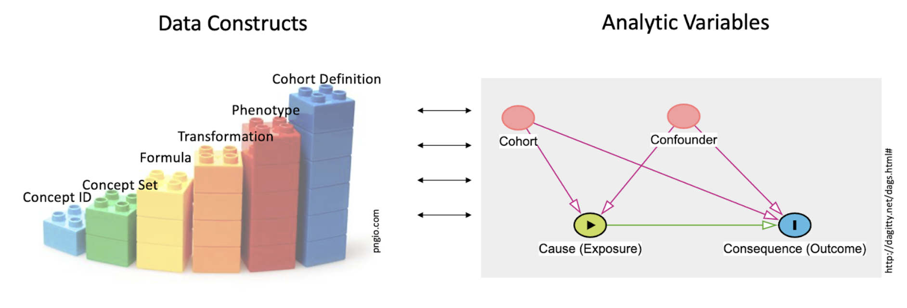
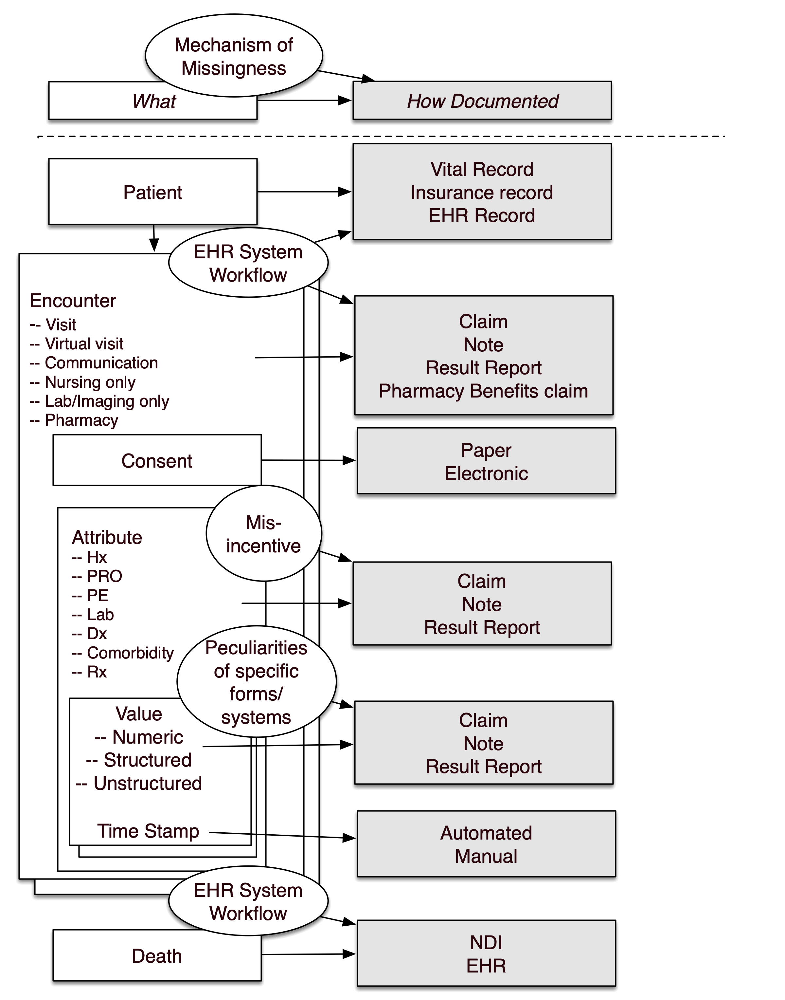
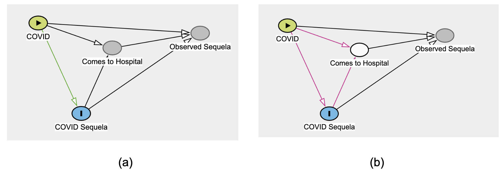

---
author:
  - name: Harold P. Lehmann
    affiliation: Johns Hopkins University School of Medicine
    affiliation-url: https://e-catalogue.jhu.edu/medicine/medical-students/subjects-instruction/health-sciences-informatics/
    email: lehmann@jhmi.edu
    orcid: 0000-0002-7698-219X
    attributes:
      corresponding: true

  - name: Hythem Sidky
    # affiliation: Johns Hopkins University School of Medicine
    # affiliation-url: https://e-catalogue.jhu.edu/medicine/medical-students/subjects-instruction/health-sciences-informatics/
    email: hythem.sidky@nih.gov
    orcid: 0000-0003-3532-4809

  - name: Jimmy Phuong
    # affiliation:
    # affiliation-url:
    # email:
    orcid: 0000-0003-0956-8404

  - name: Jimmy Phuong
    # affiliation:
    # affiliation-url:
    # email:
    orcid: 0000-0003-0956-8404

  - name: Kate Bradwell
    # affiliation: Palantir
    # affiliation-url:
    # email:
    # orcid:

  - name: Kenneth J. Wilkins
    affiliation: National Institutes of Health
    affiliation-url: https://www.nih.gov/
    # email: kenneth.wilkins@nih.gov
    orcid: 0000-0003-0531-7165

  - name: Andrea G. Zhou
    affiliation: University of Virginia, integrated Translational Health Research Institute of Virginia
    affiliation-url: https://www.ithriv.org/directory
    email: agz5de@virginia.edu
    orcid: 0000-0003-1845-5620

  - name: David Sahner
    affiliation: Senior Data Advisor to NCATS (Contracted through Axle Research and Technologies)
    affiliation-url: https://ncats.nih.gov/
    email: david.sahner@nih.gov
    orcid: 0000-0002-4616-1171

csl: ../assets/csl/apa-7e.csl
---

# Best Practices for the Research Life Cycle {#sec-practices}

**Chapter Leads:** Ken Wilkins, Harold Lehmann

:::{.callout-note}
This chapter is undergoing final edits, including formatting and cross-referencing.
Edits are expected to complete by June 2023.

This chapter was drafted in Google Docs at
<https://docs.google.com/document/d/1ttUKgwVcIZHM87elrlUNV6Qi9thzOwKBg8GegKObEtg/>
:::

## Overview

While analyses within N3C fall under the general category of "Real World Data Analysis", (RWD analysis) there is no single design or practice that applies to every study.
All the same, important data considerations can guide one's analytic plans and decisions, which effectively become the pivot-points in any RWD investigation's research lifecycle.
In this chapter, we will provide suggestions and pointers to resources that we hope will help the analyst in the majority of studies, and guide the content of discussions with their domain expert collaborators.
Recognizing that any analyst may come from one of a wide range of backgrounds, we have structured the chapter to be self-guiding.
Data scientists with  backgrounds in machine learning and computer science will benefit from  studying principles entailed in RWD biomedical methods in and beyond the confines of N3C (and should look at the [Machine Learning chapter](#MachineLearning)).
Researchers trained in traditional data analysis from schools of epidemiology, biostatistics, or econometrics will be reminded of concerns such as  over-reliance on overly-simplified parametric models and pitfalls of overfitting.
All schools of thought could benefit from more careful consideration of how their analytic decisions may impact the findings – and the limits in scope of such findings' generalizability – and just what best practices may help them to navigate potential pitfalls to reach more reliable conclusions.

The Collaborative Analytics workstream within N3C first recognized the need to form a group looking at data methods that were applicable to N3C data, and any standards that could be leveraged and refined to make optimal use of this unique resource – noting that the resource itself was being actively refined as more was learned from applying methods to its data.
Early on, the resulting Applicable Data Methods and Standards ([ADMS](https://covid.cd2h.org/data-methods)) group established a [number of principles](https://docs.google.com/document/d/1FZkHOKCC89qr4TM2voLuXQZpT-riCxUeU0-la48r4HU/edit#heading=h.9ymy4s8eihpu), that have since been refined by cross-collaboration with other groups

### Goals

Our goals were to:

#### Make it easy to do the best analysis

Analysts from a wide range of projects have created a number of tools and resources (e.g., [Concept Set Editor](https://unite.nih.gov/workspace/module/view/latest/ri.workshop.main.module.5a6c64c0-e82b-4cf8-ba5b-645cd77a1dbf), [Knowledge Store](https://unite.nih.gov/workspace/module/view/latest/ri.workshop.main.module.3ab34203-d7f3-482e-adbd-f4113bfd1a2b), [Community Notes](https://unite.nih.gov/workspace/module/view/latest/ri.workshop.main.module.452c6c44-36d0-49d5-b96f-b8bcefab9d67), and [Protocol Pad](https://unite.nih.gov/workspace/notepad/view/ri.notepad.main.notepad.9d509aa3-7c76-42b3-a891-076a6f450f37) to work towards this goal.

#### Encourage and disseminate best practice, but do not require specific approaches

"Best practice" refers to guidelines, such as those outlined by the FDA [-@usfda_2021; -@usfda_2017] and methodologists [@franklin_2021].
While a number of groups are available for consulting (Logic Liaisons, ADMS, Machine Learning Domain Team), there is no policing of analyses.
ADMS, in particular, is a cross-cutting Domain Team that provides a forum for discussing analytic issues that are important across N3C.
Example issues include the he difficulty of defining study-specific "control" cohorts when needed.
The Good Algorithmic Practice (GAP) group is a forum that includes machine learning and other general discussions related to data and analysis quality.

### Practices

Most components of high-quality research lie with research teams themselves.
Important practices contributing to reproducible, reliable work include:

#### Ensuring validated or mature code

We do recommend peer review of code, as is suggested, prior to posting code workbooks to the Knowledge Store.

#### Making methods and code findable and accessible (FA)

N3C's key library of code is the Knowledge Store (see more [below](#KnowledgeStore)).
Accessibility currently depends on perusing titles and on a short taxonomy of artifact types ("artifacts" meaning figures, tables, concept sets, variable definitions, analytic code) .
[Community Notes](https://unite.nih.gov/workspace/module/view/latest/ri.workshop.main.module.452c6c44-36d0-49d5-b96f-b8bcefab9d67) support a folksonomy of tags of both domain and methodological bents.

#### Making clear both the intention of a method as well as how it works

Documentation of code is left to the analyst.
Given the diversity of tools and methods available in N3C, there is no recommended standard for documentation.
The [Logic Liaison Templates](#LogicLiaisonTemplates), though, provide excellent models.

#### Ensuring reproducibility and reuse (IR)

[ProtocolPad](https://unite.nih.gov/workspace/module/view/latest/ri.workshop.main.module.d7099409-b81d-4d17-951c-399b1b2f7c6f) is an emerging tool to implement documentation in detail and, we hope, to encourage reuse beyond the Knowledge Store.
We are developing [Templates](https://national-covid-cohort-collaborative.github.io/guide-to-n3c-v1/chapters/tools.html#sec-tools-store-templates) that are more general than Knowledge Store items and function more as a guide (analytic decision support) than as programming code that can be modified.
Both Code Workbooks and Code Repositories can be exported as [Git repositories](#publishing-sharing-git-section) for hosting on GitHub or similar.

#### Building on the experience across and within networks

Outside N3C, the experience of OHDSI, in particular, will be referenced below.
Within N3C, discussions and work within Domain Teams enriched by individuals' experiences in a wide variety of studies and research configurations.

#### Anticipate analytic problems before they arise

We encourage discussion of issues in advance of the analysis.
For hypothesis-driven studies, we recommend finalizing the analytic protocol before outcomes are assessed.

#### Ensure state-of-the-art analyses, appropriate to the real-world data of the Enclave

We encourage conformance to methodology checklists.
Relevant ones are [STROBE](https://www.equator-network.org/reporting-guidelines/strobe/),
[RECORD](https://www.equator-network.org/reporting-guidelines/record/),
[TRIPOD](https://www.equator-network.org/reporting-guidelines/tripod-statement/),
[CERBOT](http://cerbot.org/), and
[STaRT-RWE](https://pubmed.ncbi.nlm.nih.gov/33436424/).

The high-level sequence of research below is based on experience in the Enclave and addresses some of the "what" needs to be accomplished in a research project in parallel to the "how" of previous chapters.

## Protocols: A Framework for the Research Lifecycle

.](images/practices/fig-practices-010-research-lifecycle.png){#fig-practices-010-research-lifecycle fig-alt="The standard project-management life cycle"}

Part of articulating an answerable research question is tackling an analysis as a project, which means following good [research-project management practices](https://www.hopkinsallchildrens.org/Academics/Research/Clinical-Research-Lifecycle).
The general project management phases defined by the [Project Management Institute](https://pmi.org) (project initiation, planning, execution, monitoring, closure) are shown in @fig-practices-022-building-block.
In N3C terms:

* _Development_ refers to Protocol Design,
* _Submission_ is obtaining a Data User Request ([DUR](access.md#sec-access-dur)),
* _Activation_ is assembling and running the research team,
* _Conduct_ is the workflow described in Chapter [Analyzing the Data](Analyzing the Data),
* _Oversight_ is the responsibility of the project PI,
* _Analysis_ is further workflow, and
* _Publication_ is both formal (manuscript submission) and otherwise (preprints, conferences).

The term "protocol" is used in many ways in science.
Basic scientists use it for how a particular laboratory reagent should be used or process, implemented.
In human subjects research, it is the commitment of the researcher to how patients, and their data, will be managed in a study.

In Real World Data analysis, the meaning is a bit different.
In the [Protocol Pad Detailed Instructions](https://unite.nih.gov/workspace/notepad/view/ri.notepad.main.notepad.9d509aa3-7c76-42b3-a891-076a6f450f37), we write

> In human subjects research, the protocol is what turns data into evidence: By following rules of methodology,
> we claim that the data we collect can support conclusions broader than the data set itself.
> "Protocol" can also refer to a specific set of steps that lead to reproducible results.
>
> Data-only research, like that in N3C, is different from prospective research,
> because we must make allowances for incomplete data, for selection bias, for access bias, for poor recording, for late recording,
> for differences in clinical practice across sites, for differences in documentation practice across sites...
> In other words, there are many issues with the data, before one gets to the analysis of scientific interest.
> This process of research is also called by Stoudt and colleagues, the "data analysis workflow" [-@stoudt_2021].

{Add a short paragraph here about what a protocol is, and if it's different than the steps outlined above (I assume not, just specialized for RWD analyses)}

N3C has developed a tool to facilitate the development of protocols known as the [Protocol Pad](https://unite.nih.gov/workspace/notepad/view/ri.notepad.main.notepad.9d509aa3-7c76-42b3-a891-076a6f450f37).: In the following sections we walk through recommended components of a protocol.
Briefly, they are:  Protocol Design, Development, and Completion:

### Protocol Outline

Protocol Design ❶

1. Articulate administrative information
1. Articulate research question
1. Specify protocol
1. Describe Patient, Intervention/Exposure, Comparator, Outcome (PI/ECO) elements in text

Protocol Development ❷

1. Define PECOT elements as objects and data sets
1. Assess data quality
1. Articulate missing data plan
1. Perform initial analysis
1. Iterate
1. Commit to final run
1. Peform sensitivity analysis

Protocol Completion ❸

1. Gather results
1. Publish

{#fig-practices-015-protocol-pad fig-alt="Home page for a researcher's protocols"}

<!-- N3C Teams Addressing Good Research Practices -->

Several groups in N3C focus on the quality of the research process, in general, and analytics, in particular.
The [Data and Logic Liaisons](support.md#sec-support-liaisons) provide general tools and approaches to making data available to research teams and demonstrate good models for organizing research teams.
The Applicable Data Methods and Standards ([ADMS](https://covid.cd2h.org/data-methods)) provides a forum for discussion of cross-cutting analytic concerns.
The Machine Learning & Pharmacoepidemiology [domain team](onboarding.md#sec-onboarding-dts),
besides working on specific projects, have generated protocols that can serve as models for analysis.
Good Algorithmic Practice (GAP) Core Team; and various subject-matter domain teams).

## Protocol Design ❶

The Design is where the intention and information _about_ the protocol are placed.
A protocol design may be generated iteratively, as details are better honed and even the intention becomes clearer.
By the point that the finally-established protocol is executed, the design should be fixed.
At the very least, if substantive design modifications are to be implemented in research that is not strictly exploratory, we suggest documenting the reason for doing so.

### Articulate Administrative Information

**Objective**

Gathering administrative information, such as DUR number, team members, and research question ensures that all the necessary elements are established to successfully execute a publishable research project with a clear objective.

#### Approach

Several tools provide checklists a researcher can follow to ensure their work will be publishable.
The previously mentioned Protocol Pad, for example, guides researchers through protocol development,
and is integrated with other N3C tooling to capture relationships to teams, researchers,
and artifacts such as concept sets, analyses, and datasets. .
STaRT-RWE [@wang_2021] provides a more expansive methodological checklist. @tbl-practices-start-1 below lists the elements and sub-elements in the checklist, along with suggestions for where in the Enclave the information may be found.

<!-- https://www.tablesgenerator.com/markdown_tables -->

+-------------------------------------+--------------------------------------------------------------------------------------+--------------------------+
| Element                             | Sub Element                                                                          | Source in the Enclave    |
+=====================================+======================================================================================+==========================+
| Protocol Title                      |                                                                                      | Manually entered         |
+-------------------------------------+--------------------------------------------------------------------------------------+--------------------------+
| Objective Primary                   |                                                                                      | Manually entered         |
+-------------------------------------+--------------------------------------------------------------------------------------+--------------------------+
| Objective Secondary                 |                                                                                      | Manually entered         |
+-------------------------------------+--------------------------------------------------------------------------------------+--------------------------+
| Protocol registration               | - Registration identifier                                                            | Supplied by Protocol Pad |
|                                     | - Registration date                                                                  |                          |
|                                     | - Registration site                                                                  |                          |
+-------------------------------------+--------------------------------------------------------------------------------------+--------------------------+
| Protocol version                    | - Version number                                                                     | Supplied by Protocol Pad |
|                                     | - Version date                                                                       |                          |
+-------------------------------------+--------------------------------------------------------------------------------------+--------------------------+
| Funding                             | - Grant identifier                                                                   | Manually entered         |
|                                     | - Source                                                                             |                          |
+-------------------------------------+--------------------------------------------------------------------------------------+--------------------------+
| Data Use Agreement (DUA)            | - DUA identifier                                                                     | Supplied by Protocol Pad |
|                                     | - Data provider                                                                      |                          |
|                                     | - Data provider contact for data use agreements                                      |                          |
+-------------------------------------+--------------------------------------------------------------------------------------+--------------------------+
| Human Subjects/ Ethics Approval  | - Submission identifier                                                              | Assumed by DUR           |
|                                     | - Name of human subjects/ethics approval committee                                   |                          |
+-------------------------------------+--------------------------------------------------------------------------------------+--------------------------+

: STaRT-RWE Table 1: Administrative Information, based on Wang and colleagues [-@wang_2021]. {#tbl-practices-start-1 tbl-colwidths="[30, 45, 25]"}

Not everything you need to start, though, is included in this list.
Here are a few additional things to consider:

**Assemble a team**.
A lesson learned and relearned is that any analysis in an environment like N3C _requires_ interdisciplinary teamwork.
Clinicians provide the all-important reality testing and substance of the research questions.
Biostatisticians articulate the analytic design and sometimes novel data required for those analyses (e.g., negative controls) that clinicians might not think about.
Data scientists and others work to understand how the data are modeled to best extract and format the data, communicating potential pitfalls to the rest of the team.
Other common roles include leadership and project management -–see @sec-onboarding for a more thorough review of team science.

**Documentation/Lab Notebook**.
A "lab notebook" is an important part of any researchers' repertoire, as a place to document thoughts, experiments, and results.
The protected nature of N3C data complicates documentation, however: some study details need to be available outside of the Enclave for others to view, while others must stay in the Enclave (see @sec-publishing for details on what may be exported from the Enclave and how).
This duality can lead to challenges in documentation and collaboration.
[Protocol Pad](tools.html#sec-tools-apps-protocol) is designed as an environment to map out the intended analysis (see [OHDSI](https://ohdsi.github.io/TheBookOfOhdsi/)) and to document the analysis and resulting artifacts that were actually created.
Whether ProtocolPad is used or not, each analyst should maintain a lab notebook.

**Project organization**.
Before sitting down to code, core items and roles should be articulated.
These include the research question (even if only "descriptive"), the hypotheses (if any), the identification level of data required, the PI, and, as much as possible, the identity of those filling roles of domain expert, informatician/data scientist, and statistician, even if individuals are filling multiple roles. [Methodology checklists](tools.md#sec-tools-apps-protocol) help organize this information.

**Code organization/formatting**.
[Code Workbooks](https://national-covid-cohort-collaborative.github.io/guide-to-n3c-v1/chapters/tools.html#sec-tools-apps-workbook) and
[Code Repositories](https://national-covid-cohort-collaborative.github.io/guide-to-n3c-v1/chapters/tools.html#sec-tools-apps-repo) are the heart of most N3C analyses
and we recommend that researchers attentively format their code and documentation,
like any modern software project.
While these tools provide unique interfaces initial unfamiliar to most,
they provide a host of features for organizing code, data, documentation, and metadata.
See @sec-tools for more details.

**Which tools are best for what**.
The Knowledge Store, in particular, provides some analytic tools for use.
Because of security concerns, not all code is sharable.
Data partner IDs and patient IDs present in such code in one's project should not be shared across projects or Data Use Requests (DURs), meaning that even programming code must be de-identified and templatized before being released to the Knowledge Store for general use or posted to repositories like GitHub for external review.
@sec-publishing describes processes and requirements for safe sharing of both results and code.

**Take-away**

Ideally, a project should have someone fulfilling the role of project manager, who ensures good documentation, keeps the project on track, and convenes meetings as needed.

Researchers should consider, ahead of time, documenting necessary project management information and assembling a team with the relevant expertise to maximize the likelihood of project success.
Provided above, is a list of recommended information that should be documented, and additional organizational resources.

### Articulate Research Question

#### Objective

Ensure that the question being addressed is explicit.

#### Research Question

The research question is a natural-language expression of what the protocol is about.
Although prospective delineation of a hypothesis with a null and alternative options is both standard and recommended in research, the "research question" takes a different form, and should be expressed as the question someone in the domain, or affected by the domain, might ask.

It's important to know what questions can and can_not_ be answered in the Enclave.

**Questions you cannot answer in N3C**.
While the data are rich and the applications are broad, there are still questions that cannot be adequately answered in the Enclave.
We list that caveat, along with others, below:

* Beware making estimates or predictions that rely on a random sample of "controls" (as those in N3C are [matched to confirmed COVID-19 cases within data partner by age, sex, & race/ethnicity](https://github.com/National-COVID-Cohort-Collaborative/Phenotype_Data_Acquisition/wiki/Phenotype-3.0---Additional-Information))
  * The COVID phenotype data partners use to generate N3C data match patients using 2 controls:1 case based on age, sex, race, and ethnicity
  * Therefore, age, sex, race, or ethnicity should never be features of a prediction model between COVID positive _and COVID negative patients_
* Because each COVID-19 case is matched with two others, data come in with ostensible controls for each COVID-19 case, no population-targeted inference (prevalence or incidence) can be made, even with Level 3 data.
* In general, estimation of rates (of, for example COVID-19 infection) should be avoided.
* Beware making estimates or predictions that rely on nationwide representative sampling (in order to generalize to the entire US population at risk for COVID-19)
  * E.g., prevalence or incidence of COVID-19 in any geographic region
  * Weighting analyses by zip-code-based populations might be possible, but beware.
    (See [External Data Sets](understanding.md#sec-understanding-public).)
* Eligibility criteria defined using patient ICU status, as ICU status cannot be resolved from the visit-level information available, notwithstanding the possibility that some sites repurposed non-ICUs to serve as ICUs during surges in COVID-19 patients.
  In some cases, however, additional ADT (Admission-Discharge-Transfer) data may be available.
* Questions regarding COVID negative vs.
COVID positives and co-morbidities (or other covariates) that are associated with the factors used to bring data into the Enclave, i.e., age, sex, race, and ethnicity.

**Special considerations**.
There are other questions that may _potentially_ be answerable in N3C, depending on whether the required considerations are compatible with the research question of interest.

* Outcomes involving overall mortality cannot be assessed using EHR data alone.
  Linkage with an external data source containing more complete mortality data is necessary.
  N3C contains ancillary patient-preserving record linkage ([PPRL](understanding.md#sec-understanding-pprl)) mortality data which is fully linked for a subset of data partners, and requires a separate DUR to access.
  Claims data, such as CMS, can serve as an alternative source of mortality data within enrollment periods, but limits the study population to those with Medicare for whom CMS data are available.
  This may be undesirable as that population may not be representative of the study population of interest.
* Analyses of patients with Long COVID.
  The U09.9 diagnosis code for Long COVID was launched in late 2021; its use was not immediately adopted among all data partners in the enclave [@pfaff_2023a],
  and its rate of uptake across sites varied.
  Efforts have been expended to creatively identify patients in the Enclave who might have Long COVID
  but who lack a U09.9 diagnosis code, including computable phenotypes [@pfaff_2023a].

There are others, and we welcome suggestions to add to either list.

### Specify Protocol

#### Objectives

Ensure your work is grounded in an initial "natural language" protocol that resonates with subject matter experts (e.g., clinicians, etc.) and stakeholders.

Gain early insights into how the natural language version of the protocol will be tethered to specific code and the existence of potential confounders.
This is an early step in promoting replicable and clinically valuable work.

#### Approach

Stoudt and colleagues identify 3 phases of a data-only research protocol: Explore, Refine, Produce [@stoudt_2021]. N3C provides many tools to support a protocol.
By linking the resulting artifacts together, we aim to develop a self-documenting, computable protocol.
We list here the basic steps in articulating—and specifying attributes of—a protocol, as part of the "Explore"  step.  (Note that the term "protocol" is used here in a more general way than in biology, for instance.)  This step is focused on the initial "natural language" view of the protocol; the code-based view comes in the next section.
While the checklists seek text descriptions, we recommend _linking the text as soon as possible to objects and datasets used in the Enclave_, track what resources you've used, be specific with your team members, and enable Protocol Pad to collect attributions across those resources to populate your Publication Intent Form and your manuscript, at the appropriate time.

Before analyzing the data,
create a Directed Acyclic Graph (DAG) of the research question that reflects the causal model.
Tools like Daggity [@ankan_2021] can

1. identify threats to validity earlier,
1. suggest appropriate controls, and
1. identify biases simply from the structure of the model.

In addition, a causal model helps to identify sub-projects, making the overall analysis ultimately easier and doable.
Do note, however, that "documentation", the Extraction, Loading, and Transfer operations (ETL),
and data-representation issues are often _not_ represented in such models,
although faults at each of those steps can contribute to (cause) data quality issues.

The following simple example shows the power of a DAG in drawing attention to a specific confounder.

{#fig-practices-020-site-bias fig-alt="Effect of site (data partner)"}

@fig-practices-020-site-bias shows how data partner ID (i.e. "Site") is _always_ a confounder, in the sense of @fig-practices-022-building-block, above.
As such, stratification or some other strategy is _always_ required first, on the way to deciding whether data can be pooled across sites.
^[See @redelmeier_2023 for a more involved example of a [DAG](https://ars.els-cdn.com/content/image/1-s2.0-S0002934322008221-gr3_lrg.jpg) in COVID research.]

### Describe PICOT Elements in Text

#### Objective

Provide the core details for readers that define key elements of the study methodology.

#### Approach

Even in methodological studies, there is a universe of populations and contexts for which the methods apply (or not).
In descriptive studies, the focus is on a population and its attributes.

In associational, causal, and intervention studies, the following attributes are important [cite]:

1. **P**opulation (cohort and control),
1. **I**ntervention/Exposure (if any),
1. **C**omparator,
1. **O**utcome,
1. **T**ime horizon, and
1. potential confounders.

These should be articulated in text with proper intention so analysts and reviewers have a basis for assessing whether subsequent code matches the intention. (Of course, after confronting the data, these intentions often change prior to finalizing the protocol.)

**Other attributes include**: Design, Rationale, study objectives, which need to be manually entered.
The DUR identifier should be supplied by the system.

+------------------------------------------------+--------------------------------------------------+--------------------------------------------------------------------------------------------------------------------------------------------------+
| Section                                        | Element                                          | Where found in the Enclave                                                                                                                       |
+================================================+==================================================+==================================================================================================================================================+
| TABLE 2. VERSION HISTORY                       | - Version date                                   | - Protocol Pad                                                                                                                                   |
|                                                | - Version number                                 | - Manual entry of change log and rationale                                                                                                       |
|                                                | - Change log                                     |                                                                                                                                                  |
|                                                | - Rationale for change                           |                                                                                                                                                  |
+------------------------------------------------+--------------------------------------------------+--------------------------------------------------------------------------------------------------------------------------------------------------+
| FIGURE 1. DESIGN DIAGRAM                       |                                                  | - Manual. [Suggest use of @schneeweiss_2019]                                                                                                     |
|                                                |                                                  | - Entered manually in Lab Notebook of Protocol Pad, with links to data sets                                                                      |
+------------------------------------------------+--------------------------------------------------+--------------------------------------------------------------------------------------------------------------------------------------------------+
| A. Meta-data about data source and software    | - Data Source(s)                                 | - [Release notes](https://unite.nih.gov/workspace/documentation/product/n3c-info/release-notes-overview)                                         |
+------------------------------------------------+--------------------------------------------------+--------------------------------------------------------------------------------------------------------------------------------------------------+
| {For each data source:}                        | - Study Period                                   | - Entered manually in Lab Notebook of Protocol Pad, with links to data sets                                                                      |
|                                                | - Eligible Cohort Entry Period                   | - Link to [N3C Phenotype Description](https://github.com/National-COVID-Cohort-Collaborative/Phenotype_Data_Acquisition/wiki/Latest-Phenotype)   |
|                                                | - Data Extraction Date/Version                   | - Link to various                                                                                                                                |
|                                                | - Data sampling/extraction criteria              |   [Guides](https://unite.nih.gov/workspace/module/view/latest/ri.workshop.main.module.e7b83a8c-545e-49ac-8714-f34bfa7f7767?view=focus&Id=23)     |
|                                                | - Type(s) of data                                |   to PPRL-based linked data                                                                                                                      |
|                                                | - Data linkage                                   |                                                                                                                                                  |
|                                                | - Data conversion                                |                                                                                                                                                  |
|                                                | - Software to create study population            |                                                                                                                                                  |
+------------------------------------------------+--------------------------------------------------+--------------------------------------------------------------------------------------------------------------------------------------------------+

: STaRT-RWE Table 2 and Design, based on Wang and colleagues [-@wang_2021]. {#tbl-practices-start-2 tbl-colwidths="[30, 25, 45]"}

As suggested in @tbl-practices-start-2, it is helpful to diagram the cohort definition.
A well received model is that of [Schneeweiss and colleagues](https://pubmed.ncbi.nlm.nih.gov/30856654/).

.](images/practices/fig-practices-021-schneweiss-graphical-study-design.png){#fig-practices-021-schneweiss-graphical-study-design fig-alt="Graphical study design for study with EHR–claims linked data"}

It is helpful to be precise in articulating the research question, so correct analytic methods will be chosen.
Examples are differentiating classification from prediction from estimation, and association from temporal correlation from causal relationships.

## Protocol Development ❷

### !! What is the H3 header here? !!

#### Objectives

Support team science during refinement and production of a detailed protocol.

Provide an audit trail of how the protocol was developed.

Support execution of the protocol.

#### Approach

Team science, a transdisciplinary endeavor that entails both theory and application [@klein_1996],
has its own mix of needs in "data-only" (e.g., RWE) studies, and, in particular, in distributed settings.
Communication is essential across distance in multicenter studies, as well as communication between and among disciplines.
Regardless of the online tools, each team needs clarity on what the work is, why it is needed, and where it is heading.
This clarity is especially needed around the protocol, because, while the Protocol Design specifies the outlines, Protocol Development fleshes out the details, which can change prior to protocol finalization, depending upon data availability and quality.

From a regulatory perspective, research must be auditable.
Even if the research is not performed with regulatory intent, choices made and abandoned should be documented and available for review.

The remainder of this section lays out the elements of a data-only protocol.

### Define PICOT elements as objects and data sets

#### Objectives

Provide computable definitions for core protocol PICOT elements.

Instantiate those core protocol elements.

#### Approach

PICOT elements for analysis must be shaped from the raw data of the Enclave.
The definition of a cohort is, in turn, based on key building blocks.
@fig-practices-022-building-block shows the building blocks and their relationship to the typical notion of analytic variables in statistical models.

{#fig-practices-022-building-block fig-alt="Relating data scientist's work to that of the analyst"}

One key role of the data scientist is to create datasets from the raw material of the EHR (concept ids, and such) engineering variables, used by the analyst in the analysis, shown as toy building blocks on the left.
Terms are defined in the text.
This work of the data scientist is included in the set of tasks generally called _data cleaning.
_The importance of data cleaning and appropriate preprocessing cannot be overestimated, and often requires clinical domain expertise in addition to sound data science practices, such as a well-reasoned approach to missing values (see Section 2.3) and normalization of values in the context of certain machine learning algorithms.

The simplest building block on the left of @fig-practices-022-building-block is the [_concept id_](understanding.md#sec-understanding-basics-omop-vocab),
the raw data of the OMOP tables.
Next comes the [_concept set_](understanding.md#sec-understanding-sets),
which creates sets of concept ids that are semantically synonymous _for the purposes of this study's Research Question_.
The next 4 columns all fall under the general category of [derived variable](_Analyzing the Data#Using the Knowledge Store); the different columns suggest different roles.
So a _Formula_ may be independent of the context of use
(e.g., [BMI](https://unite.nih.gov/workspace/module/view/latest/ri.workshop.main.module.3ab34203-d7f3-482e-adbd-f4113bfd1a2b?id=KO-2ED519D&view=focus)),
regardless of the research question.
A _Transformation_ may be more complex, such as
"[macrovisit](https://unite.nih.gov/workspace/module/view/latest/ri.workshop.main.module.3ab34203-d7f3-482e-adbd-f4113bfd1a2b?id=KO-B136507&view=focus)" [@sidky_2023]
to indicate a hospital admission, or "[critical visit](https://unite.nih.gov/workspace/module/view/latest/ri.workshop.main.module.3ab34203-d7f3-482e-adbd-f4113bfd1a2b?id=KO-C368A83&view=focus)", used in defining a Covid-19 hospitalization.
A [Phenotype](Understanding the dat_a#Phenotype & Ingestion Review) defines a clinical construct ("[covid-positive](https://unite.nih.gov/workspace/module/view/latest/ri.workshop.main.module.3ab34203-d7f3-482e-adbd-f4113bfd1a2b?id=KO-BE5C652&view=focus)"; "[visits with invasive respiratory support](https://unite.nih.gov/workspace/module/view/latest/ri.workshop.main.module.3ab34203-d7f3-482e-adbd-f4113bfd1a2b?id=KO-8779684&view=focus)", "[HIV patient](https://unite.nih.gov/workspace/module/view/latest/ri.workshop.main.module.3ab34203-d7f3-482e-adbd-f4113bfd1a2b?id=KO-1E14E73&view=focus)"), while a _Cohort Definition_ gives the phenotype a [local habitation and a name](https://shakespeare.folger.edu/shakespeares-works/a-midsummer-nights-dream/act-5-scene-1/) (e.g., in the past 5 years) or utilizes an algorithm (e.g., [long covid algorithm-based classification](https://unite.nih.gov/workspace/module/view/latest/ri.workshop.main.module.3ab34203-d7f3-482e-adbd-f4113bfd1a2b?id=KO-30757BE&view=focus)).

The figure recognizes that the _role_ each construct plays depends on the context; "diabetes" could be the target cohort (are patients with diabetes at higher risk of developing Covid-19  sequelae, compared with those who do not?), the confounder (does a presumed treatment for Covid-19 have its effect weakened in the presence of diabetes?), the cause (are there specific outcomes for patients with diabetes?), or the outcome (are any patients with Covid-19 at risk for developing type 2 diabetes?).

Iteration starts at the very outset of cohort definition.
The double arrows in the center of @fig-practices-022-building-block
refer to just this back-and-forth work analysts have in deciding when they have the right variable definitions.

The process of defining variables is laid out in @sec-tools.
Many DURs involve a number of related protocols; the steps laid out in that chapter are directed at pre-processing that ultimately applies to a set of protocols.
There are a variety of templates in the Knowledge Store that are produced by the Logic Liaisons and can facilitate this decision making process.
The [Whitelist Filtering](https://unite.nih.gov/workspace/module/view/latest/ri.workshop.main.module.3ab34203-d7f3-482e-adbd-f4113bfd1a2b?id=KO-D00A6DC&view=focus) and [Data Density by Site and Domain](https://unite.nih.gov/workspace/module/view/latest/ri.workshop.main.module.3ab34203-d7f3-482e-adbd-f4113bfd1a2b?id=KO-C3B0BBE&view=focus) templates provide a method by which researchers can assess data quality and density prior to starting variable generation.
Depending on the cohort of interest (COVID-19+ or All Patients) and/or outcome of interest, it may be desirable to eliminate particular sites based on their lack of sufficient data in the corresponding domain.
There are also two additional Logic Liaison data quality templates that allow researchers to assess the quality of the variables they've created using the OMOP data tables.
While the [Systematic Missingness](https://unite.nih.gov/workspace/module/view/latest/ri.workshop.main.module.3ab34203-d7f3-482e-adbd-f4113bfd1a2b?id=KO-E8BD195&view=focus) template provides an all or nothing indication of fact presence by site, the [Fact Density by Site](https://unite.nih.gov/workspace/module/view/latest/ri.workshop.main.module.3ab34203-d7f3-482e-adbd-f4113bfd1a2b?id=KO-9901C7E&view=focus) template calculates the Standardized Density, Median Absolute Deviation (MAD), and Directional Median Deviations (DMD) and creates heatmaps to visualize the metrics.

This back-and-forth work ("pre-processing"; "data cleaning") points to the fact that developing the final protocol entails a series of decisions.
Recognizing "data cleaning" as a decision-rich process helps to raise the profile of this work, helps the team to make those decisions explicitly,
and helps to attract decision support to the process.
These decisions should be documented in the lab notebook.

The elements of this phase that go into the STaRT-RWE checklist are listed in @tbl-practices-start-3. The elements can be found in the Enclave in the
(a) README in Template, _or_
(b) dataset description, _or_
(c) Free text in Protocol pad.

+------------------------------------------+------------------------------------------------------------+------------------------------------------------------------+
| PICOT                                    | Element                                                    |                                                            |
+==========================================+============================================================+============================================================+
| B. Index Date (day 0) defining criterion | Study population name(s)                                | Diagnosis position2                          |
|                                          | Day 0 Description                                       | Incident with respect to…                               |
|                                          | Number of entries                                       | Pre-specified                                           |
|                                          | Type of entry                                           | Varied for sensitivity                                  |
|                                          | Washout window                                          | Source of algorithm                                        |
|                                          | Care Settings1                               |                                                            |
|                                          | Code Type                                                  |                                                            |
+------------------------------------------+------------------------------------------------------------+------------------------------------------------------------+
| C. Inclusion Criteria                    | Criterion                                               | Diagnosis position2                          |
|                                          | Details                                                 | Incident with respect to...                             |
|                                          | Order of application                                    | Pre-specified                                           |
|                                          | Assessment window                                       | Varied for sensitivity                                  |
|                                          | Care Settings1                               | Source of algorithm                                        |
|                                          | Code Type                                                  |                                                            |
+------------------------------------------+------------------------------------------------------------+------------------------------------------------------------+
| D. Exclusion Criteria                    | Criterion                                               | Diagnosis position2                          |
|                                          | Details                                                 | Incident with respect to...                             |
|                                          | Order of application                                    | Pre-specified                                           |
|                                          | Assessment window                                       | Varied for sensitivity                                  |
|                                          | Care Settings1                               | Source of algorithm                                        |
|                                          | Code Type                                                  |                                                            |
+------------------------------------------+------------------------------------------------------------+------------------------------------------------------------+
| E. Predefined Covariates                 | Criterion                                               | Diagnosis position2                          |
|                                          | Details                                                 | Incident with respect to...                             |
|                                          | Order of application                                    | Pre-specified                                           |
|                                          | Assessment window                                       | Varied for sensitivity                                  |
|                                          | Care Settings1                               | Source of algorithm                                        |
|                                          | Code Type                                                  |                                                            |
+------------------------------------------+------------------------------------------------------------+------------------------------------------------------------+
| F. Empirically Defined Covariates        | Algorithm                                               | Diagnosis position2                          |
|                                          | Type of variable                                        | Incident with respect to...                             |
|                                          | Assessment window                                       | Pre-specified                                           |
|                                          | Care Settings1                               | Varied for sensitivity                                  |
|                                          | Code Type                                                  | Source/code of algorithm                                   |
+------------------------------------------+------------------------------------------------------------+------------------------------------------------------------+
| G. Outcome                               | Outcome name                                            | Diagnosis position2                          |
|                                          | Outcome measurement characteristics                     | Incident with respect to...                             |
|                                          | Primary outcome?                                        | Pre-specified                                           |
|                                          | Type of outcome                                         | Varied for sensitivity                                  |
|                                          | Washout window                                          | Source of algorithm                                        |
|                                          | Care Settings1                               |                                                            |
|                                          | Code Category                                              |                                                            |
+------------------------------------------+------------------------------------------------------------+------------------------------------------------------------+
| H. Follow up                             | Begins                                                  | Day X following index date                              |
|                                          | Date of Outcome                                         | End of study period                                     |
|                                          | Date of Death                                           | End of exposure                                         |
|                                          | Date of Disenrollment                                   | Date of add to/switch from exposure                     |
|                                          |                                                            | Other                                                      |
+------------------------------------------+------------------------------------------------------------+------------------------------------------------------------+

: STaRT-TWE Design elements (TABLE 3. SUMMARY SPECIFICATION FOR ANALYTIC STUDY POPULATION), based on Wang and colleagues [-@wang_2021]. {#tbl-practices-start-3 tbl-colwidths="[30, 35, 35]"}

[Chapter Analyzing The Data](#Analyzing The Data) discusses this process in more detail.

### Assess Data Quality

#### Objective

Address data quality issues through action that mitigates the risk of reaching erroneous conclusions.

#### Approach

A key component of the back-and-forth work is **data quality checks**.
While the Data Quality Dashboard helps the Data Ingestion and Harmonization (DI&H) team decide on readiness of site data for release, _data quality checks for a specific analysis is the responsibility of the analyst_.
While providing an exhaustive list of the steps to this process is outside the scope of this document, we highlight in @tbl-practices-dq some data quality issues that warrant special attention.
Many of the items in this list were borrowed from Sidky et al. [-@sidky_2023] which can be referred to for further detail.

+--------------------------------------------------------------+-------------------------------------------------------------------------------------------------------------------------+
| Data quality issue                                           | Considerations and possible solutions                                                                                   |
+==============================================================+=========================================================================================================================+
| Site-specific variability in data availability               | - Cluster data sources based on relevant study variables and eliminate those with insufficient data.                    |
|                                                              | - Investigate possible temporal missingness patterns and evidence of missing not at random (MNAR) data.                 |
|                                                              | - Potentially leverage relevant techniques such as multiple imputation and inverse                                      |
|                                                              |   probability weighting to handle remaining missing data or balance covariates.                                         |
+--------------------------------------------------------------+-------------------------------------------------------------------------------------------------------------------------+
| Site is _always_ a confounder                                | - Stratify analysis by site.                                                                                            |
|                                                              | - Include a site-specific random effect in your model.                                                                  |
|                                                              | - Pool results across site-specific model estimates.                                                                    |
|                                                              | - Use cluster-robust standard errors, with site as the clustering variable.                                             |
+--------------------------------------------------------------+-------------------------------------------------------------------------------------------------------------------------+
| Drug exposure data are often unreconciled                    | - Aggregate contiguous drug exposure intervals into single presumed drug eras.                                          |
|                                                              | - Residual open-ended intervals may simply not allow for time-varying analysis                                          |
|                                                              |   and may only be suitable for analysis as point exposures.                                                             |
+--------------------------------------------------------------+-------------------------------------------------------------------------------------------------------------------------+
| Lack of enrollment dates on patients                         | - For the main analysis, include only patients with a history of at least one visit prior to the index date.            |
|                                                              |   This also increases the likelihood of capturing medical history prior to,                                             |
|                                                              |   for example, a COVID-19 diagnosis index date.                                                                         |
|                                                              | - Identify the end of follow-up as the last recorded patient interaction with a data partner.                           |
|                                                              | - Perform a sensitivity analysis to understand the impact of continuity of care on the estimand.                        |
|                                                              | - Consider incorporating prognostic factors proximal to the outcome into the model.                                     |
+--------------------------------------------------------------+-------------------------------------------------------------------------------------------------------------------------+
| Limited availability of out-of-hospital mortality data       | - Leverage PPRL mortality data, available for a subset of sites.                                                        |
|                                                              | - Consider a sensitivity analysis on censoring time for discharged patients.                                            |
|                                                              | - Consider designs where in-hospital deaths only are needed.                                                            |
|                                                              | - Employ competing risk analysis analysis with discharge and in-hospital mortality as competing risks.                  |
+--------------------------------------------------------------+-------------------------------------------------------------------------------------------------------------------------+
| Previous medical history may be carried forward in EHR data  | - Calculate the number of events recorded per day throughout the visit                                                  |
|                                                              |   for an outcome of interest to assess validity of such carry forward.                                                  |
|                                                              | - Determine if treatment preceded the outcome or if it is an artifact.                                                  |
+--------------------------------------------------------------+-------------------------------------------------------------------------------------------------------------------------+
| N3C COVID*                                                   | - Consider research questions that are conditioned on COVID-19 positivity.                                              |
| "phenotype" is a 2:1 control:case match on COVID-19          | - Secondary outcome analysis may be biased if the cohort spans cases and controls.                                      |
| negative and positive patients.                              | - Patients initially COVID-19 negative may not always remain negative.                                                  |
+--------------------------------------------------------------+-------------------------------------------------------------------------------------------------------------------------+

: Data Quality Issues. *For non-COVID-based datasets, beware of how controls are brought into the Enclave. {#tbl-practices-dq tbl-colwidths="[25, 75]"}

### Articulate missing-data plan

#### Objective

Prepare analysis to be generalizable despite missing data that ideally would be available.

#### Approach

There is a large literature on missing data.
A strength of the centralized data of the Enclave is that one could assess whether missingness of a data item
is a result of a "lesion" at the item (e.g., lab) level, visit level, patient level, or site level; see @fig-practices-050-missing-data.
Before finalizing a protocol, search out what data are missing
(starting with cohort definition, then outcomes, then confounders),
at what level, and decide how to address them.
The pattern of missingness is critical.
Data may be missing "not at random" (MNAR, unrelated to factors that have been captured in the database),
missing completely at random (MCAR, in which the missing and observed data have similar distributions),
or missing at random (MAR, where there may be differences between missing and observed values, but these can be adequately explained by other captured variables).

Many techniques exist to deal with missing data
(for example, restriction of analyses to complete data, which is acceptable in the context of data MCAR; imputation based on the average of observed values, etc.),
_but the suitableness of available choices depends on the pattern of missingness_.
Multiple imputation techniques based on machine learning, in which missing values are predicted based on other variables, may be appropriate if data are MAR.
Note that assuming data are missing completely at random may be a very dangerous assumption, especially in the context of observational or EHR data, where,
for example, variability among practitioners in follow-up practices or disease surveillance may be substantial.
If patients with the disease die, their data are missing.
Imputation does not substitute for checking on mortality.
While missingness patterns are difficult to verify with observational data alone, data _across_ sites—as we have in the Enclave—helps in assessing whether data are missing at random or not.

{#fig-practices-050-missing-data fig-alt="Possible sources of missing data"}

### Perform Initial Analysis

#### Objective

Perform the analysis efficiently, correctly, and reproducibly.

#### Approach

Analysis takes place in a specific _Environment_.
The first phase is final data _Pre-Processing_,
which overlaps with the previous steps but is more focused on the specific research question within the DUR.
The analysis itself must take into account issues that make challenging the generation of real-world evidence from the real-world data of the Enclave.
There are _Recommended Methods_ for addressing those many issues.
We also address the _External Data Sets_ you might use to supplement the EHR and other patient-specific data in the Enclave.

#### Environment

Tuning the analytic environment is crucial to making the analysis as efficient as possible.
Many analysts come into the Enclave unfamiliar with Apache Spark.

The key tools for analysts are Contour analyses, [code workbooks](https://unite.nih.gov/workspace/module/view/latest/ri.workshop.main.module.e7b83a8c-545e-49ac-8714-f34bfa7f7767?view=focus&Id=22) and [code repositories](https://unite.nih.gov/workspace/module/view/latest/ri.workshop.main.module.e7b83a8c-545e-49ac-8714-f34bfa7f7767?view=focus&Id=24).
Training is available for the Spark languages, [PySpark](https://unite.nih.gov/workspace/module/view/latest/ri.workshop.main.module.e7b83a8c-545e-49ac-8714-f34bfa7f7767?view=focus&Id=21) and [SparkR](https://unite.nih.gov/workspace/module/view/latest/ri.workshop.main.module.e7b83a8c-545e-49ac-8714-f34bfa7f7767?view=focus&Id=20).
Examples of code workbooks and Contour analyses can be found in the [N3C Training Area](https://unite.nih.gov/workspace/compass/view/ri.compass.main.folder.6046cbcd-22e5-435e-98c2-bbadddf626cf).
While the Enclave is a powerful environment, analysts have learned many "tricks of the trade" to do better work, such as dealing with [slow builds](https://unite.nih.gov/workspace/module/view/latest/ri.workshop.main.module.e7b83a8c-545e-49ac-8714-f34bfa7f7767?view=focus&Id=14).
One issue is preference for code repositories as more "native" to the Foundry (N3C environment) vs the benefits of code workbooks (which rely upon  R or leverage  data visualization steps, or DAG-viz of workflows) returning dataframes for R/Python (e.g., N3Community Note [here](https://unite.nih.gov/workspace/module/view/latest/ri.workshop.main.module.452c6c44-36d0-49d5-b96f-b8bcefab9d67?doc_node_uid=25be6b45-0786-4c66-8f34-f9647145867d&view=focus)).

Caton, in his [review of fairness](https://arxiv.org/abs/2010.04053) in machine learning (ML), points to 3 phases of analysis: Pre-processing, Processing, and Post-processing.
We defer other considerations for machine learning, including bias and generalizability, to the special topics appendix chapter [here](https://docs.google.com/document/d/1YLsu1AWK86b93ak-uHKn5_10PNcxY0dkKEmLH48IQT4/edit?usp=share_link).

#### Pre-Processing

Pre-processing is, essentially, the decision-oriented process described around @fig-practices-022-building-block.
While machine learners can manipulate a training set, protocols covered by this chapter do not have that right.

Instead, beyond the "cleaning of data", analysts must be concerned with selection bias and collider bias [@griffith_2022; @weiskopf_2023]. The latter is a causal-modeling concern that results from "selecting" patients whose records we have (as opposed to those whose information did not make it into our records).

{#fig-practices-060-collider-bias fig-alt="Collider bias in N3C"}

@fig-practices-060-collider-bias shows the potential for bias, just from limiting ourselves to (conditioning on) data in the EHR.
The situation could be aggravated by social determinants of health (SDoH) factors that confound the relationship between COVID and its sequela, influencing whether the patient comes to the hospital at all.

Attempts by N3C analysts to address this selection bias include propensity score matching, inverse probability weighting, balanced weighting, and G-computation.

The STaRT-RWE recommendations for the analysis phase itself are fewer; there are two phases: the primary analysis and the sensitivity analyses.

+------------------------------------------------------------+------------------------------------------------------------+
| Element                                                    | Enclave Source                                             |
+============================================================+============================================================+
| - Hypothesis                                               | Protocol PICO                                              |
| - Study population(s)                                      |                                                            |
| - Outcome                                                  |                                                            |
+------------------------------------------------------------+------------------------------------------------------------+
| - Software                                                 | Code Workbook (SQL, python R)                              |
+------------------------------------------------------------+------------------------------------------------------------+
| - Model(s)                                                 | Citation, link to Code Workbook                            |
+------------------------------------------------------------+------------------------------------------------------------+
| - Confounding adjustment method                            | Citation, description, link to Code Workbook               |
| - Missing data methods                                     |                                                            |
| - Subgroup Analysis                                        |                                                            |
+------------------------------------------------------------+------------------------------------------------------------+

: STaRT-RWE analysis specifications, based on Wang and colleagues [-@wang_2021]. {#tbl-practices-start-analysis tbl-colwidths="[45, 55]"}

While STaRT-RWE places "missing data" in "Analysis Specifications", the absence of data is a key concern in developing the "Final" protocol; it's notable that what data are considered "missing" depends heavily on the question or analytic task at hand, yet given such domain-driven considerations, one can rely on overarching frameworks like Rubin's Taxonomy (missing \[not\]\[completely\] at random) or on a structural missingness rubric recently-proposed in the machine learning literature [https://doi.org/10.1038/s42256-022-00596-z](https://doi.org/10.1038/s42256-022-00596-z).
In analyzing EHR data, data should be assumed missing not at random (MNAR), unless there is a good reason not to do so [@tan_2023].
At the least, the data should be [explored for missingness](https://unite.nih.gov/workspace/module/view/latest/ri.workshop.main.module.3ab34203-d7f3-482e-adbd-f4113bfd1a2b?id=KO-E8BD195&view=focus),
and variability of missingness across sites considered.
Data imputation should be considered if there is a reason to believe that systematic missingness is independent of unknown extraneous factors not captured by the data and imputation can be safely predicated upon knowledge of other captured variables that fully or adequately explain missingness.

It is during this final "data cleaning" phase that data quality issues arise that were not surfaced during the data ingestion, harmonization, or general-templating upstream work.
Analysts are encouraged to report  "an Issue", notifying the N3C team of these issues.

#### Recommended Methods for Data Analysis

Study designs: See Franklin and colleagues for suggestions [-@franklin_2021].
_The Book of OHDSI_ [-@ohdsi_2019] provides a [chapter](https://ohdsi.github.io/TheBookOfOhdsi/MethodValidity.html) introducing methods validity and fitting of method to the research question.

For associational/causal research questions, to address hypotheses and confounding, the FDA recommends a set of analyses that go beyond the typical regression types, yet is framed targeting a specific estimand that makes all five (ICH-E9[R1]) attributes [cite]:

+------------------------------------------------------------+------------------------------------------------------------+
| Active Comparator                                       | Instrumental Variable                                   |
| Adjusting                                               | Inverse Probability                                     |
| Bayesian Twin Regression                                | Latent Class Growth Modeling (LCGM)                     |
| Bias                                                    | (Manski's) Partial Identification                       |
| Causal Inference                                        | Marginal Structure Models                               |
| Confounding                                             | Negative Control                                        |
| DAG/ADMG                                                | Non-adherence                                           |
| Depletion of Susceptible                                | Perturbation Variable                                   |
| Difference in Difference                                | Propensity Score                                        |
| Doubly Robust Methods                                   | Pseudo Treatment                                        |
| Empirical Calibration                                   | Regression Discontinuity                                |
| G-Estimation                                            | Reverse Causation                                       |
| High-dimensional Proxy Adjustment                       | Targeted Maximum Likelihood Estimation                  |
| Identification                                          | Trend in Trend                                          |
| Immortal Time                                           | Trimming                                                |
+------------------------------------------------------------+------------------------------------------------------------+

: Recommended Data Analysis Methods. {#tbl-practices-methods}

While not all EHR-based research is "causal", many studies seek "associations", "effect", or "impact", each of which requires attention to some of these methods or issues.
Other strategies include the simulated/emulated clinical trial [@hernan_2016; @kuehne_2019; @sidky_2023].

PCORI has a [Methodology Standards list](https://www.pcori.org/research/about-our-research/research-methodology) of its own that, unlike the reporting guidelines described [below](#Methodology Checklists), goes into details about analytic plans themselves.
Standards of particular interest to analysts in N3C are Standards for [Data Integrity and Rigorous Analyses](#https://www.pcori.org/research/about-our-research/research-methodology/pcori-methodology-standards#Data%20Integrity%20and%20Rigorous%20Analyses), [Preventing and Handling Missing Data](https://www.pcori.org/research/about-our-research/research-methodology/pcori-methodology-standards#Preventing%20and%20Handling%20Missing%20Data),  [Heterogeneity of Treatment Effects (HTE)](https://www.pcori.org/research/about-our-research/research-methodology/pcori-methodology-standards#Heterogeneity%20of%20Treatment%20Effects), and [Standards for Causal Inference Methods](https://www.pcori.org/research/about-our-research/research-methodology/pcori-methodology-standards#Causal%20Inference%20Methods).

Several N3C studies have used propensity scores (matching or otherwise) to minimize selection bias and treatment-assignment bias in this observational dataset
[@zhou_2022; @narrett_2023; @anderson_2022].

#### External Data Sets

Over 50 external datasets are available for analysis via the Knowledge Store, such as [mapping zip codes to states and geolocations](https://unite.nih.gov/workspace/module/view/latest/ri.workshop.main.module.3ab34203-d7f3-482e-adbd-f4113bfd1a2b?id=KO-AA5C326&view=focus), [American Communities Survey](https://unite.nih.gov/workspace/module/view/latest/ri.workshop.main.module.3ab34203-d7f3-482e-adbd-f4113bfd1a2b?id=KO-ECAB31C&view=focus), [Social Deprivation Index](https://unite.nih.gov/workspace/module/view/latest/ri.workshop.main.module.3ab34203-d7f3-482e-adbd-f4113bfd1a2b?id=KO-C11235B&view=focus),  [residential segregation indices](https://unite.nih.gov/workspace/module/view/latest/ri.workshop.main.module.3ab34203-d7f3-482e-adbd-f4113bfd1a2b?id=KO-97D65D4&view=focus), [air quality](https://unite.nih.gov/workspace/module/view/latest/ri.workshop.main.module.3ab34203-d7f3-482e-adbd-f4113bfd1a2b?id=KO-7CBC299&view=focus), and many others.
These datasets help in linking patients to Area-level Social Determinants of Health (SDoH), in particular, and for debiasing results based on EHR data from academic health centers.
Of course, applying geographically-based measures to an individual can lead to its own sorts of bias.
See @sec-understanding for more information.

Ways to use the external sets include census data [@madlock_brown_2022a; @madlock_brown_2022b]
and mix of spatial units available for linking (zip code, county) [@cutter_2014].
Distance between patient zip code and facility zip code is at times used as a proxy for rurality or difficulties in healthcare access.

Analysts re-using code from the Knowledge Store are encouraged to post comments on those Knowledge Store items to alert later analysts to strengths and challenges of the specific code.
Analysts are also encouraged to post a Community Note describing their strategy and approach, if that approach cannot be templatized in a Knowledge Store item.

### Fairness and Bias

Analysts have become more sensitive to the issues of methodological and social bias and fairness implicitly or explicitly reflected in the data and analyses performed.
The Health Evidence Knowledge Accelerator (HEvKA) Project, as part of EBMonFHIR,
is working on a list of over 200 [methodological biases](https://fevir.net/resources/CodeSystem/27270#SEVCO:01000).

N3C has led a number of [seminars](https://docs.google.com/presentation/d/1yzi_2t8m7MOE-0fdHP6DF3B61YC-a6vGsur1mFMBnrg/edit#slide=id.gd4f8b365ff_0_0) on such biases.
Caton and Haas [-@caton_2020] provide a comprehensive list of measures, corresponding to different notions of equity;
these include statistical parity, impact disparity [@islam_2022],
equality of opportunity, calibration, and counterfactual fairness.
A key point is that, as Kleinberg and colleagues showed [-@kleinberg_2016], an analysis cannot satisfy all these notions simultaneously.

Methodological biases of specific concern involve time, such as Immortal time bias, (semi-)competing risks, and time-dependent confounding.

### Iterate

As Stoudt points out, developing an observational-study protocol has elements of discovery, meaning, effectively, that the analyst iterates.
The "earlier" in the protocol one goes, the more likely the entire protocol will change, hence, we try to iterate at one step (e.g., variable definition) before moving on to a next step.

It is crucial that the elements of the analysis are finalized before the "answer" is revealed (e.g., does the exposure in fact lead to a difference in outcome?).
As such, documenting what the "final analysis" consists of is crucial for believability.

Thus, running the algorithm blinded to the outcome or with a subset of data or with some surrogate for the final analysis is crucial to make sure that, in optimizing the analysis, you are not (consciously or not) tailoring the analysis to a pre-desired outcome.

### Commit to Final Run

Once the elements are finalized, there is the "final run", which still requires diagnostics that should be documented, if not reported.
The team should be clear that, when this run is initialized, variables will not be redesigned or errant data eliminated.
If a new protocol is suggested by the results of this run, it should be initialized as its own, new protocol

### Perform Sensitivity Analysis

A responsibility of any analyst is the extent to which quantities important to the question at hand may or may not be available or measured among the data at hand.
Unmeasured confounding is a lurking concern in all clinical research, yet is typically assumed (under the guidance of domain experts) to not be present to a degree that it impacts quantitative findings such that conclusions (e.g., "treatment reduces risk of outcome") actually change.
It should be noted, however, that this assumption is – by dint of involving _unmeasured_ quantities/variables that are confounding a targeted association/effect – not verifiable from available data.
Thus, there's effectively a need to assess how _sensitive_ conclusions are to unverifiable assumptions via _sensitivity analysis_; an assessment of how quantitative findings (and thus conclusions) differ under a range of plausible departures from the unverifiable assumptions (e.g., there exists an unmeasured confounding effect _U_ that entails an impact of confounding of a degree deemed possible by a domain expert); the "plausibility" of this range is crucially dependent on domain-expert input, rather than any data-driven or data-derivable extent.
We return to the broader topic of sensitivity analysis below.

Sensitivity analysis ideally takes place after the final analysis, so one does not redo the analysis, taking the insight from sensitivity analysis into account.
However, any sensitivity to initial assumptions is crucial to report.
Sensitivity analyses are used to assess the robustness of the conclusions to uncertainties in the input [@franklin_2022].
While, as in the STaRT-RWE checklist, the focus is on varying values of key parameters, in N3C research (and other multi-EHR-based studies),
attention should be paid to varying cohort definitions, and to definitions of other key variables and other constituents of an analytic model.
Enabling such repeated analyses means automating a long chain of computing steps, so this strategy requires planning and engineering.

+--------------------------------------------------------------------+------------------------------------------------------------+
| Element                                                            | Enclave Source                                             |
+====================================================================+============================================================+
| What is the parameter being varied?                                | Protocol Step, Code Workbook                               |
+--------------------------------------------------------------------+------------------------------------------------------------+
| Why? (What do you expect to learn?)                                | Protocol Step (Lab Notebook)                               |
+--------------------------------------------------------------------+------------------------------------------------------------+
| Strengths of the sensitivity analysis compared to the primary?     | Lab Notebook                                               |
+--------------------------------------------------------------------+------------------------------------------------------------+
| Weaknesses of the sensitivity analysis compared to the primary?    | Lab Notebook                                               |
+--------------------------------------------------------------------+------------------------------------------------------------+

: STaRT-RWE sensitivity analysis elements, based on Wang and colleagues [-@wang_2021]. {#tbl-practices-start-sensitivity tbl-colwidths="[60, 40]"}

## Protocol Completion ❸

### Gather Results; Publish

While a [separate chapter](#Publishing and Sharing your Work ) is devoted to the process of publishing, here we would like to address _what_ should be published.

First, do record your conclusion in an appropriate place in your documentation, so the link between your research question and your answer is clear.

Second, do fill out the appropriate methodological checklist.
Ideally, most of the information will already have been documented, either informally in your lab notebook or in the ProtocolPad for the project.

Third, do attend to the components of your work that should be published or shared.
Any concept sets used in the analysis should be cited and published to Zenodo/GitHub, which means they should be properly annotated.
Any programming code that was used should, if possible, be templatized for sharing in the Knowledge Store.
If you used code from the Knowledge Store, be sure to link your project to that object and to leave comments in the Knowledge Store for later analysts.
If you have worked out a process that would be helpful to others, even if it cannot be represented as shareable code, leave a Community Note about it.

Fourth, consider generating [FHIR-based evidence resources](https://fevir.net/), for external computer systems to ingest, or for other research projects in the Enclave to take advantage of
[@alper_2023].

As part of reporting on an analysis, be sure to identify the data release (number or date) on which the analysis was done and validated.

### Methodology Checklist

As mentioned earlier, researchers are encouraged to submit a methodology checklist, or reporting guideline, to the publisher.
Such submission is (1) considered best practice, (2) requested by publishers, and (3) communicates that the author is aware of state-of-the-art practices in publication.
Perhaps the best single repository of such checklists is the [Equator Network](https://www.equator-network.org/reporting-guidelines).

Research in N3C falls under "Observational" research, so
[STROBE](https://www.equator-network.org/wp-content/uploads/2015/10/STROBE_checklist_v4_combined.pdf)
(Strengthening the Reporting of Observational Studies in Epidemiology) is the most generally appropriate [@vonelm_2014].
However, for EHR-based research,
[RECORD](https://journals.plos.org/plosmedicine/article?id=10.1371/journal.pmed.1001885)
(REporting of studies Conducted using Observational Routinely-collected health Data) is appropriate [@benchimol_2015].
The most detailed is STaRT-RWE [@wang_2021].
Protocol Pad attempts to collect the information in the process of doing the research that you will need at the end, for publication.

(Predictive models, machine learning, and AI have their own checklists as well.)

Note that these are _reporting_ checklists, and not _research_ checklists.
This entire chapter has been constructed to provide some guidance about performing the research itself.

### Evidence quality

The Book of OHDSI has a chapter on [Evidence Quality](https://ohdsi.github.io/TheBookOfOhdsi/EvidenceQuality.html).
The core of the chapter is the following graphic.

.](images/practices/fig-practices-070-ohdsi-evidence-quality.png){#fig-practices-070-ohdsi-evidence-quality fig-alt="OHDSI Scheme for Evidence Quality"}

Suggestions for demonstrating these attributes in the Enclave are as follows:

1. _Repeatable_:
  Re-execute the Final Protocol.
  Focuses on the Code Workbooks.

1. _Reproducible_:
  Having another researcher execute the Protocol is difficult only because anyone working with a project's data must be on that project's DUR.
  This reproducibility entails a sort of code review, within the Project Team, however.

1. _Replicable_:
  Repeat the analysis with a later release of the Enclave data.
  Alternatively, perform the analyses on different subsets of data partners.
  This strategy is tricky, however, since the Final Protocol may have been developed, taking into account data peculiarities of specific sites.

1. _Generalizable_:
  This attribute relates to generalizability to unseen data, both temporally and geographically and could be implemented, as well, with a later release of Enclave data.

    Re-use of templatized code, shared via the Knowledge Store, provides some generalizability.
    However, with the Knowledge Store, the focus is on methodological re-use, not validation of specific research conclusions.

1. _Robust_:
  Sensitivity analysis is the primary strategy to establish robustness, as discussed above.
  The Clinical Trials community (International Conference on Harmonization) are promoting the notion of "supplementary analysis".

1. _Calibrated_:
  Applies to multiple-hypothesis analysis.
  A novel approach to observational data is the LEGEND [@schuemie_2020]
  approach and the calibration of _p_ values [@schuemie_2018].

## Summary of Tools Available

### Specific to N3C Enclave capabilities

  These are findable typically via [Knowledge Store](https://unite.nih.gov/workspace/module/view/latest/ri.workshop.main.module.3ab34203-d7f3-482e-adbd-f4113bfd1a2b).

### Data Liaison resources

1. [Concept Set Browser / Editor](https://unite.nih.gov/workspace/module/view/latest/ri.workshop.main.module.66c725b0-0ae9-4d03-9b3f-28d8f1e29528)

1. [TermHub](http://bit.ly/termhub)

1. Logic Liaison resources (See [Knowledge Store](https://unite.nih.gov/workspace/module/view/latest/ri.workshop.main.module.3ab34203-d7f3-482e-adbd-f4113bfd1a2b), filtering by originating research project [RP-5C7806] [N3C Operational] Logic Liaison Team )

1. Templates (! what is this line about? !)

1. Tables (! what is this line about? !)

1. N3C [Community Notes](https://unite.nih.gov/workspace/module/view/latest/ri.workshop.main.module.452c6c44-36d0-49d5-b96f-b8bcefab9d67)

1. [Protocol Pad:RWE](https://unite.nih.gov/workspace/module/view/latest/ri.workshop.main.module.452c6c44-36d0-49d5-b96f-b8bcefab9d67) for real-world evidence projects, like those in N3C.

### Useful Resources more generally

1. Suite of causal inference software tools

1. Suite of data partner heterogeneity assessment software tools

    1. [GitHub of N3C LLs code](https://unite.nih.gov/workspace/module/view/latest/ri.workshop.main.module.452c6c44-36d0-49d5-b96f-b8bcefab9d67)

    1. Carlos Saez's [GitHub](#https://github.com/carlosjsaez)

1. Suite of data quality assessment software tools

1. Suite of measurement error software tools

1. Suite of missing data software tools

1. Create causal Directed Acyclic Graphs with <http://dagitty.net>.
