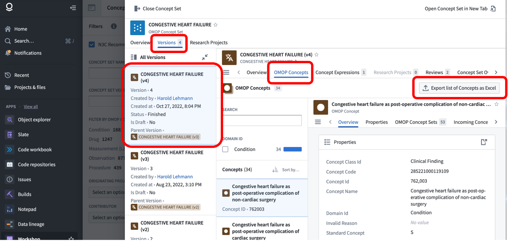
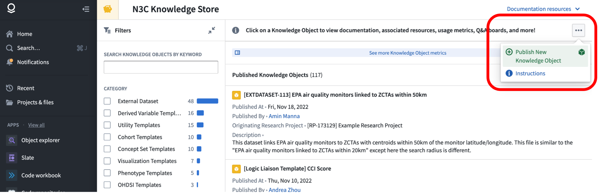

---
author:
  - name: Julie A McMurry
    affiliation: University of Colorado, Anschutz Medical Campus
    affiliation-url: https://tislab.org/
    email: julie.mcmurry@cuanschutz.edu
    orcid: 0000-0002-9353-5498
    attributes:
      corresponding: true

  - name: Jeremy Richard Harper
    affiliation: Owl Health Works
    affiliation-url: https://www.linkedin.com/in/jeremyharper1/
    email: jeremytech@gmail.com
    orcid: 0000-0003-1244-8948

  - name: Christine Suver
    affiliation: Sage Bionetworks
    affiliation-url: https://www.linkedin.com/in/christine-suver-451233b
    email: christine.suver@sagebase.org
    orcid: 0000-0002-2986-385X

  - name: Carolyn T Bramante
    affiliation: University of Minnesota
    affiliation-url: https://med.umn.edu/bio/carolyn-bramante
    email: bramante@umn.edu
    orcid: 0000-0001-5858-2080

  - name: Mary K Emmett
    affiliation: CAMC Institute for Academic Medicine
    affiliation-url: https://www.linkedin.com/in/mary-emmett-6673529
    email: mary.emmett@camc.org
    orcid: 0000-0002-8551-8655

  - name: Amit K Saha
    affiliation: Wake Forest School of Medicine
    affiliation-url: https://school.wakehealth.edu/faculty/s/amit-saha
    email: aksaha@wakehealth.edu
    orcid: 0000-0002-3542-4319

  - name: Farrukh M. Koraishy
    affiliation: Department of Medicine/Nephrology, Stony Brook University, NY
    affiliation-url: https://renaissance.stonybrookmedicine.edu/medicine/nephrology/faculty_research/koraishy_research
    email: Farrukh.Koraishy@stonybrookmedicine.edu
    orcid: 0000-0001-6974-5674

  - name: A Jerrod Anzalone
    affiliation: University of Nebraska Medical Center
    affiliation-url: https://gpctr.unmc.edu/
    email: alfred.anzalone@unmc.edu
    orcid: 0000-0002-3212-7845

  # - name:
  #   affiliation:
  #   affiliation-url:
  #   email:
  #   orcid:

csl: ../assets/csl/apa-7e.csl
---

# Publishing and Sharing Your Work {#sec-publishing}

**Chapter Leads**: Julie McMurry, Jeremy Harper

## Publication Committee Process {#sec-publishing-committee}

The Publication Committee is a multidisciplinary team that meets on a weekly basis to evaluate abstracts and manuscripts prior to submission for peer review (and / or preprint).
The committee's primary goal is to ensure that authors comply with N3C policies and procedures.
This chapter describes attribution and publication principles regarding community dissemination of research resulting from N3C.

The guiding principle of the Publication Committee is to be a steward of the following critical components of the N3C:

1. **Data partners and individual patients**: Assure that the publication is:
    1. Consistent with the approved Data Use Request (**DUR**)
    1. Consistent with policies to protect the identity of individuals, data partners, and marginalized groups

1. **Individual consortial contributors**: Assure inclusive and appropriate attribution of the work that went into the data elements used for a given analysis or publication.
Many individuals contribute time and expertise into building the N3C, and it is important to acknowledge their work.
Thus, a tiered approach to authorship has been developed (see @tbl-publishing-authorship).

1. **N3C collaborative**: Assure that information about the N3C is represented accurately

1. **Authors**: Serve as a resource for authors

| Tier 1:<br>Masthead Authorship | Tier 2:<br>Consortial Collaborators | Tier 3:<br>In Text Acknowledgements |
| ------------------------------ | ----------------------------------- | ----------------------------------- |
|Substantial intellectually important contributions made directly to the manuscript | Less substantial but still intellectually important contributions made directly to the study/manuscript or to knowledge artifacts used directly by the study, such as concept sets or code | Important contributions to the N3C infrastructure |

: Authorship tiers designed to accurately represent publication contributions {#tbl-publishing-authorship}

The first two tiers are indexed in Medline, which is an important way for contributions to acknowledge those who made them.
Tier 1 and 2 authors must satisfy [ICMJE criteria](https://www.icmje.org/recommendations/browse/roles-and-responsibilities/defining-the-role-of-authors-and-contributors.html):

> The ICMJE recommends that authorship be based on the following 4 criteria:
>
> * Substantial contributions to the conception or design of the work; or the acquisition, analysis, or interpretation of data for the work; AND
> * Drafting the work or revising it critically for important intellectual content; AND
> * Final approval of the version to be published; AND
> * Agreement to be accountable for all aspects of the work in ensuring that questions related to the accuracy or integrity of any part of the work are appropriately investigated and resolved.

The publication committee has a role in helping authors identify Tier 2 and Tier 3 contributors:

* Notify core contributors (named in [covid.cd2h.org/acknowledgements](covid.cd2h.org/acknowledgements)) and relevant domain teams of manuscripts that might be using their work
* Enable core contributors and relevant domain teams to review the manuscript and either opt out of acknowledgment or opt into consortial contributorship.
  Opting into consortial contributorship requires meeting the four ICMJE criteria above
* Any other invited individuals (e.g., domain team) would opt into acknowledgment OR opt into consortial contributorship;
  the latter requires meeting the four ICMJE criteria above.
* The publication committee then informs the author of any responses to consortial-level contributions or changes to default acknowledgments.

The publications committee helps to maintain the list of core contributors, and progress is underway to automatically track contributions directly within the N3C Data Enclave, which aids this process.

The publication committee also maintains the content on <https://covid.cd2h.org/acknowledgements> to be included in the acknowledgments section of each manuscript.
An abridged version of the acknowledgments is available for use in abstracts, posters, and slides.

## Result Download (aka export) Request Process {#sec-publishing-drr}

### Policy summary {#sec-publishing-drr-summary}

In compliance with the NCATS [Data Transfer](https://ncats.nih.gov/files/NCATS_Data_Transfer_Agreement_05-11-2020_Updated%20508.pdf) and [Data Use](https://ncats.nih.gov/files/NCATS_N3C_Data_Use_Agreement.pdf) Agreements that all N3C Data Enclave users agree to, under no circumstances are tables, figures, parameter estimates, or aggregated statistics to leave the Enclave until download (aka export) approval is obtained by the ResultDownload Committee.
Prior approval is required for export regardless of the result format (e.g., tables, figures) and regardless of the target venue (manuscripts, posters, presentations, supplementary material, or even your own private hard drive).
Prior approval is also required regardless of the export mechanism (screenshot, copy/paste, or download).

### Constraints with aggregated data pertaining to small groups of patients (aka small 'cell sizes') {#sec-publishing-drr-small}

To protect patient's data confidentiality, aggregations pertaining to fewer than 20 persons, unless the value is zero, must be identified with a symbol (best represented as `< 20` with a corresponding statement that group size below 20 has been obscured in accordance with the N3C Data Use Agreement).
Users may apply for an appeal to reduce the reportable threshold down to 10 (via the Enclave-external help desk, see @sec-support).
A strong scientific rationale for this must be provided.
NCATS makes the final decision about whether to approve the appeal.
In no cases may group sizes below 10 be considered.
Authors must include an asterisk or footnote in their manuscript to indicate that the values as low as 10 are reported with approval from the N3C Download Committee.

Example: Consider the following fictional table, which reports several aggregations of fewer than 20 patients in the 'other' gender category, race (AI/AN, black), and in comorbidities (Dementia, HIV).
In their original form (left) these would violate the policy, as there are several values reported below 20.
Even if these values are simply replaced with `< 20` (middle), the masking is still insufficient, because marginal totals can be used to calculate some of their contents.
A fully-masked example is shown on the right, modifying the reported values to satisfy the policy constraints, and including a note of the changes made.

{#fig-publishing-010-masking-example width=100% fig-alt="masking-example"}

### Constraints related to Native Populations {#sec-publishing-drr-native}

NCATS has engaged in extensive discussion with the NIH Tribal Health Research Office and developed data use plans based on Tribal input following formal Tribal Consultations.
As of September 2022, data from individuals who self-identify as American Indian (AI) or Alaska Native (AN) are indicated in race and ethnicity distribution.

* All zip codes of regions representing rural populations of 20,000 persons or less are fully obscured to '00000'
* All zip codes of regions of more than 20,000 persons that overlap with Tribal communities or where the majority of residents identify as AI/AN are identified by the first 3 digits.
  For example, if a ZIP code of "01234" represents a predominantly AI/AN community, the user will see only a partial ZIP code of "012".

The N3C Data User Code of Conduct was revised to clarify that assumptions about Tribal affiliation are not valid or appropriate.
For more information, consult [NCATS Tribal Consultations](https://ncats.nih.gov/n3c/about/tribal-consultation).

### Constraints related to Data Partner IDs {#sec-publishing-drr-partner}

For any exports that include Data Partner IDs, these IDs must be masked before being published and a statement that these have been masked must also be included.
You may consider assigning random labels to data partners, such as four-digit codes which do not occur in the partner IDs.

## Technical Considerations {#sec-publishing-tech}

In addition to the processes and policies described above, there are technical requirements for exporting summary data and figures from the N3C Data Enclave, and features you should be aware of as your project nears publication.

### Pinning to a Release {#sec-publishing-tech-pin}

All datasets in the Enclave are capable of being versioned with branches, meaning that previous versions of a dataset remain available under a different branch name.
N3C uses this mechanism to provide researchers access to the most recent version of the data via the 'master' branch, which is selected by default when importing datasets to [Code Workbooks](tools.md#sec-tools-apps-workbook) or [Code Repositories](tools.md#code-repositories-sec-tools-apps-repo).
For example, consider the following Code Workbook, into which we've imported the [Synthea notional `condition_era` table](support.html#sec-support-notional-synthea).

{#fig-publishing-020-dataset-branch fig-alt="dataset-branch"}

Clicking on the "Branch" tab of the dataset node shows that the master branch is currently being used in this workbook.
Instead of master, we could use the dropdown to select another branch–on real N3C data, these branches will be named like `Release-v98-2022-10-27`. (We call them releases because new versions are 'released' periodically after [quality checks and harmonization](cycle.md).) Selecting such a branch will import the release of that table as of the date selected, effectively 'pinning' the dataset to a point in time.
The `master` branch is configured to always match the latest release, and thus changes over time.

When working with a Code Repository, the branch can be selected as a parameter to the `Input` entry in the `@transform` decorator, for example:

```py
source_df = Input("/UNITE/LDS Release/datasets/condition_era", branch = "Release-v98-2022-10-27")
```

:::{.callout-note}
After changing the branch of an imported dataset, you will need to re-compute downstream results for their output to reflect the new input.

Additionally, all primary N3C tables are versioned with similar release names; if you are using both the `condition_era` and `drug_exposure` tables, you should select the same branch for each.
It is not recommended to mix data from different releases (or a pinned release with the master branch), because they may contain incompatible data–each N3C release is designed to be a self-contained set of datasets.

In fact, because downstream results are only updated when they are explicitly run, you may wish to avoid using the master branch altogether, or run the risk of one set of different sets of results being based on different releases, depending on when they were run.
:::

Why is pinning to a release helpful? Because the default `master` branch is continuously being updated, analysis results based on it will change over time along with the underlying data (if they are re-run).
This becomes cumbersome when writing about results!

### Download Request Process {#sec-publishing-tech-process}

All research results derived from N3C data–including summary tables, figures, and logs–must be reviewed to ensure they don't inadvertently leak any patient-level data.
The review will check for the policy requirements described above (such as cell sizes less than 20 being masked), and when approved you will be able to download tabular data as a comma-separated-values (CSV) file, images as PDF or PNG, and logs as plain text.

The submission and export process is described in detail in the [How to download results outside the Enclave training module](https://unite.nih.gov/workspace/module/view/latest/ri.workshop.main.module.e7b83a8c-545e-49ac-8714-f34bfa7f7767?view=focus&Id=15) , but we'll provide a brief overview here.

#### Submitting a Download Request {#sec-publishing-tech-process-submit}

The download request dashboard may be accessed from the Enclave homepage under "Download Dashboard." This interface shows your previous requests, and you can submit a new one via the "Submit a new Download Request" button.

{#fig-publishing-030-download-dashboard fig-alt="download-dashboard"}

When submitting a new download request, you will first be asked to complete a short quiz to ensure you understand the requirements.
Subsequently, you will be prompted to enter information about the request, and select one or more "Resources" that you wish to export.
A single download request may include multiple resources, such as multiple summary tables saved as datasets.
To export figures you should include them in a Report, which can be done from either the Code Workbook or Contour interfaces.
Desired log information (such as textual results from statistical tests) should also be copied and pasted into the report so that it can be reviewed.

{#fig-publishing-040-download-form fig-alt="download-form"}

If you need the review request to be expedited, you have the option of entering a Need By Date and providing a justification.

#### Downloading an Approved Request {#sec-publishing-tech-process-download}

When a request is approved, behind the scenes a read-only copy of the materials you requested is created in a location that you will have access to download from.
This is to prevent modification of export materials post-review.

When your request is approved, you will see it listed as Approved in the Download Dashboard (see above).
Each approved request is provided with a DRR ID (which stands for Data Review Request), for example "DRR-E5C4B6C" shown above.
If we scroll down further in the specific request, we can use the "View all…" link to see the individual approved "Resource(s) To Download":

{#fig-publishing-050-download-approved fig-alt="download-approved"}

To export one of the datasets as CSV, we can open it by clicking on it, and in the resulting new tab select "Download as CSV" from the "Actions" menu - this will prompt you to enter the corresponding DRR ID, after which the file will be downloaded to your local computer.

Exporting figures and logs stored in Reports can be done in multiple ways.
After opening the approved report from the list of resources to download, you can select either "Export to PDF" or "Export to PowerPoint" from the "Actions" menu.
Again you will be prompted to enter the DRR ID before the file download begins.
A common issue with "Download as PDF" is that figures produced in Code Workbooks may be lower resolution than expected.

### Exporting Code to a Git Repo {#sec-publishing-tech-code}

While code written inside the Enclave is generally not executable in other contexts (a result of the proprietary execution environment), exporting code for review and publication can be an important part of computational science.
Fortunately, both Code Workbooks and Code Repositories support cloning as git repositories, which can then be mirrored to public git hosting like GitHub or BitBucket.
This publication step is completely optional and may not even be applicable to all work.

:::{.callout-note}
Git repositories cloned from the Enclave are read-only; changes made to the locally cloned copy cannot be pushed back to the Enclave.
You can however pull new changes made in the Enclave, see below.

Unlike summary tables, figures, or other results derived from N3C data, N3C does not require review of code prior to export.
However, you should be careful to ensure that the code does not include any sensitive information added by hand.
The most common use case for such hard-coded data is `data_partner_id` values added to filter a data partner's data.
These should be removed or masked to comply with N3C policy.
:::

Code Workbook code can be exported via the "Gear" icon in the interface, under "Export git repository." Selecting this item will open the workbook in a new browser tab, with a new "Export Code Workbook" panel on the right, providing the git command to use to clone the repo to your local computer.
As described in the panel text, the link contains an authentication token that you should keep private.

{#fig-publishing-060-workbook-git fig-alt="workbook-git"}

The resulting git repo will contain three files, `pipeline.R`, `pipeline.py`, and `pipeline.sql`, containing all of the workbooks' R, Python, and SQL transform code respectively.
These files are not very reader-friendly, and as of this writing, N3C is working on parsing tools to help researchers publish their work in an accessible manner.

#### Pulling Changes, Pushing to GitHub, Branches, and Code Repositories {#sec-publishing-tech-code-github}

While it is not possible to push changes made locally up to the Enclave, it is possible to pull updates made in the Enclave with a simple `git pull`.
However, updates are not pulled unless some action is taken within the workbook to commit them prior to pulling.
Simply editing the code for a transform is not enough, but executing a transform or adding a new transform will commit the current state of the workbook so that it can be pulled.

Once you've pulled the latest version of your workbook locally, you likely will want to push a copy up to a public repository such as GitHub.
The recommended way to do this is to create a new _empty_ repository in GitHub (or your git hosting service of choice) with the same name as the workbook, and set it up as a push-only remote repository.
For example, for a workbook named `example_workbook`, one would create a new GitHub repository named `example_workbook`, and in the local copy run:

```bash
git remote set-url --add --push origin https://github.com/<username>/example_workbook.git
```

A subsequent `git push` will sync the state of the remote repository.
You will of course need the appropriate permissions to push a repository to GitHub, via a [Personal Access Token](https://docs.github.com/en/authentication/keeping-your-account-and-data-secure/creating-a-personal-access-token) or some other means.

If you have created one or more branches in your code workbook, these are treated as regular git branches and so can be synced locally with `git fetch` and `git switch <branch-name>`.
A subsequent `git push` will push the new branch to GitHub as well.

Code Repositories work much the same way.
The primary differences are that

1. commits to a repo in the Enclave are made manually, rather than automatically when a transform is run or created, and
1. the Clone button provides only the git URL with the embedded token, you will need to use this URL in combination with `git clone` or other git commands as usual.
  Code Repos similarly support branching.

{#fig-publishing-070-repo-git fig-alt="repo-git"}

#### Python Libraries and Code Repositories {#sec-publishing-tech-code-python}

Code Repositories are less frequently submitted to the Knowledge Store, but they provide a feature for sharing code that Code Workbooks don't: it is possible to author a Python library in a Code Repository that can then be imported for use in either another Code Repository or a Code Workbook by any N3C researcher.
One such example is the [Semantic Similarity Python Library](https://unite.nih.gov/workspace/module/view/latest/ri.workshop.main.module.3ab34203-d7f3-482e-adbd-f4113bfd1a2b?id=KO-E28751A&view=focus) .
Authoring Python libraries is different from authoring Code Repositories that transform data, and is covered in the [official documentation](https://www.palantir.com/docs/foundry/transforms-python/share-python-libraries/),
as is [utilizing such libraries in Code Repositories](https://www.palantir.com/docs/foundry/transforms-python/use-python-libraries/).
Using them in Code Workbooks requires updating the workbook [environment](https://www.palantir.com/docs/foundry/code-workbook/environment-overview/) to include the library, just like with any other Python or R library you might like to use.

In fact, Python libraries published this way are automatically usable by others in N3C without submission to the Knowledge Store, but you should still submit the repository itself along with documentation as a Knowledge Object for discoverability in N3C.
If you run into issues or have questions, be sure to submit an [Enclave-internal support ticket](support.md#sec-support-internal) or visit [office hours](support.md#sec-support-office).

### Exporting Concept Sets {#sec-publishing-tech-concepts}

As discussed in @sec-understanding, concept sets are sets of OMOP concept_ids representing clinical concepts.
These are organized and curated as shared resources in N3C, see the section on the [Concept Set Browser](tools.md#sec-tools-concepts) for details.

When publishing work utilizing a concept set, you will likely want to download the concept set in a tabular format for inclusion in supplemental materials.
Fortunately, the concept set browser supports this functionality–when viewing a specific version of a concept set, the "OMOP Concepts" tab lists the individual concepts and provides an "Export list of Concepts as Excel." The provided Excel export includes the concept IDs and other relevant information.

{#fig-publishing-080-cset-excel-export fig-alt="cset-excel-export"}

Some concept sets, notably those properly reviewed and marked N3C Recommended, are already published externally and referenceable via a DOI at the [N3C Zenodo community](https://zenodo.org/communities/cd2h-covid/).

## Submitting to the Knowledge Store {#sec-publishing-ks}

For security reasons the permissions around project workspaces are very tight; it is not possible for a researcher to share data, code, or other resources with others outside of the project workspace.
While necessary, this prevents code sharing and re-use amongst the many analysts working in the N3C Data Enclave.
The [N3C Knowledge Store](tools.md#sec-tools-store) provides an authorized mechanism for researchers to share code, and datasets derived via code, with other researchers (provided they also have access to the correct input datasets in the case of shared datasets).
Because the Knowledge Store is internal to the Enclave and protected to those who have the authorization to view row-level data, the publication is not involved in monitoring or approving the contents.

If you've written an analysis pipeline that would be of benefit to others, you should consider submitting it to the Knowledge Store for others to find and use.
Details on this process are covered in the [Knowledge Store Guide](https://unite.nih.gov/workspace/module/view/latest/ri.workshop.main.module.e7b83a8c-545e-49ac-8714-f34bfa7f7767?view=focus&Id=9)  training module, but we'll give an overview here.
Note that the process can be cumbersome and sometimes requires administrator help–be sure to submit an [Enclave-internal support ticket](support.md#sec-support-internal) or visit [office hours](support.md#sec-support-office) if you run into any issues or have questions.

Code sharing within N3C is usually accomplished by sharing Code Workbook "templates" in the knowledge store, which provide a set of workbook nodes that can be imported into a workbook and configured via parameters for the end user.
Authoring workbook templates is covered in the [official documentation](https://www.palantir.com/docs/foundry/code-workbook/templates-overview/).
Templates are typically accompanied by a README (as a Report) with documentation, an example workbook using the template on N3C data, and potentially the derived dataset created by the example workbook. We suggest placing these resources in a single folder prior to submitting them to the Knowledge Store.

To submit your new "knowledge object" to the store, first find the "Publish New Knowledge Object" item under the … menu in the upper right of the Knowledge Store:

{#fig-publishing-090-knowledge-store-1 fig-alt="knowledge-store-1"}

This will open a form where you are able to select your knowledge object (you should select the folder containing your template and other materials) and add details such as a title and description.

{#fig-publishing-100-knowledge-store-form fig-alt="knowledge-store-form"}

Once the form is completed the submission will be sent to a queue for system administrators to finalize the creation of the knowledge object (which requires creating read-only copies in a place where other researchers can access them) and listing them in the store.
Depending on the complexity and goals of your template, administrators may help create multiple versions of your example workbook with pre-configured access to different levels of N3C data and set up a schedule so that they produce new derived datasets whenever a new release of N3C data is available.
This allows other researchers to use the computed datasets directly, or import the template for customization.

::: {.callout-note appearance="simple"}

## Additional Chapter Details

This chapter was first published May 2023.
If you have suggested modifications or additions, please see [How to Contribute](../index.qmd#sec-welcome-contribute) on the book's initial page.
:::
