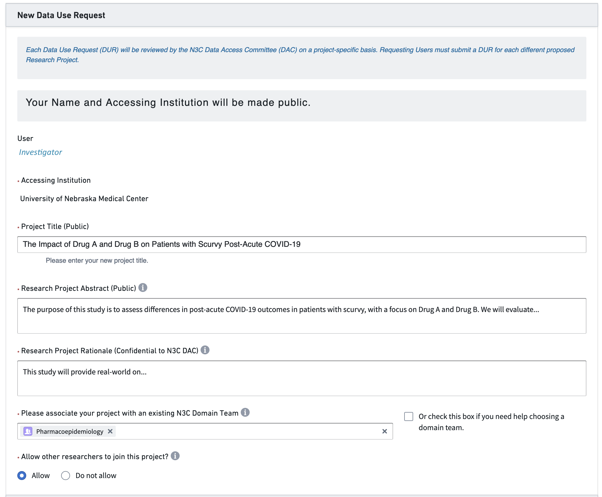

# A Research Story {#sec-story}

**Chapter Leads**: Will Beasley, Jerrod Anzalone

Now that we have introduced N3C and described its motivation and importance, we'll walk through the lifecycle of an example project from onboarding to publishing. This path typically takes at least 6 months and 6 collaborators. It isn't easy to do yourself, but fortunately N3C has attracted a large and diverse set of researchers. Coupled with a large and diverse set of robust patient records, completing a research project within a year is possible.

{#fig-story-010-intro-to-story fig-alt="Path of a typical N3C project"}

Suppose you are starting a project by yourself. In that case, the N3C ecosystem of researchers and resources is at your fingertips. You'll likely be able to recruit collaborators with complementary skills (in addition to N3C-wide resources such as [instructional material](support.md) and [office hours](support.md#sec-support-office)).  If you would like to join an existing project, there are [domain teams](onboarding.md#sec-onboarding-dt) and ongoing projects that likely will fit your interests and benefit from your abilities. @fig-story-010-intro-to-story provides a high-level overview of the path of a typical N3C project from clinical question to research product.

Electronic Health Record (EHR) research has become an increasingly important tool to evaluate real-world evidence (RWE) to understand insights into treatment effectiveness, the impact of healthcare interventions, and our understanding of rare diseases. EHRs provide access to large, diverse patient populations and longitudinal data that allows observations of health changes over time or in cross-section. The strength of the EHR is that it reflects real-world care and is often a better representation of clinical care than the controlled settings of a traditional clinical trial. However, with this comes challenges of interpreting differences in care delivery, data standards, and merging expertise from clinical subject matter experts, clinical informaticists, biostatisticians and epidemiologists, medical terminologists, and other experts as healthcare data is linked with other health assets to move toward a more comprehensive representation of a patient’s lived experience relative their health outcomes.

:::{.callout-note icon=false}

## Voice of Narrator

Our story begins in your office. Your own piece of heaven. As a researcher of scurvy, you have wondered, "do patients receiving the newest medications have more favorable covid outcomes than patients receiving the previous generation?" Given that scurvy is a rare disease with no opportunities for industry funding, leaving the best option for studying it observational data from the EHR. You expect a modest improvement based on the meds’ relationships with other diseases. But many patients are required to detect a modest effect size, and your local institution has a small population. Given its low prevalence, no single institution would have a sufficient sample size to answer your research question.

Yesterday you attended a local N3C presentation and became interested because it likely has enough qualifying scurvy patients to detect even small signals.  Your mind wanders as you get a little greedy; additional hypotheses enter your daydream.  *Does the relationship attenuate as you move inland?*  You realize that a massive national dataset can not only better address your existing question, but it could also allow you to ask newer and more nuanced questions.  *Is the relationship more pronounced in other racial/ethnic groups?*  The stream persists throughout the night.
:::

## Onboarding {#sec-story-onboarding}

The startup costs are more expensive for an N3C investigation compared to most, but the incremental costs are cheaper.  Even with strong institutional support, the university's agreement with the NIH takes several months in legal and administrative channels.  Yet after clearing that first (tall) hurdle for your site, each specific project takes only a week or two to be processed by the N3C staff.  That's a remarkably short time considering the scale of available data.  It's likely quicker than initiating a project based on a single EMR from your site --much quicker than EMRs from 70+ sites.

:::{.callout-note icon=false}

## Voice of Narrator

The next afternoon you are chatting with your institution's Navigator.^[This role may be called something differently at your Institution; the roles are defined below in @sec-story-team.]  She organized the local N3C presentation and invited any interested attendees to contact her.
:::

::: {.callout-tip appearance="simple" icon=true}
Hover over a footnote to see the popup, without jumping to the bottom of the page.
:::

* **Navigator**: I'm glad you think the N3C might help your research.  As I wrote in this morning's email, the agreement between the university and the NIH was established last year, so don't worry about that.^[Read about the institutional-level DUA in @sec-onboarding.]  There are two remaining steps.  First, complete your personal paperwork.^[See @sec-onboarding.]  Second, submit a DUR tailored to your hypotheses.^[Project-level paperwork are discussed in @sec-onboarding.]

* **Investigator**: Remind me what a DUR is?

* **N**: A *d*ata *u*se *r*equest describes your upcoming project.  Once a committee approves your proposal, your project's code and data are protected in this workspace allotted on the NIH cloud.^[The NIH "Enclave" is detailed in @sec-tools.]  Everyone on your project uses this dedicated workspace too.  But they don't have to submit additional DURs --you grant them permission to join yours.^[DURs are the topic of @sec-access.]

* **I**: Umm, I think I got it.

* **N**: It will make sense once you get it into it.  Skim the example DUR proposals I'm sending now.  Then start filling out this online form.  Get as far as you can, and then I'll help with the rest.  If there's something I don't know, I'll ask a friend.  The DUR application process will take about an hour.  Then the proposal will likely be approved within a week or two.  In the meantime, we can talk about potential collaborators.

* **I**: Is there anything else I need to know?

* **N**: The only other consideration at this point is whether your want your study to use Level 2 or Level 3 data. Level 2 data is fully de-identified, meaning all the dates are shifted by up to 180 days. Also, all location identifiers are obfuscated to allow potential reidentification, so you won’t have access to 5-digit ZIP Codes or other granular location measures. If you need either of those, you have to submit Level 3 data, which is a limited data set containing these data elements. Your institution requires an IRB protocol to submit a Level 3 DUR, so keep that in mind.

* **I**: Ok, that’s very helpful. I may need real dates as I anticipate differences in treatment deliveries based on real-world availability. Am I stuck with Level 2 data if I start there?

* **N**: No. If needed, you can request a workspace to be updated from Level 2 to Level 3 and receive IRB approval.

* **I**: That’s great. I think we’ll start with Level 2 and go from there. I’ll work on the research protocol.

After some thought, the investigator puts together a research protocol and submits a DUR in N3C. They submit the [DUR](access.md#sec-access-dur), shown in @fig-story-020-dur.

{#fig-story-020-dur fig-alt="Submitted Data Use Request"}

## Team building & collaborating {#sec-story-team}

The next step is to build a team to leverage retrospective medical records. Like most contemporary research teams, heterogenous skills are important. Ideally a team has at least, as shown in @fig-story-030-team-formation, members who can fill the roles below:

1. a **navigator** who has learned the administrative and IRB requirements and can facilitate the investigation,
1. a **subject matter expert** (SME) who has clinical experience with the disease of interest and can inform decisions with EHR variables,
1. a **statistician or data scientist** who understands the limitations of observational collection and can model retrospective data,
1. a **logic liaison or informatician** who understands the challenges of EHRs and can extract and transform information (also known as a data engineer),
1. a **data liaison** who has expertise in medical terminology to help develop concept sets or identify previously validated concept sets, and
1. a **principal investigator** who knows the literature and can testable hypotheses and write the manuscript.

{#fig-story-030-team-formation fig-alt="Typical N3C Team Composition"}

N3C teams have some differences from conventional research teams at single sites.  Some trends we have noticed are:

1. Most N3C teams have researchers from multiple institutions. In the experience of the authors and editors, this encourages more diverse opinions and more willingness to express constructive criticism. Researchers from a single institution/lab are sometimes more reluctant to generate contrary views.

1. The role of the navigator is often the most important member of a successful team. Your local investigations are likely guided by someone with years of experience with institutional safeguards and the personnel who can help when something stalls. N3C is bigger and younger than your site’s EHR research team, so an N3C project will benefit when guided by a bright, patient, and persistent navigator.

If your team needs someone, consider asking a relevant [domain team](onboarding.md#sec-onboarding-dt) for help identifying and approaching potential collaborators.

:::{.callout-note icon=false}

## Voice of Narrator

Recruiting your crew...
:::

## Research Team's First Meeting

:::{.callout-note icon=false}

## Voice of Narrator

Three weeks later...

Once the team is assembled, the first discussion is usually a variation of this exchange, with the goal to move toward competition of a research protocol:
:::

* **Investigator**: Welcome everyone.  We'd like to know if Drug A or Drug B is associated with better outcomes.
* **Statistician**: No problem.  I can longitudinally model the type and amount of each medication received by each patient, relative to their intake date.
* **Logic Liaison**: Hmmm.  I'm happy to produce a dataset with the `dose` and `frequency` columns^[Read about the OMOP Standard Tables in @sec-understanding, specifically the medications are in the [`drug_exposure`](https://ohdsi.github.io/CommonDataModel/cdm60.html#DRUG_EXPOSURE) table.], but you may not find it useful.  Those two columns are sparsely populated and they look inconsistent across sites.^[Conformance is a topic in @sec-lifecycle.]
* **I**: Bummer.  Then what's realistic or feasible?
* **Subject Matter Expert**: Maybe this simplifies the picture...  In my clinical experience, a patient rarely switches between Drugs A & B.  Based on the initial presentation, their provider will pick A *or* B, and complete the regimen unless there's an adverse event.
* **St**: In that case, should my initial model have three levels for treatment: A, B, and A+B?
* **I**: Probably.  In the N3C database, can someone tell me how many patients get both during the same visit?
* **LL**: I'm already logged into the Enclave^[See @sec-access for accessing the N3C Enclave.].  Give me 2 minutes to whip up something in SQL.^[Read about SQL, Python, and R transforms in Code Workbooks in @sec-tools.]
* **I**: Oh my goodness, is that your cat?  What a cutie! ^[There is a brief discussion of SME's cat.]
* **LL** *after a few minutes*: Ok, I got it.  [Unmutes himself.]  Ok, I got it.  40% of patients are Drug A only, 52% are Drug B only, while 8% have at least one administration of both Drug A & B in the same visit.
* **SME**: Weird. 8% is a lot more than I expected.  I was thinking around 1%.
* **LL**: Hmm, let me check.  Give me another minute.^[There is a brief discussion of S's daughter strutting in the background wearing a cowboy hat and waiving a fairy wand.]
* **LL** *after a few minutes*: I see what you mean.  It looks like the bulk of the combo patients were admitted in the spring of 2020. After Jan 2021, only 3% of patients have both Drug A & B.
* **St**: I was already planning to model the phase of the pandemic.  I'll test if there's a significant interaction between time and treatment.
* **I**: I like that as a starting point.  Regarding the question about dose and frequency...  For now let's assume the providers were following the current dosing guidelines.  Therefore the `dose` and `frequency` variables can be dropped from the analyses.
* **St**: Phew.  I didn't want to admit this.  But I skimmed the dosing guidelines you emailed yesterday.  It looked complicated.  I wasn't sure if I could appropriately incorporate those variables in the model.
* **I**: Well, that's everything I wanted to cover today.  See you in two weeks.  Wait.  I can't believe I forgot.  Sorry -our Navigator is sick this week and I'm almost worthless in her absence.  Is everyone still on the call?  For our secondary hypothesis, we want everything to connect  to a patient's diagnoses.  ...before, during, and after their covid hospitalization.
* **LL**: Bad news.  This is kinda like the `dose` and `frequency` situation a few minutes ago. The structure of the [OMOP diagnosis table](https://ohdsi.github.io/CommonDataModel/cdm60.html#CONDITION_OCCURRENCE) theoretically can connect a patient's diagnoses across different locations.  But the quality of the historical records really depends on the site.  Some places like Rhode Island leverage their state's HIE^[An [HIE](https://www.healthit.gov/topic/health-it-and-health-information-exchange-basics/health-information-exchange) is a health information exchange.] to populate their N3C dataset.  However other places are not as well connected.  If a patient doesn't have diagnosis records, it's tough to determine if they are healthy, or if their primary care provider uses a siloed EMR.^[The benefits and caveats of real-world data are a theme throughout the book, particularly in the best practices discussed in @sec-practices.]
* **I**: Ugh.  Good point.
* **LL**: But I've got good news.  All the N3C contributors comprehensively capture all conditions diagnosed *during* the visit.  Furthermore the diagnosis codes are standardized really well across sites.  That's because all the providers enter ICD codes into the EMR, which eventually can be cleanly mapped to OMOP's standard concepts.^[Authoring and using concept sets are described in @sec-understanding.  Mapping an ICD to SNOMED diagnosis code is an example of mapping a "non-standard" to a "standard" concept, discussed in @sec-understanding.]
* **I**: Well, that's fine for this paper.  Maybe our next manuscript will follow up with N3C's death records.^[TODO: is the book planning to have a section on the CMS & death records?]
* **SME**: Sorry everybody, I have clinic this week, and they're calling me.  I need to drop.^[Everyone says goodbye to the cat.]
* **St**: Can I go back and ask a question about medications?  I see that Drug A has 15 different brand names.  I don't recognize half of them.  How should I classify them?
* **LL**: It's actually worse than that.  Sorry I'm a downer today.  Can you see my screen?  Drug A has 15 brand names and 200 different RxNorm codes; each package is uniquely identified by the NIH's NLM.  SME and I started on a concept set Thursday.  We're operationalizing the drug classes by their [RxNorm](https://www.nlm.nih.gov/research/umls/rxnorm/docs/appendix5.html) ingredient.  There are five ingredients that are conceptualized as Drug A.  A friend showed me how she used the OMOP tables in a different project.^[The [`concept_relationship`](https://ohdsi.github.io/CommonDataModel/cdm60.html#CONCEPT_RELATIONSHIP) table is discussed with the OMOP concept hierarchy in @sec-understanding.]  I'll roll up the meds into the patient-level dataset.  It will have one integer for the number of medication records tied to a Drug A ingredient and another integer for Drug B records.  You'll probably want to transform the two counts into two booleans.
* **St**: And if I change my mind and decide to use the counts, then at least I'll know.
* **Shoreleave**: and knowing is half the battle.

## Protocol, variables, & definitions

Developing a research protocol is both familiar and vague for most research teams in the context of EHR studies. Most researchers have several years of graduate-level courses and real-world experience.

1. Tradeoffs are inevitable when selecting variables. Rarely will an investigator’s first choice be available.

1. Retrospective medical records are extracted from a larger dataset. An investigation can use only a fraction of the terabytes in an EMR. Many decisions are involved to include only the relevant variables among the qualifying patients.

While there are different approaches to developing a Research Protocol, the general steps involved include:

1. Define the research question: The first step is to clearly define the research question and the patient population of interest. This will guide the selection of relevant clinical concepts and data sources.

1. Determine the study design: The research team should choose an appropriate study design, such as a cohort study or case-control study, and determine the inclusion and exclusion criteria for the patient population.

1. Develop the analytic plan: The research team should prospectively specify the statistical methods to be used to analyze the data, including any adjustments for confounding variables and any sensitivity analyses.

1. Document the study protocol: The research team should document a detailed study protocol that includes all of the above information, as well as any other relevant information, such as the ethical and regulatory considerations, data privacy and security measures, and data sharing agreements. N3C contains a Protocol Pad that supports the development and documentation of detailed study protocols.

After creating a research protocol, variable definitions are decided using OMOP and N3C tools and deployed in the Enclave.

## Learning and using OMOP and OHDSI Tooling

The [Observational Health Data Sciences and Informatics (OHDSI)](https://www.ohdsi.org/) Observational Health Data Sciences and Informatics (OHDSI) program maintains the Observational Medical Outcomes Partnership (OMOP) common data model (CDM). OMOP was funded in 2008 by the US Food and Drug Administration, primarily for adverse drug events surveillance, but it has since expanded to become the de-facto global research CDM. Detecting a small signal requires a large datasets --larger than any single health care database [@ohdsi_2019, Chapter 1]. Given its ubiquity and active research community, OMOP is well suited for N3C. OMOP has extensive tooling to support researchers, including two that directly support the curation of concept sets from the OHDSI program and one that is specific to N3C:

1. [Atlas](https://github.com/OHDSI/Atlas/wiki) provides a user-friendly interface for querying and analyzing data in the OMOP CDM. In the context of N3C, it supports browsing medical terminology and supports the development of concept sets.

2. [Athena](https://athena.ohdsi.org/) is a centralized repository of standardized clinical vocabularies.

3. The [N3C Concept Set Browser](@sec-tools) is an N3C specific tool that allows you to explore and modify existing concept sets as well as create new concept sets to fit your exact study needs.

Concept sets, described in detail in @sec-understanding and @sec-tools, are the basic building blocks of an analytic dataset. The contain lists of medical codes, usually restricted to very specific definition or computable phenotype. In N3C, they are used to identify cohorts or exposures to answer a research question. They point to standardized vocabularies and clinically organized domains in the OMOP CDM (e.g., drug, condition, measurement).

In general, the overall process involved in developing concepts is as follows:

1. Define the research question: The first step is for the research team to clearly define the research question and population of interest, which will guide the selection of relevant clinical concepts.
2. Explore the data: Using Atlas or the N3C Concept Set Browser, the team member filling as the data liaison will explore the data available or existing concept sets to identify relevant clinical concepts.
3. Refine the concept set: The data liaison works with the SME to refine the concept set, which is usually an iterative process, to include clinically relevant and exclude clinically irrelevant concepts.
4. Validate the concept set: Once the concept set has been defined, the SME and logic liaison validate the concept set and publish it in the N3C Concept Set Browser, which allows for reuse across the N3C community.

:::{.callout-note icon=false}

## Voice of Narrator

After determining the need for a concept set defining anemia, which is a common symptom of scurvy, the subject matter expert and data liaison meet to refine the concept set.
:::

* **Data Liaison**: Good morning! I've started digging into existing concept sets for anemia and found one potential option.
* **Subject Matter Expert**: Good morning! That's great. Let's take a look at it.
* **DL** *pulls up concept set for anemia*: This is one that's out there. It uses the parent SNOMED CT Code [271737000](https://athena.ohdsi.org/search-terms/terms/439777).
* **SME**: Hmm...this isn't quite right. We need anemia caused by blood loss. A lot of these are unrelated.
* **DL**: Gotcha. Let's take a look at the hierarchy and see if we can refine it. We can look at the descendants and go from there.
* *Three hours later*
* **DL**: Ok, great. I think we have a working example. I'm going to extract all of these into a spreadsheet. Please go through this one more time and then I'll share with the group to review.

## Creating an analysis-ready dataset

:::{.callout-note icon=false}

## Voice of Narrator

Once the project team has outlined the study protocol, key definitions, and timing of study elements, the next phase is the curation of a dataset for analyis. This is typically within the purview of the team informaticist or logic liaison. Let's take a peak into the process...
:::

After clarifying all the data elements and study protocol, the next step is to curate an an analytic dataset. Depending on the study design, this can be organized in multiple ways. In general, analytic datasets are organized at either the person or encounter level. This means that you'll have a single analytic dataset that contains one row with facts about either an individual patient or an individual encounter. This topic is covered in greater detail in the [Tools](tools.md) and [Best Practices](practices.md) chapters. 

Using the previously defined protocol, the informaticist will use the [concept set browser] to identify or create concept sets of relevance to the study and begin to pull together the analytic dataset in a [code workbook](tools.md#sec-tools-apps-workbook) or [code repository](tools.md#sec-tools-apps-repo) in the N3C Enclave. This will be a time-intensive process that, once completed, will result in a dataset that is ready for analysis, which can be handed off to the team's statistician for analysis.

<style>
table {
  border-collapse: collapse;
  border-spacing: 0;
  width: 100%;
  border: 1px solid #ddd;
}

th, td {
  text-align: left;
  padding: 8px;
}

tr:nth-child(even){background-color: #f2f2f2}
</style>
</head>
<body>

<strong>Table 1: Scurvy Analytic Dataset</strong>
<div style="overflow-x:auto;">
  <table>
    <tr>
        <th>Age</th>
        <th>Sex</th>
        <th>Race_Ethnicity</th>
        <th>Quarter_of_COVID_Diagnosis</th>
        <th>Smoking_Status</th>
        <th>Scurvy_Indicator_Before_COVID</th>
        <th>Medication_A</th>
        <th>Medication_B</th>
        <th>Diabetes_Indicator_Before_COVID</th>
        <th>COPD_Indicator_Before_COVID</th>
        <th>Liver_Disease_Indicator_Before_COVID</th>
        <th>Cancer_Indicator_Before_COVID</th>
        <th>Renal_Disease_Indicator_Before_COVID</th>
        <th>COVID_Hospitalization</th>
        <th>ECMO_IMV</th>
        <th>Time_to_ECMO_IMV</th>
        <th>Death</th>
        <th>Time_to_Death</th>
    </tr>
    <tr>
        <td>27</td>
        <td>M</td>
        <td>Non-Hispanic White</td>
        <td>Q2 2022</td>
        <td>Current or Former Smoker</td>
        <td>0</td>
        <td>0</td>
        <td>0</td>
        <td>0</td>
        <td>1</td>
        <td>0</td>
        <td>0</td>
        <td>0</td>
        <td>1</td>
        <td>0</td>
        <td>28</td>
        <td>0</td>
        <td>28</td>
    </tr>
    <tr>
        <td>75</td>
        <td>F</td>
        <td>Hispanic or Latinx</td>
        <td>Q1 2021</td>
        <td>No Documented History of Smoking</td>
        <td>0</td>
        <td>0</td>
        <td>0</td>
        <td>0</td>
        <td>0</td>
        <td>0</td>
        <td>1</td>
        <td>0</td>
        <td>0</td>
        <td>0</td>
        <td>28</td>
        <td>0</td>
        <td>28</td>
    </tr>
    <tr>
        <td>54</td>
        <td>M</td>
        <td>Non-Hispanic Black or African American</td>
        <td>Q4 2020</td>
        <td>No Documented History of Smoking</td>
        <td>1</td>
        <td>1</td>
        <td>0</td>
        <td>1</td>
        <td>0</td>
        <td>0</td>
        <td>1</td>
        <td>0</td>
        <td>1</td>
        <td>0</td>
        <td>1</td>
        <td>1</td>
        <td>1</td>
    </tr>
    <tr>
        <td>34</td>
        <td>F</td>
        <td>Non-Hispanic White</td>
        <td>Q1 2023</td>
        <td>Current or Former Smoker</td>
        <td>1</td>
        <td>0</td>
        <td>1</td>
        <td>1</td>
        <td>0</td>
        <td>1</td>
        <td>0</td>
        <td>0</td>
        <td>1</td>
        <td>1</td>
        <td>3</td>
        <td>1</td>
        <td>5</td>
    </tr>
    <tr>
        <td>…</td>
        <td>…</td>
        <td>…</td>
        <td>…</td>
        <td>…</td>
        <td>…</td>
        <td>…</td>
        <td>…</td>
        <td>…</td>
        <td>…</td>
        <td>…</td>
        <td>…</td>
        <td>…</td>
        <td>…</td>
        <td>…</td>
        <td>…</td>
        <td>…</td>
        <td>…</td>
    </tr>
</table>
</div>

## Analyses

:::{.callout-note icon=false}

## Voice of Narrator

Once the analytic dataset is finalized, the handoff between the informaticist and statistician takes place. This often requires a discussion or ongoing dialogue to understand the data structure and definitions. 
:::

* **Navigator**: Welcome everyone. Today we'd like to review the analytic dataset and next steps in moving the analysis forward. 
* **Informaticist**: Yep. I've made a new code workbook in your folder in the project workspace. Can you pull it up and we can take a look.
* **Statistician**: Sure. Did you send me the dataset? I don't remember seeing an email. 
* **N** Remember, everything has to be done within the secure N3C platform. So you won't be doing anything on your local machine. It all has to be done within the platform. Do you know how to get to the project workspace?
* **S** ...remind me. 
* *A few minutes later after a refresher.*
* **S** Ok, great. I think I get it. So it's not that different from using R in RStudio as long as I follow the documentation you sent me. I think I can figure that out. What happens when I want to share results with the rest of the team? Can I send them out?
* **N** You can add them to a report and share them within the N3C Enclave to those who have access to our project workspace. If you want to share results outside the platform, you can request any summary results, model output, or plots using the download review process. N3C leadership reviews any results before they can be extracted from the Enclave to ensure compliance with the N3C privacy and security expectations.
* **S** Gotcha. I'll reach out if I have any questions once I get to that point in the process. Thanks!

From here, the statistician can work directly in N3C using R or Python for data analysis. After some work figuring out the platform, the statistician has some simple summary statistics to add to a report. Within a code workbook, they develop the following code and output to add to a report. 

```
  descriptive_statistics <- function(analytic_dataset) {
  library(gtsummary)
  library(dplyr)

  patient_characteristics <-
    analytic_dataset %>%
    select(Scurvy_Indicator_Before_COVID, Age, Race_Ethnicity, Medication_A, Medication_B) %>%
    tbl_summary(by = Scurvy_Indicator_Before_COVID)  

  table1 <- patient_characteristics <- as_tibble(table1, col_labels = FALSE)

  return(table1)
  }
```

Which produces the following table. 

<strong>Table 2: Characteristics of Patients with and without Scurvy, January 2020 - December 2022 </strong>
<table>
    <tr>
        <th><strong>Characteristic</strong></th>
        <td><strong>No History of Scurvy,</strong> <br>N = 19,871</td>
        <td><strong>History of Scurvy,</strong> <br>N = 2,199</td>
    </tr>
    <tr>
        <th>Age, Median (IQR)</th>
        <td>50 (25, 75)</td>
        <td>51 (27, 75)</td>
    </tr>
    <tr>
        <th>Race/Ethnicity</th>
        <td>NA</td>
        <td>NA</td>
    </tr>
    <tr>
        <th>Non-Hispanic White</th>
        <td>7,834 (39%)</td>
        <td>883 (40%)</td>
    </tr>
    <tr>
        <th>Non-Hispanic Black or African American</th>
        <td>3,970 (20%)</td>
        <td>431 (20%)</td>
    </tr>
    <tr>
        <th>Hispanic or Latinx</th>
        <td>3,986 (20%)</td>
        <td>430 (20%)</td>
    </tr>
    <tr>
        <th>Missing/Other</th>
        <td>4,081 (21%)</td>
        <td>455 (21%)</td>
    </tr>
    <tr>
        <th>Medication A</th>
        <td>3,017 (15%)</td>
        <td>318 (14%)</td>
    </tr>
    <tr>
        <th>Medication B</th>
        <td>1,661 (8.4%)</td>
        <td>173 (7.9%)</td>
    </tr>
</table>

After repeating this for the remaining analyses for the project, the statistician creates a report and requests it be reviewed by the [N3C Download Review Committee](publishing.md)

* **Statistician**: Good afternoon! I just received notification from N3C that my download review request was approved. What happens now? 
* **Navigator**: That's great! Now that it's been approved, you can go into the Download Review Dashboard and there's an area where you can safely download the results. The review comes with a DRR #, which is required to download the associated results. 
* **S** Ok. And then I can send it out to the rest of the team? 
* **N** Yep! Once it's been reviewed, you can share it with the rest of the team outside of the Enclave. 
* **S** Great. Thank you! I'll set up a time to review the results with the team next week. 
  
## Draft paper, pub committee

:::{.callout-note icon=false}

## Voice of Narrator

Nearing the trail head...
:::

* **Investigator**: Thanks everyone for making this meeting. I hope you've had a chance to review the results that were circulated last week. 
* **Subject Matter Expert**: They looked great. Very unexpected, but intruiging results. I was surprised that outcomes were so much better in those exposed Medication B than Medication A. 
* *Team reviews the results in detail. Manuscript write-up divided amongst the study team.*
* **I** Ok, so we should all know what the next steps are in terms of the write-up. Are there any other requirements from N3C before we can submit the paper to our target journal? 
* **Navigator** Good question. The manuscript draft has to be reviewed by the N3C Publication Committee. They meet weekly and will review the drat to make sure it's compliant with N3C policies and adheres to the original research question proposed by us. 
* **I** Ok, that makes sense. How long does it usually take?
* **N** In my experience, it's a pretty quick turnaround. Usually 1-2 weeks unless there are serious issues with the draft. They are primarily concerned about compliance with N3C policies, such as not having small cell counts and having gone through the download review process. Since we did this, it should be a quick review. 
* **I** Awesome. I hope you'll be able to help us when we get to the step. Thank you!
* **N** Of course. Let's plan on meeting after the draft is closer to being finished. 
* **I** Sounds great. See you all in two weeks!

At this point, the team divides up the remaining work and gets to writing. After completing a draft that's almost ready to be submitted for publication, they submit their draft to the [N3C Publication Committee](publishing.md). After a week, they hear back from the N3C Publication Committee.

### Sample Email from N3C Publication Comittee
>
> Title: Approved to submit MSID:383.23 | Investigator | The Impact of Drug A and Drug B on Patient with Scurvy Post-Acute COVID-19 
> Dear Investigator,
>
>
>
> The publication committee has reviewed and conditionally approved your manuscript for submission. The following must be addressed:
> Please add "on behalf of the N3C consortium" to the end of the author list with an asterisk that says consortial contributors are in the process of being documented.
>
>
> Sincerely, 
>
>
> The N3C Publication Committee
>
> 