# Help and Support {#sec-support}

**Chapter Leads**: Shawn O'Neil, Saad Ljazouli

## Support Tickets: Enclave-Internal {#sec-support-internal}

While live-support options are available, submitting questions via "tickets" (also known as "issues" in the Enclave) helps ensure they reach the right person and that questions are logged and tracked.
Given the sensitive nature of N3C data, questions that pertain to patients or data partners should be asked within the Enclave itself.

The within-Enclave support ticket system is also a good avenue for technical questions, including about platform features, performance, permissions, and tooling.
In fact, when submitting a ticket in the Enclave, the ticket itself will automatically track the resource being viewed when the ticket is submitted.

To illustrate an example, we first navigate to the Synthea Notional Data entry in the Data Catalog (under "Projects & files" in the left navigation menu).

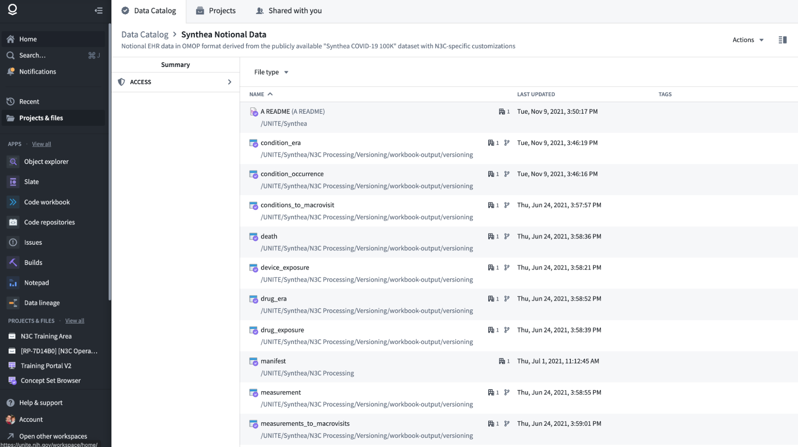{#fig-support-010-synthea-folder width=50% fig-alt="Navigating to Synthea"}

Next, we'll open the `condition_era` table which displays a preview in the Dataset Preview application.
Let's suppose we have a question about this data, or perhaps have discovered a potential data quality issue.

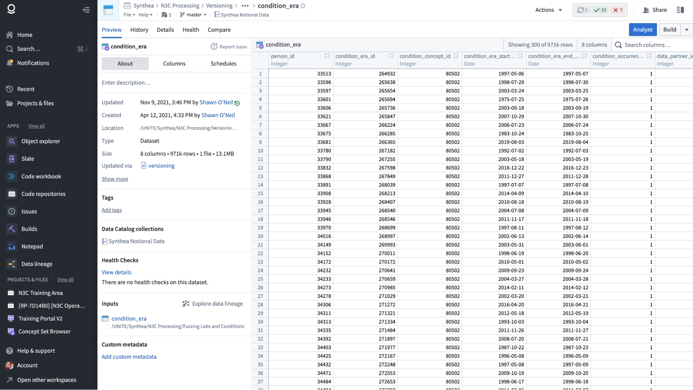{#fig-support-020-synthea-preview width=50% fig-alt="Synthea Preview"}

To submit a ticket about the currently opened dataset, we'll open the Help menu near the top, and select "Report Issue".

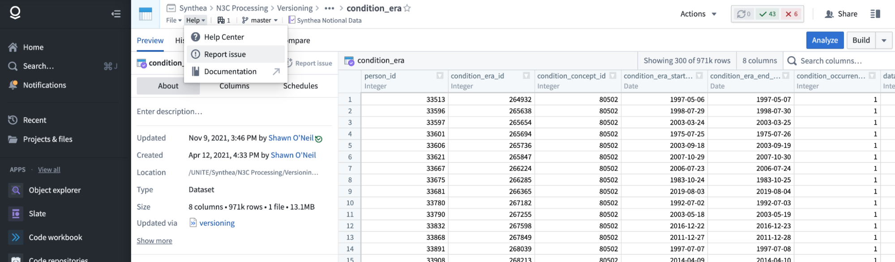{#fig-support-030-issue-report fig-alt="New Issue"}

This opens a dialog requisition information about the ticket.
Notice that the RESOURCE is identified as the `condition_era` table we had opened.
Since we are asking a question about the data, we'll select "Data quality".

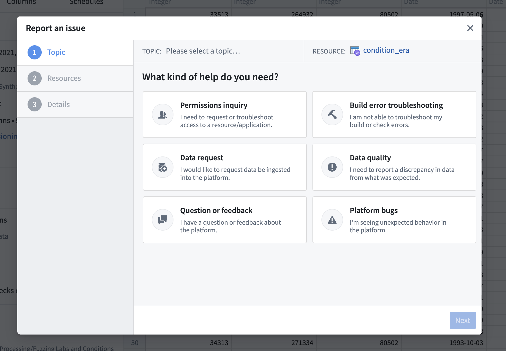{#fig-support-040-issue-kind-of-help width=50% fig-alt="New Issue: What kind of help do you need?"}

Once we click Next, we'll be prompted to change the resource of interest or application being used (if desired).
Since we are reporting an issue on a dataset, we even have the option of selecting the specific column we are interested in.
We'll just click Next here.

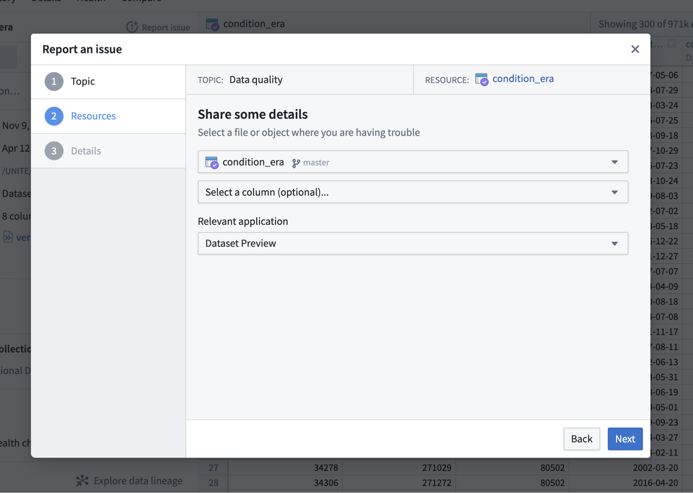{#fig-support-050-issue-share-details width=50% fig-alt="Share some details"}

:::{.callout-tip}

## Reporting Issues via Help Center {#sec-support-internal-reporting}

Using "Report Issue" from the Help menu of an Enclave application is the preferred way to submit a ticket, as this option keeps the best track of the resource being reported from.
While most Enclave applications have a Help menu near the top left, not all do.
In these cases you can alternatively submit an issue by finding the "Help & support" option in the lower part of the left navigation bar and choosing the "Help Center".
This will open a sidebar to the right, with a large blue button at the bottom for "Report an Issue".
:::

Finally, we are prompted to submit our issue, including a title and description with pre-filled questions depending on the issue type selected.
Answering all of these is not required, but any information you can add that speaks to them is helpful.
This section also allows you to upload a screenshot if desired.
Even though these issues are protected in Enclave, you should not screenshot any data (or results like summary tables or figures), as that would result in your local computer storing, even if temporarily, unapproved patient-level information.
Nevertheless, when excluding patient data is possible, a screenshot may help diagnose the problem, and the support personnel who respond to the issue may request a screenshot during follow-up.

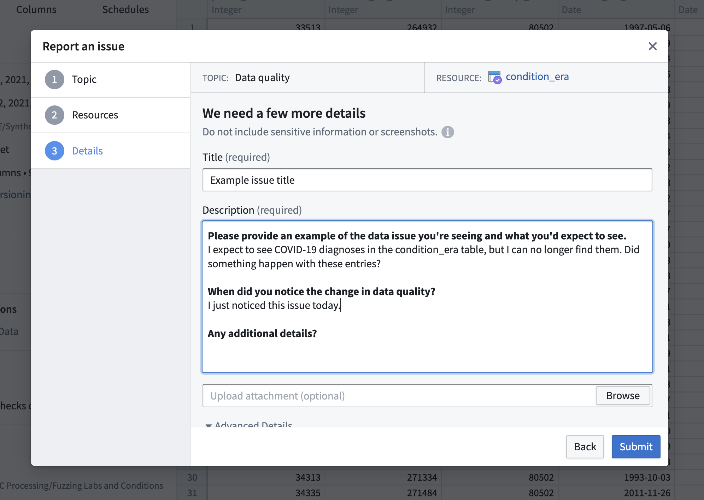{#fig-support-060-issue-more-details width=50% fig-alt="More details"}

We can scroll down in this panel to see more advanced information pertaining to the ticket.
Priority should generally be left to "Medium", since "High" priority is used to alert infrastructure support of system-wide issues or outages likely to affect a majority of users.
The default assignee is the "N3C: Issues Triage Team", who will further route the ticket to the appropriate support group (issues are triaged most business days, but follow-up from support may take longer).
Followers allow you to specify other users who will receive alerts about this issue.
Adding labels to the ticket is optional as well, since the triage team usually applies relevant labels for tracking purposes.

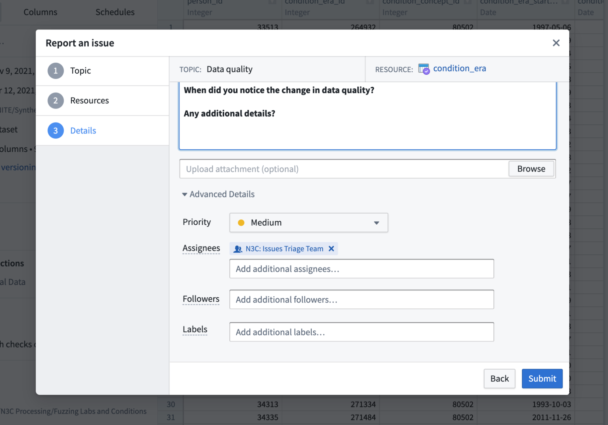{#fig-support-070-issue-submit width=50% fig-alt="Submit"}

Once we click Submit and refresh the browser page, we'll see that a new "warning" icon has been added to the interface indicating that the resource now has one or more open issues relating to it, and it can be clicked on to open a menu with details.
This warning will also show for other users who open the resource, and it will show in the file browser for this dataset.
Reporting issues about datasets from the datasets themselves is thus a mechanism for alerting support teams and other N3C researchers about potential data quality issues.
The same principle applies to other resource types like Code Workbooks, in cases where multiple researchers are working with them.

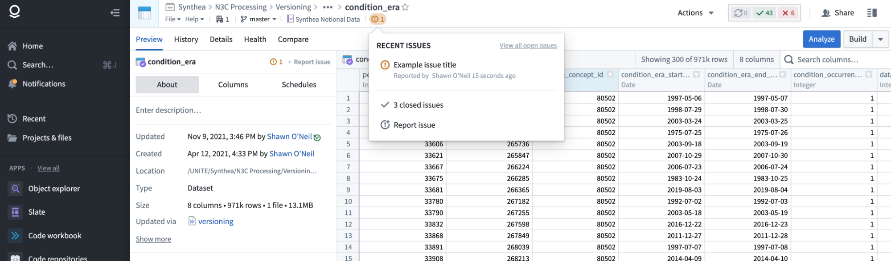{#fig-support-080-issue-recent fig-alt="Recent Issues"}

### Issue followup {#sec-support-internal-followup}

After your ticket is submitted, it will be routed to a triage team who will decide which support group is best able to address it.
These include groups with admin-level access and general knowledge of the Enclave (at least one of which is familiar N3C-specific tools or workflows), experts in N3C data ingestion and harmonization processes, as well as individuals with expertise in OMOP and other N3C technologies.

When activity occurs on your ticket you will see a small orange dot appear on the Notifications navigation menu item indicating you have a new notification, clicking this will show this notification (and any others you may have received).
By default, you will also receive email notifications for ticket activity.
This can be configured under your account preferences (the Account item in the left navigation menu).
Finally, you can review and respond to tickets via the Issues application (which may be hidden for you in the left navigation bar under "View all apps").

## Support Tickets: Enclave-External {#sec-support-external}

While the Enclave-internal ticket system is a good avenue for more technical questions about data analysis or the data itself, most other questions should be directed to an Enclave-external ticket system (sometimes called the "support desk").
At the very least, if your issue is you cannot login to the Enclave, that cannot be reported via the Enclave-internal ticketing system!

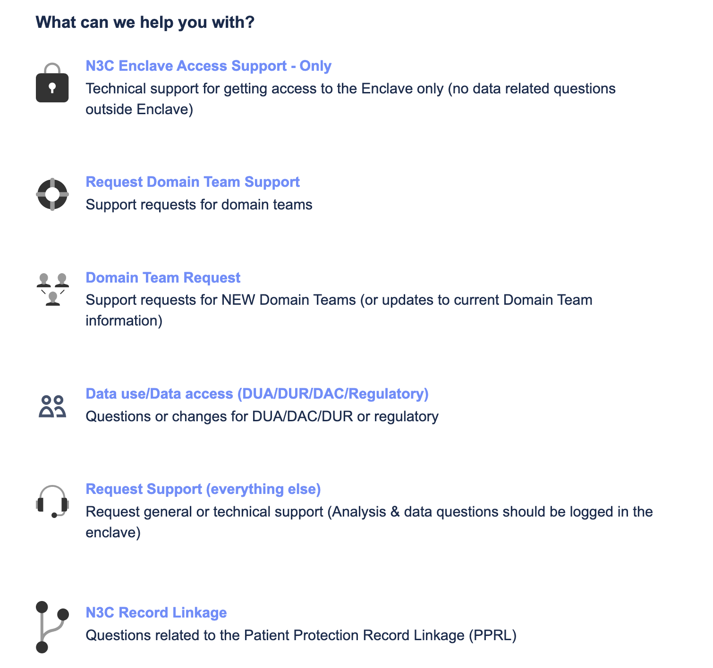{#fig-support-090-ticket-start width=50% fig-alt="Starting a ticket"}

The external help desk can be found at <https://covid.cd2h.org/support>.
Here you will find a link to "Submit a Support Request" that directs you to select the kind of support you need.

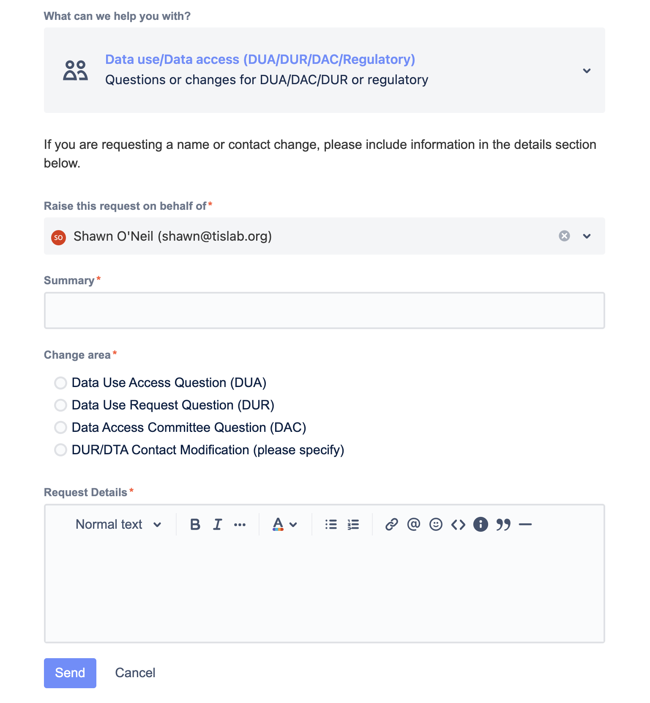{#fig-support-100-ticket-details width=50% fig-alt="Ticket details"}

Each of the options is described, and range from Enclave access support (commonly used for login issues), [Domain Team](onboarding.md#sec-onboarding-dt) creation or support, questions about [Data Use Requests](access.md#sec-access-dur) or the Data Access Committee (commonly used to check on DUR review status), [PPRL](understanding.md#sec-understanding-pprl) data, and "everything else". In general, this help desk is staffed by a broader range of core N3C administrators, and so is generally the best option outside of technical or data questions.

After selecting a support area, you will be given the option to select sub-categorizations, enter a description of the issue or question, provide a summary title for tracking and select the user (usually you) submitting the request.
The list of users is pre-populated based on N3C data, but you can also type an email address in the same field.

Once submitted, you will receive an email with a link to the ticket.
You can use this link to make further comments, or do so by replying to the email directly.

## Office Hours {#sec-support-office}

N3C hosts office hours on Tuesdays and Thursdays of most weeks, at 10a PT/1p ET.
The join link can be found at [https://covid.cd2h.org/support](https://covid.cd2h.org/support).
All are welcome to join, from experienced N3C analysts looking for help with complex machine learning implementations, to brand new researchers needing help finding their project workspace.
Experienced N3C volunteers are on hand and able to help with most questions.
They can also refer you to external resources, or suggest submitting a ticket when appropriate.
Some researchers join just to watch and learn.
To satisfy N3C data privacy rules, N3C staff utilize Zoom breakout rooms allowing a researcher to share their screen only with others who have the same [level](access.md#sec-access-background) of access.

## Training Resources {#sec-support-training}

Many training and educational resources are available within the Enclave where we can readily organize and link them to relevant resources.
The "Training Material" button on the Enclave homepage displays several categories of training materials:

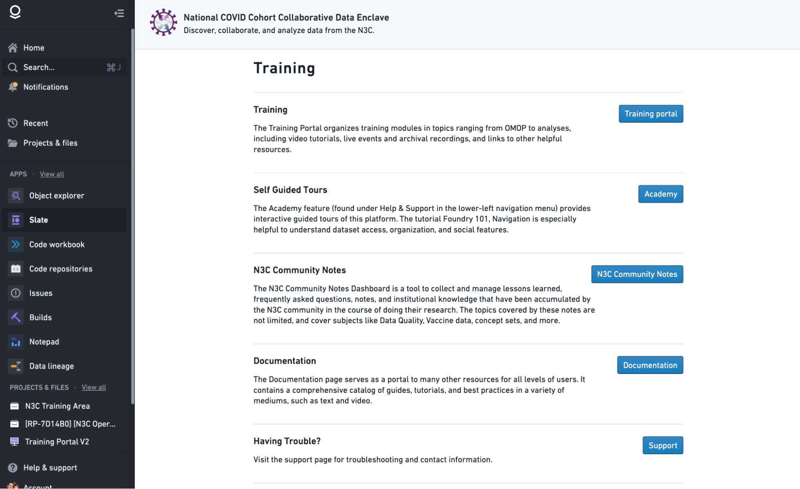{#fig-support-110-training-material fig-alt="Training Material"}

While the documentation and self-guided tours provide information about the cloud-based Enclave platform, they don't provide any information specific to N3C.
The Training Portal is the primary location for N3C-related training materials, while N3C Community Notes allow researchers to post short articles/guides for others to use.
The Support option will redirect to a page linking to the two ticket systems described above.

### Training (Training Portal) {#sec-support-training-portal}

The N3C Training Portal hosts training "modules". The list of training modules is roughly sorted by researchers' N3C journey-those new to N3C will likely find the first modules of most interest, while those preparing to publish their results should scroll to the end.

Modules are searchable by keyword (from their title and description), and a brief list of Suggested Modules can be found in the orange button in the upper-right, though browsing through the full list is recommended.

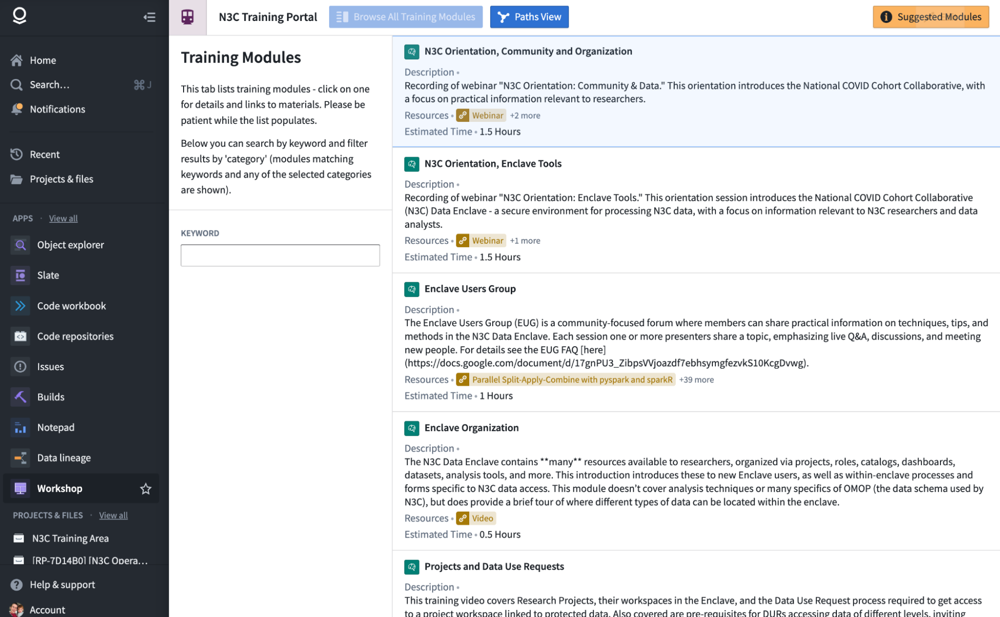{#fig-support-120-training-modules fig-alt="Training Modules"}

The Training Portal also has a Paths View, which shows potential learning paths of interest.
These links are not formally assigned, and act more like a recommendation system to help navigate and find modules and resources of interest.
This interface is limited in the number of items it can display, so you may want to filter using the "Starting Module Category" dropdown.

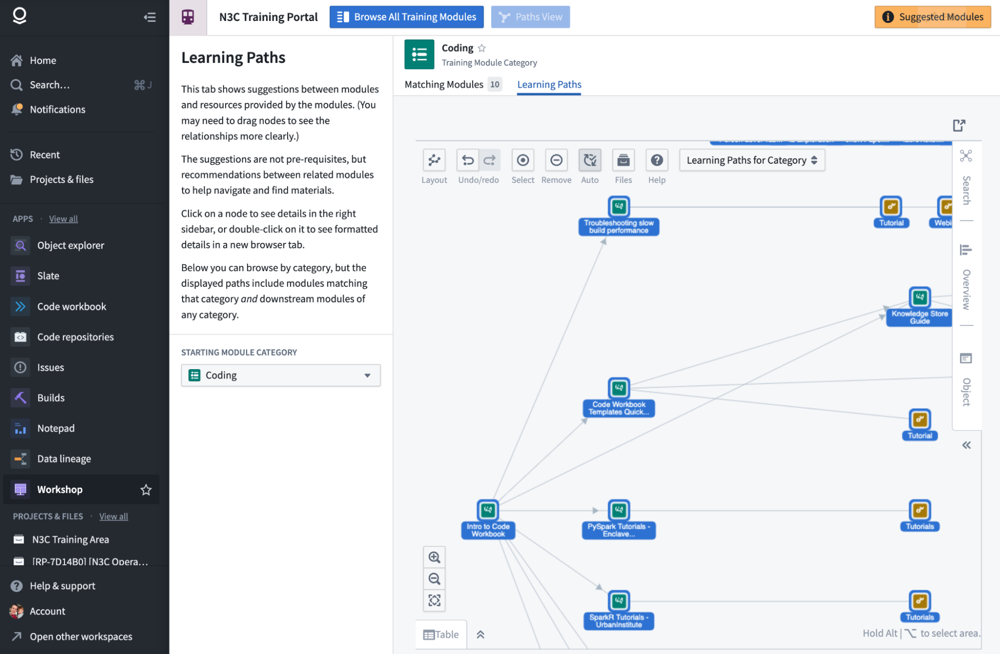{#fig-support-130-training-paths fig-alt="Learning Paths"}

Opening a module from the main list view reveals an overview of the module, including title, description, topics, learning objectives, suggested background, and estimated time to complete.
Immediately below the title is a link whose URL points to this specific module in the portal for sharing.

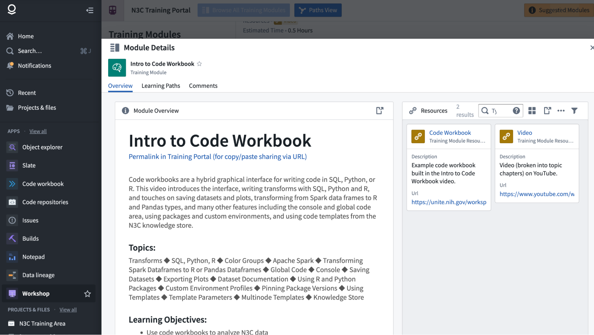{#fig-support-140-training-module-overview fig-alt="Overview of a Training Module"}

To the right is a list of resources comprising the materials of the module; these may be videos or documents, example Enclave resources like code workbooks, or in some cases links to relevant external resources.
The small search box allows you to filter the list, and is especially useful for modules with many resources such as our Enclave Users' Group series discussed below.

N3C community members are welcome to suggest or develop new training modules for inclusion in the portal.
Several have been developed this way, and each module tracks authorship information.
To contribute to the training portal or other N3C-related education and training efforts, just contact the Education & Training Domain Team at [https://covid.cd2h.org/ET-DT](https://covid.cd2h.org/ET-DT).

### Self Guided Tours (Academy) {#sec-support-training-academy}

This platform feature provides step-by-step walkthroughs of individual tools like [Contour](tools.md#sec-tools-apps-contour) and [Code Workbooks](tools.md#sec-tools-apps-workbook).
The Foundry 10X and 20X series are recommended and cover the basic tools researchers will encounter.
Along the right individual steps walk you through an example workflow or analysis.
Note that because these tours are not developed by N3C, the example analyses and data will not be N3C-relevant.
You may also be prompted to create files or work in a "home folder" (which N3C has disabled) or a [project workspace](access.md#sec-access-workspaces) you don't have write permissions to.
Instead, you can utilize the N3C Training Area (see below).

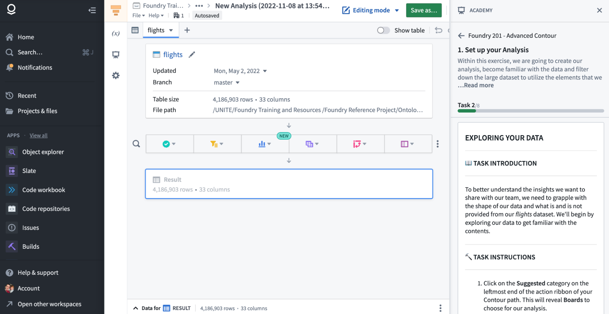{#fig-support-150-academy width=75% fig-alt="Academy walk-through"}

### N3C Community Notes {#sec-support-training-community}

N3C Community Notes is a within-Enclave application where researchers can author and share short articles, code snippets, or FAQ items.
The application supports a rich tagging system, and notes can be linked to other N3C resources like training modules, [knowledge objects](tools.md#sec-tools-store), and [concept sets](tools.md#sec-tools-concepts).
The note overview contains a link whose URL points to this specific note in the application for sharing.

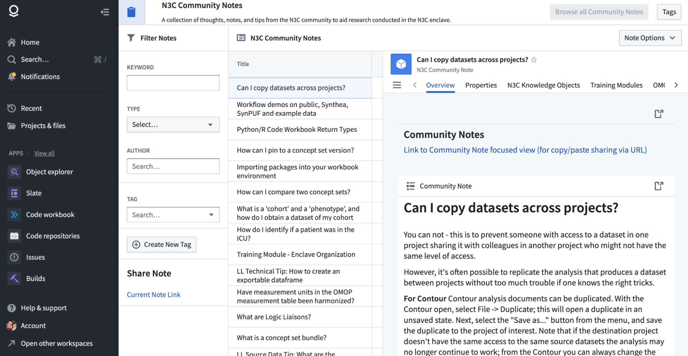{#fig-support-160-community-notes width=75% fig-alt="N3C Community Notes"}

### Documentation {#sec-support-training-documentation}

The official platform documentation is a rich resource for details on applications, and includes many guides and how-tos.
If you don't desire to read all of the documentation in detail, you should at least skim sections relevant to applications you use.
The search function can find articles relevant to specific application features or techniques.

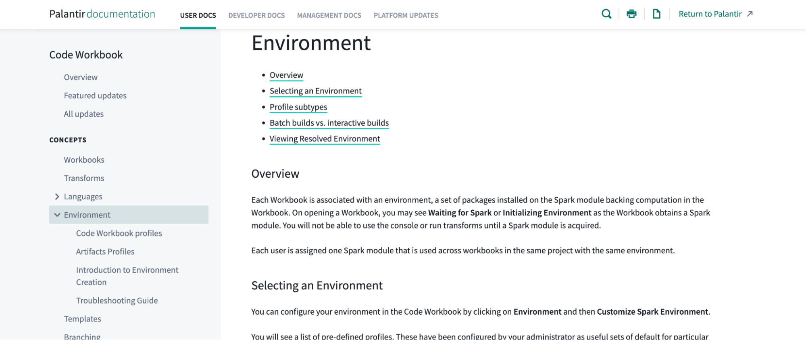{#fig-support-170-palantir-documentation width=75% fig-alt="Foundry Documentation"}

### Having Trouble? (Support) {#sec-support-training-trouble}

This last entry in the Training Resources page simply redirects to a page describing, and linking to, the two ticket systems described earlier in this chapter.

## N3C Training Area {#sec-support-area}

The N3C Training Area is a [project workspace](access.md#sec-access-workspaces) where all N3C users can practice and learn using notional datasets (described below).
This workspace is also used to organize other training resources (like the Training Portal).

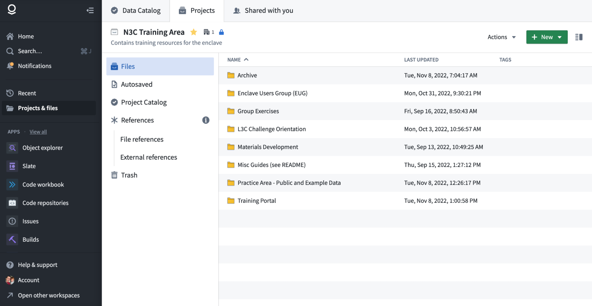{#fig-support-180-training-area width=75% fig-alt="Training Area"}

If you wish to create a practice folder, you are free to do so inside the "Practice Area - Public and Example Data".
Simply open it up, and using the green +New button create a new subfolder with a unique name (many use shortened usernames, e.g., "oneils").
Within this folder you will be able to create new analyses, and these will have access to the notional datasets described next.

## Notional Datasets {#sec-support-notional}

OMOP-formatted N3C patient data are protected by a [Data Use Request](access.md#sec-access-dur) process, but researchers may wish to explore OMOP tables and Enclave tools prior to completing a DUR.
The N3C Training Area is the place to do such practice, and N3C provides two notional (i.e., fake) datasets formatted similarly to the [Level 2 and Level 3](access.md) data that do not require a DUR to access.
They are both available via the [data catalog](access.md#sec-access-workspaces) under "Synpuf Synthetic Data" and "Synthea Notional Data".^[Note that these should not be confused with the [Level 1 Synthetic Data](access.md#sec-access-availability), which are derived from N3C patient data and protected by a Data Use Request.] The data they contain differ in some important ways, described next.

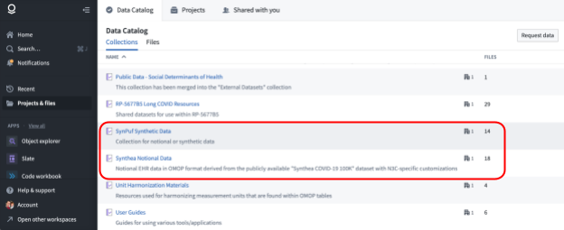{#fig-support-190-synthetic-datasets width=75% fig-alt="Two sets of synthetic data"}

### SynPuf Synthetic Data {#sec-support-notional-synpuf}

SynPuf is short for "Synthetic Public Use Files", or EHR records that have been scrubbed of personally identifiable information and released for public educational use.
These SynPuf files originate from [SynPuf Medicare Claims data](https://www.cms.gov/Research-Statistics-Data-and-Systems/Downloadable-Public-Use-Files/SynPUFs) and have been [converted to OMOP format](https://forums.ohdsi.org/t/synpuf/4936) by the OHDSI community.
The content of these data differs from N3C data in many ways (e.g., records prior to Jan. 1, 2018 are included), and they represent a distinctive population of Medicare-eligible patients.
Lastly, the data are not recent, and so contain no COVID-19-related records such as diagnoses, lab tests, or vaccine records.
The SynPuf data do not contain some N3C customizations to the OMOP data model, for example the `manifest` table used in N3C data to describe metadata about contributing data partners.

Compared to the Synthea data however, SynPuf data better represent real EHR data, including the potential for data entry errors, diversity in medical codes used, and missing data.
We thus recommend that researchers interested in trying statistical or machine learning models (or other applications better suited for realistic data) use the SynPuf notional data.

### Synthea Notional Data {#sec-support-notional-synthea}

In contrast to the SynPuf data, the Synthea notional data are derived from a probabilistic model of early-pandemic COVID-19 patient trajectories published by @walonoski_2020 converted to OMOP.
These data include COVID-19 diagnoses and lab tests for a subset of patients.
The main limitation of this notional data is its model-generated cleanliness.
Pneumonia in the Synthea dataset, for example, is always represented with the same concept ID, while in real data a variety of pneumonia sub-type concept IDs are represented.
Real EHR data also contain missing, erroneous, or inconsistent information.
With regard to COVID-19, N3C has modified the original data published by @walonoski_2020 to include more diversity and realism in COVID-19 diagnoses and lab tests; a README file in the data catalog describes the modifications in detail.

The Synthea data have an additional benefit of being slightly more aligned with real N3C data for additions beyond the OMOP standard.
For example, while SynPuf data tables include data partner IDs, Synthea also includes a `manifest` table with mock data partner metadata.
The Synthea data also include constructed [macrovisit](understanding.md#sec-understanding-ehr) information.

## OHDSI Resources {#sec-support-ohdsi}

N3C relies heavily on the OMOP common data model, developed by an international group of researchers comprising the Observational Health Data Sciences and Informatics consortium, or [OHDSI](https://ohdsi.org).
OHDSI provides a wealth of training and support resources, the most significant of which are the [Book of OHDSI](https://ohdsi.github.io/TheBookOfOhdsi/) (the inspiration for this book), [EHDEN Academy](https://academy.ehden.eu/) (online video-based courses and lectures), and the [OHDSI forums](https://forums.ohdsi.org/).
These cover basic and advanced usage of OMOP data as well as techniques and good practices for working with observational EHR data.

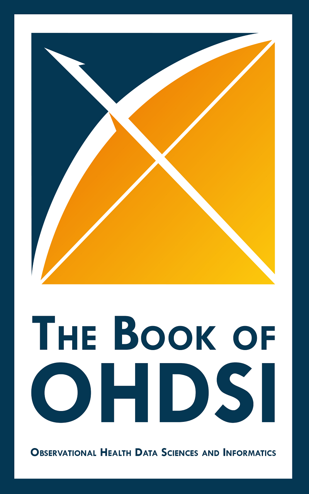{#fig-support-200-ohdsi width=12.5% fig-alt="The Book of OHDSI is a great starting place for learning OMOP"}

## Community Resources {#sec-support-community}

In addition to Community Notes mentioned above, several venues are available to get help and support from the broad community.
N3C researchers include statisticians and data scientists of all stripes, clinicians, and even industry and government representatives.
More than a few new collaborations have resulted from peer-to-peer support in N3C!

### Enclave Users' Group {#sec-support-community-eug}

The Enclave Users Group (EUG) is a community-focused forum where analysts can share practical information on techniques, tips, and methods in the N3C Data Enclave.
Each session one or more presenters share a topic, emphasizing live Q&A, discussions, and meeting new people.
Topics range from statistical techniques like propensity score matching, scaling machine learning algorithms for use on billion-row datasets, tips for scientific software development, and introductions of new N3C resources and initiatives.
EUG sessions do not present protected data, so sessions are recorded and example resources are available in the N3C Training Area.
For more information and an index of recorded sessions see the [Enclave Users' Group module](https://unite.nih.gov/workspace/module/view/latest/ri.workshop.main.module.e7b83a8c-545e-49ac-8714-f34bfa7f7767?view=focus&Id=19)  in the Training Portal.

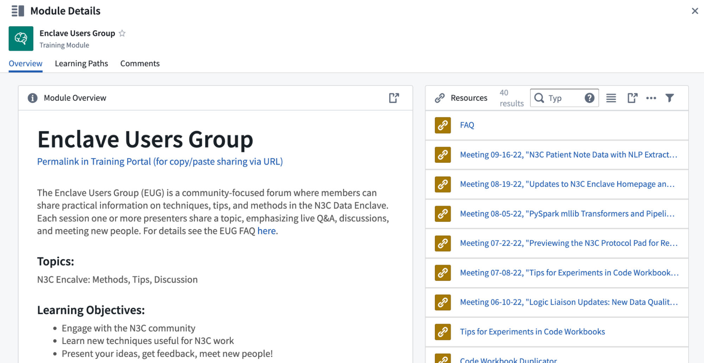{#fig-support-210-eug width=75% fig-alt="Enclave Users' Group"}

### Slack {#sec-support-community-slack}

Slack is commonly used for team communication in N3C, and several widely-subscribed channels are great support resources.
These include `#n3c-analytics` where researchers ask general questions about methods or data (with 390+ members), `#n3c-training` where training-related announcements are posted, and a variety of topic-focused channels such as `#n3c-ml` for machine learning.
N3C uses the Slack organization of the [National Center for Data To Health](https://cd2h.org) at [https://cd2h.slack.com](https://cd2h.slack.com).
Access however is managed via the N3C [onboarding process](onboarding.md), where Slack-preferred emails are collected.

### Domain Teams {#sec-support-community-dt}

[Domain Teams](onboarding.md#sec-onboarding-dt), covered in more detail in other parts of this book, are excellent support and training resources for their members.
Not only can Domain Teams answer common questions of new N3C researchers, they can answer questions that pertain to their area of expertise.
The [pregnancy domain team](https://covid.cd2h.org/pregnancy), for example, is the best source of knowledge for locating pregnancy-related records in EHR data.^[This is not as trivial as it sounds!]

## Data and Logic Liaisons {#sec-support-liaisons}

[N3C Logic and Data Liaisons](https://covid.cd2h.org/liaisons) are teams contributing to the N3C mission through software development and user support, prioritizing the needs of Domain Teams and their members.
In order to perform research, users need to identify key variables for analysis.
These key variables are generated through Code Workbooks and Templates that utilize specific Concept Sets (lists of key variables from constituent vocabularies), that identify and extract data to answer research questions.
Through interaction with [Domain Teams](onboarding.md#sec-onboarding-dt),
the Data and Logic Liaisons continually develop and refine a core set of N3C Recommended concept sets and code templates that generate commonly used variables and support efficient customization by research teams.

You may have noticed the data & logic liaisons have appeared several times in this book, including:

* Fact Tables and Templates (@sec-tools-store-ll),
* Curated Concept Sets (@sec-tools-concepts),
* Published Concepts Sets (@sec-understanding-sets-library-published), and
* Data Quality [@pfaff_2022b].

They also provide support services as described below.

### Data Liaison Services {#sec-support-liaisons-data}

EHR data are complex, more so when they cover data contributed by 75+ sites.
The Data Liaisons group consists of those most familiar with N3C data, including members of the [phenotype and ingestion and harmonization](cycle.md) teams.
Data Liaisons are subject matter experts in biomedical, translational, clinical data standards, and Real-World data utilization to support program investigator analyses.
Data Liaisons curate and review N3C-recommended [concept sets](tools.md#sec-tools-concepts) for researcher use, and can field data-related questions, which should be submitted via the Enclave-internal ticket system.
Potential data quality issues should also be submitted via Enclave-internal ticket system for routing to the Data Liaisons for review.

For basic questions about the OMOP common data model, refer to the OHDSI resources, and training portal modules for getting started with OMOP.
Personalized assistance is provided during N3C Office Hours.
Support for Concept Set consultation can be received by submitting a help desk technical support ticket in the N3C Data Enclave.
The Data Liaisons team will send a representative to your domain team meetings on an as-needed basis for general consultation.

### Logic Liaison Services {#sec-support-liaisons-logic}

Logic Liaisons consist of analysts with significant technical expertise for research with N3C data.
Although they do not develop project-specific research code as a service, they do create [Knowledge Objects](tools.md#sec-tools-store) such as reusable code templates and convenient derived datasets.
Logic Liaison members provide technical support during office hours, and many are active in the `#n3c-analytics` Slack channel.

Logic Liaisons support N3C researchers who are learning to use and adapt the Logic Liaison code fact tables and templates.
They also help researchers assess the feasibility of the project design with regard to data availability and data limitations.
This team helps researchers assess and clean their project-specific fact tables using Logic Liaison Data Quality templates, which help research teams decide which sites to include in the analysis.

Logic Liaison Code Fact Tables and Templates can be accessed by searching the Knowledge Store for "Logic Liaison Template".
Recorded trainings are provided in the "Logic Liaison Templates" module of the N3C Training Portal.
Personalized help is provided during N3C Office Hours.
Support for issues and errors encountered when using a Logic Liaison Template can be received by submitting a technical support ticket in the Enclave.
Team members are also active in the `#n3c-analytics` Slack channel.
The Logic Liaison team will send a representative to your domain team meetings on an as-needed basis for general consultation.

::: {.callout-note appearance="simple"}

## Additional Chapter Details

This chapter was first published May 2023.
If you have suggested modifications or additions, please see [How to Contribute](../index.qmd#sec-welcome-contribute) on the book's initial page.
:::
